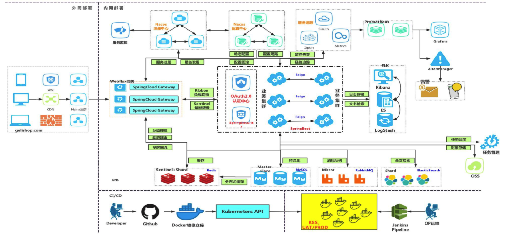
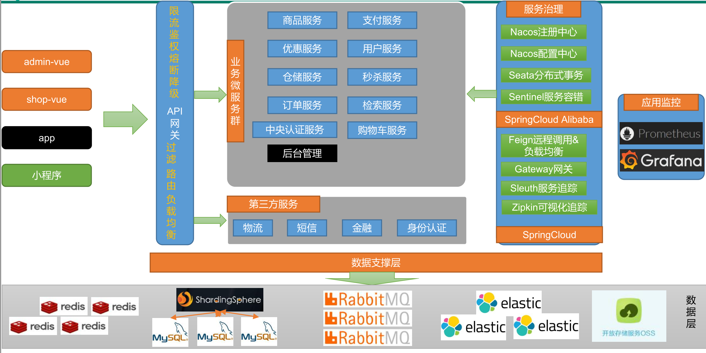

# SilinceMall

SilinceMall 项目是一套电商项目，包括前台商城系统以及后台管理系统，基于 SpringCloud、SpringCloud Alibaba、MyBatis Plus实现。前台商城系统包括：用户登录、注册、商品搜索、商品详情、购物车、订单、秒杀活动等模块。后台管理系统包括：系统管理、商品系统、优惠营销、库存系统、订单系统、用户系统、内容管理等七大模块。


## 笔记说明

[Silince商城—分布式基础](https://github.com/Silincee/SilinceMall/blob/main/note/Silince商城—分布式基础.md)

[Silince商城—分布式高级](https://github.com/Silincee/SilinceMall/blob/main/note/Silince商城—分布式高级.md)


## 组织结构

```
silincemall
├── silincemall-common -- 工具类及通用代码
├── renren-generator -- 人人开源项目的代码生成器
├── silincemall-auth-server -- 认证中心（社交登录、OAuth2.0）
├── silincemall-cart -- 购物车服务
├── silincemall-coupon -- 优惠卷服务
├── silincemall-gateway -- 统一配置网关
├── silincemall-order -- 订单服务
├── silincemall-product -- 商品服务
├── silincemall-search -- 检索服务
├── silincemall-seckill -- 秒杀服务
├── silincemall-third-party -- 第三方服务（对象存储、短信）
├── silincemall-ware -- 仓储服务
└── silincemall-member -- 会员服务
```


## 技术选型

### 后端技术

| 技术               | 说明                     | 官网                                                  |
| ------------------ | ------------------------ | ----------------------------------------------------- |
| SpringBoot         | 容器+MVC框架             | https://spring.io/projects/spring-boot                |
| SpringCloud        | 微服务架构               | https://spring.io/projects/spring-cloud               |
| SpringCloudAlibaba | 一系列组件               | https://spring.io/projects/spring-cloud-alibaba       |
| MyBatis-Plus       | ORM框架                  | [https://mp.baomidou.com](https://mp.baomidou.com/)   |
| renren-generator   | 人人开源项目的代码生成器 | https://gitee.com/renrenio/renren-generator           |
| Elasticsearch      | 搜索引擎                 | https://github.com/elastic/elasticsearch              |
| RabbitMQ           | 消息队列                 | [https://www.rabbitmq.com](https://www.rabbitmq.com/) |
| Springsession      | 分布式缓存               | https://projects.spring.io/spring-session             |
| Redisson           | 分布式锁                 | https://github.com/redisson/redisson                  |
| Docker             | 应用容器引擎             | [https://www.docker.com](https://www.docker.com/)     |
| OSS                | 对象云存储               | https://github.com/aliyun/aliyun-oss-java-sdk         |

### 前端技术

| 技术      | 说明       | 官网                                                    |
| --------- | ---------- | ------------------------------------------------------- |
| Vue       | 前端框架   | [https://vuejs.org](https://vuejs.org/)                 |
| Element   | 前端UI框架 | [https://element.eleme.io](https://element.eleme.io/)   |
| thymeleaf | 模板引擎   | [https://www.thymeleaf.org](https://www.thymeleaf.org/) |
| node.js   | 服务端的js | https://nodejs.org/en                                   |

## 架构图

### 系统架构图



### 业务架构图



