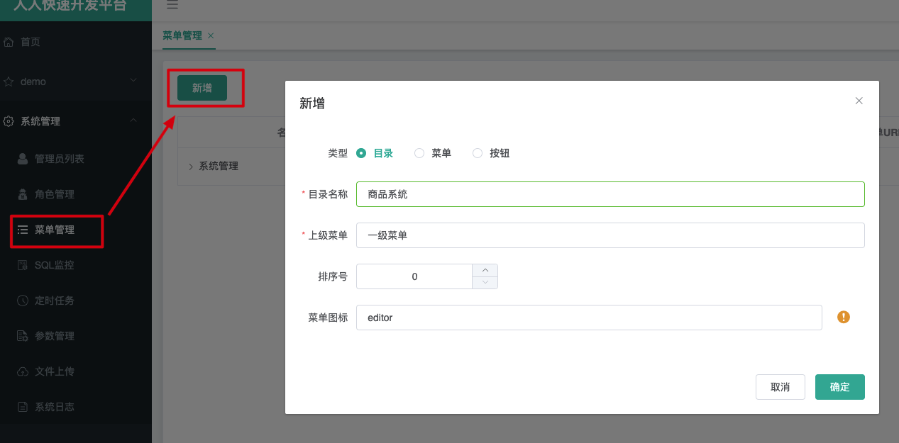
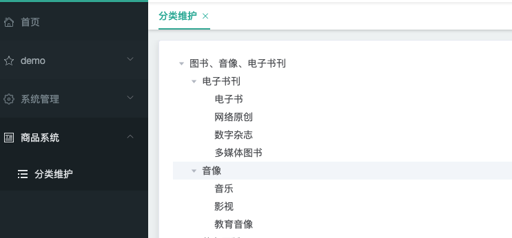
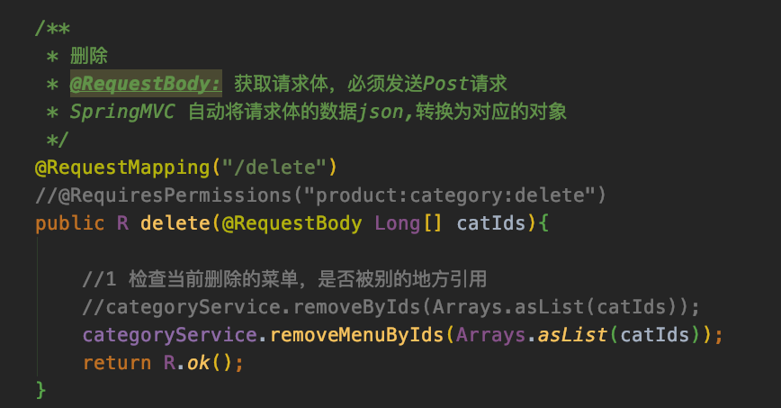
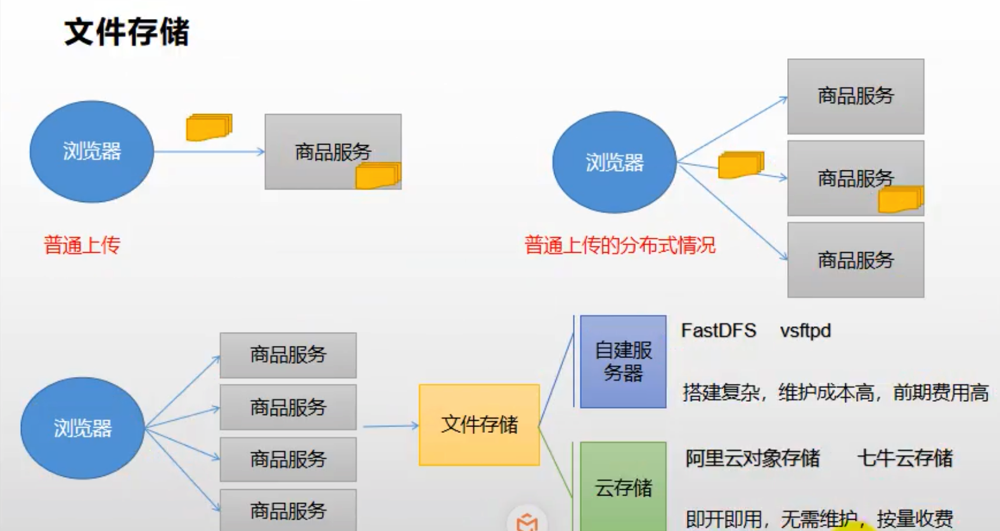
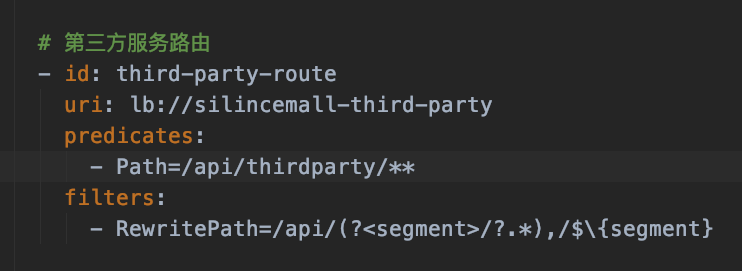
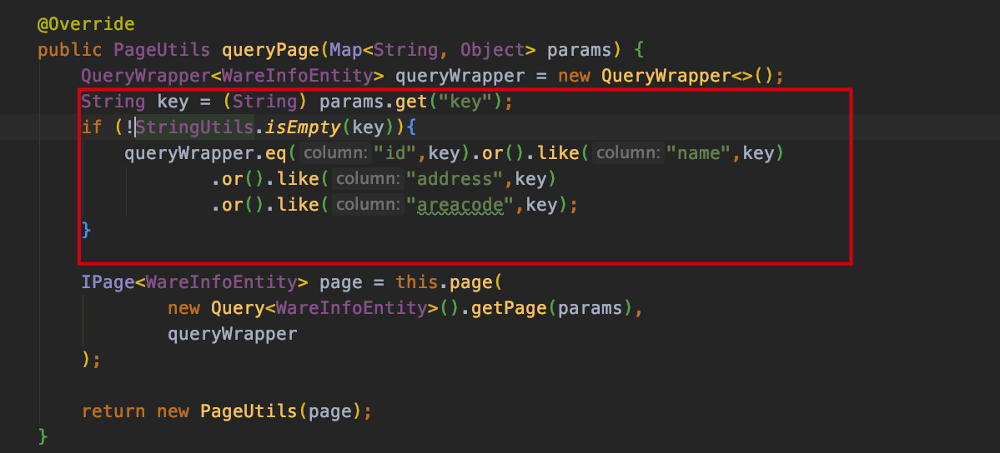
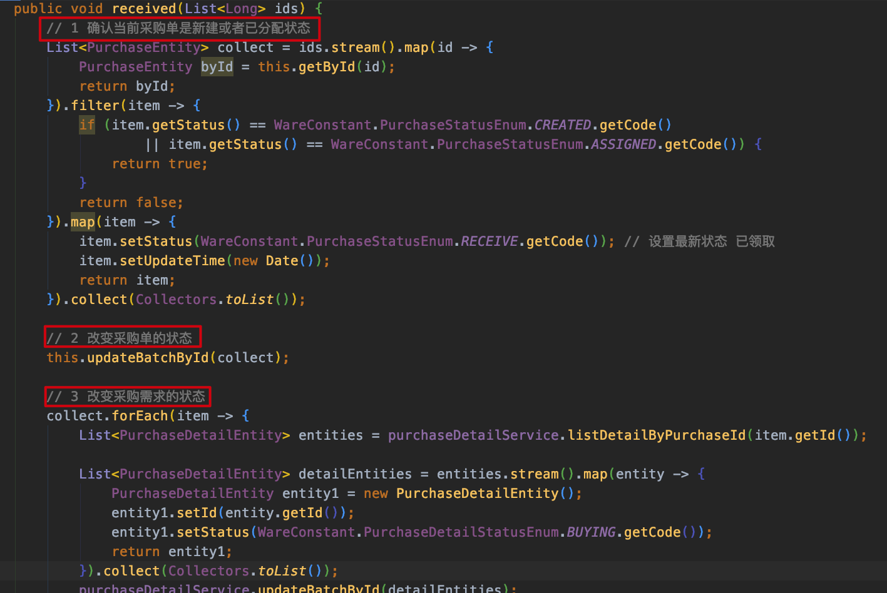

# 1项目架构图


# 2环境搭建

## 数据库部署 mysql+redis

服务器采用阿里云，并使用docker安装 mysql:5.7 和redis。

1）mysql的安装

```shell
# 拉取镜像
docker pull mysql:5.7 
# 启动容器 端口映射 文件挂载 设置密码
sudo docker run -p 3306:3306 --name mysql \
-v /mydata/mysql/log:/var/log/mysql \
-v /mydata/mysql/data:/var/lib/mysql \
-v /mydata/mysql/conf:/etc/mysql \
-e MYSQL_ROOT_PASSWORD=root \
-d mysql:5.7
```

修改配置 /mydata/mysql/conf/my.cnf

```shell
[client]
default-character-set=utf8
[mysql]
default-character-set=utf8
[mysqld]
init_connect='SET collation_connection = utf8_unicode_ci'
init_connect='SET NAMES utf8'
character-set-server=utf8
collation-server=utf8_unicode_ci
skip-character-set-client-handshake
skip-name-resolve
```

重启容器

```shell
docker restart mysql
docker update mysql --restart=always # 设置mysql在docker启动时运行
```

2）redis 的安装

```shell
docker pull redis
mkdir -p /mydata/redis/conf
touch /mydata/redis/conf/redis.conf
echo "appendonly yes"  >> /mydata/redis/conf/redis.conf # 持久化
docker run -p 6379:6379 --name redis -v /mydata/redis/data:/data \
 -v /mydata/redis/conf/redis.conf:/etc/redis/redis.conf \
 -d redis redis-server /etc/redis/redis.conf
# 设置redis在docker启动时运行
docker update redis --restart=always
```

3）导入sql文件夹中的数据


## 使用人人开源搭建后台管理系统

项目地址：https://gitee.com/renrenio


1）renren-fast-vue

```shell
cnpm install
npm run dev
```

2）renren-fast

- 修改数据源配置信息即可

3）renren-generator

- 修改数据源配置信息
- 修改generator.properties配置文件。使得路径能够对应

```properties
#码生成器，配置信息
mainPath=cn.silince
#包名
package=cn.silince.silincemall
moduleName=product
#作者
author=silince
#Email
email=zhangjianlincn@outlook.com
#表前缀(类名不会包含表前缀)
tablePrefix=pms_
```

- 替各个微服务快速生成基本代码


## 微服务模块搭建

1）初始化时候选择 web 和 openfeign


2）服务整合 Mybatis-Plus

1. 导入依赖，因为各个模块都用得到，自己放到 common模块即可

```xml
<dependency>
  <groupId>com.baomidou</groupId>
  <artifactId>mybatis-plus-boot-starter</artifactId>
  <version>3.2.0</version>
</dependency>
```

2. 配置数据源

- 导入 mysql 驱动，因为各个模块都用得到，自己放到 common模块即可

```xml
<!-- -->
<dependency>
  <groupId>mysql</groupId>
  <artifactId>mysql-connector-java</artifactId>
  <version>8.0.17</version>
</dependency>
```

- 创建application.yml并配置：

```properties
spring:
  datasource:
    username: root 
    password: password
    url: jdbc:mysql://47.97.191.157/silincemall_pms
    driver-class-name: com.mysql.cj.jdbc.Driver
```


3. 配置MyBatis-Plus

- 在主启动累上配置 `@MapperScan`注解 开启扫描

```java
@MapperScan("cn.silince.silincemall.product.dao")
@SpringBootApplication
public class SilincemallProductApplication {

    public static void main(String[] args) {
        SpringApplication.run(SilincemallProductApplication.class, args);
    }

}
```

- 告诉MyBatis-Plus sql映射文件的位置。在application.yml中添加：

```properties
mybatis-plus:
  mapper-locations: classpath:/mapper/**/*.xml # classpath*:则表示不止扫描自己的类路径，包括我应用的其他依赖的类路径
  global-config:
    db-config:
      id-type: auto # 配置主键自增
```


## 微服务平台搭建


1）**[SpringCloud Alibaba](https://github.com/alibaba/spring-cloud-alibaba)** 简介

Spring Cloud Alibaba 致力于提供微服务开发的一站式解决方案。此项目包含开发分布式应用 微服务的必需组件，方便开发者通过 Spring Cloud 编程模型轻松使用这些组件来开发分布 式应用服务。

依托 Spring Cloud Alibaba，您只需要添加一些注解和少量配置，就可以将 Spring Cloud 应用 接入阿里微服务解决方案，通过阿里中间件来迅速搭建分布式应用系统。


2）为什么要使用 **SpringCloud Alibaba** 

**SpringCloud** 的几大痛点
 SpringCloud 部分组件停止维护和更新，给开发带来不便;
 SpringCloud 部分环境搭建复杂，没有完善的可视化界面，我们需要大量的二次开发和定制 SpringCloud 配置复杂，难以上手，部分配置差别难以区分和合理应用


**SpringCloud Alibaba** 的优势: 阿里使用过的组件经历了考验，性能强悍，设计合理，现在开源出来大家用 成套的产品搭配完善的可视化界面给开发运维带来极大的便利 搭建简单，学习曲线低。

结合 **SpringCloud Alibaba** 我们最终的技术搭配方案: 

- [SpringCloud Alibaba - Nacos:注册中心(服务发现/注册) ](http://www.silince.cn/2020/11/28/SpringCloud-Alibaba-Nacos服务注册和配置中心/)
- [SpringCloud Alibaba - Nacos:配置中心(动态配置管理) ](http://www.silince.cn/2020/11/28/SpringCloud-Alibaba-Nacos服务注册和配置中心/)
- [SpringCloud - Ribbon:负载均衡](www.silince.cn/2020/11/22/SpringCloud-服务调用/)
- [SpringCloud - Feign:声明式 HTTP 客户端(调用远程服务) ](www.silince.cn/2020/11/22/SpringCloud-服务调用/)
- [SpringCloud Alibaba - Sentinel:服务容错(限流、降级、熔断) ](www.silince.cn/2020/11/29/SpringCloud-Alibaba-Sentinel实现熔断与限流/)

- [SpringCloud - Gateway:API 网关(webflux 编程模式) ](www.silince.cn/2020/11/24/SpringCloud-服务网关/)

- [SpringCloud - Sleuth:调用链监控](www.silince.cn/2020/11/27/SpringCloud-Sleuth分布式请求链路跟踪/)

- [SpringCloud Alibaba - Seata:原 Fescar，即分布式事务解决方案](www.silince.cn/2020/11/30/SpringCloud-Alibaba-Seata处理分布式事务/)


3）版本选择

由于 Spring Boot 1 和 Spring Boot 2 在 Actuator 模块的接口和注解有很大的变更，且 spring-cloud-commons 从 1.x.x 版本升级到 2.0.0 版本也有较大的变更，因此我们采取跟 SpringBoot 版本号一致的版本:

- 1.5.x 版本适用于 Spring Boot 1.5.x
- 2.0.x 版本适用于 Spring Boot 2.0.x 
- 2.1.x 版本适用于 Spring Boot 2.1.x


4）引入依赖

在 common 项目中引入如下。进行统一管理 

```xml
<dependencyManagement>
  <dependencies>
    <dependency>
      <groupId>com.alibaba.cloud</groupId>
      <artifactId>spring-cloud-alibaba-dependencies</artifactId> 
      <version>2.1.0.RELEASE</version>
      <type>pom</type>
      <scope>import</scope> 
    </dependency>
  </dependencies> 
</dependencyManagement>
```


### Nacos作为注册中心

Nacos 是阿里巴巴开源的一个更易于构建云原生应用的动态服务发现、配置管理和服务管理 平台。他是使用 java 编写。需要依赖 java 环境。Nacos 文档地址: https://nacos.io/zh-cn/docs/quick-start.html

1）安装并运行Nacos

- 解压安装包，直接运行bin目录下的`startup.sh`
- 命令运行成功后直接访问http://localhost:8848/nacos/#/login
- 默认账号密码都是nacos

```shell
cd /Users/silince/Applications/Nacos/nacos/bin
sh startup.sh -m standalone
```


2）将微服务注册到 **nacos** 中

首先，在common模块的 **pom.xml** 文件，引入 **Nacos Discovery Starter**。

```xml
<dependency>
  <groupId>com.alibaba.cloud</groupId>
  <artifactId>spring-cloud-starter-alibaba-nacos-discovery</artifactId>
</dependency>
```

在配置文件application.yml 中配置nacos服务器地址和服务名称

```yml
spring:
  ...
  cloud:
    nacos:
      server-addr: 127.0.0.1:8848
  application:
    name: silincemall-coupon
```

将服务注册到注册中心，在主启动类上添加`@EnableDiscoveryClient`注解：

```java
@SpringBootApplication
@EnableDiscoveryClient // 开启服务注册发现
public class SilincemallCouponApplication {

    public static void main(String[] args) {
        SpringApplication.run(SilincemallCouponApplication.class, args);
    }

}
```


### 使用 **feign** 远程调用

> 所有服务注册完毕后，使用feign测试远程调用
>
> 业务：会员想要从优惠券服务中获取到当前会员领取到的所有优惠券

想要远程调用的步骤：

1）引入 open-feign

```xml
<dependency>
  <groupId>org.springframework.cloud</groupId>
  <artifactId>spring-cloud-starter-openfeign</artifactId>
</dependency>
```


2）编写一个接口，告诉SpringCloud这个接口需要调用远程服务

- 声明接口的每一个方法都是调用哪个远程服务的那个请求

```java
@FeignClient("silincemall-coupon") // 注册中心中想要调用的服务名
public interface CouponFeignService {

    /**
     * @description: 返回当前会员所有优惠券
     */
    @RequestMapping("/coupon/coupon/member/list")
    public R membercoupons();
}
```

3）开启远程调用功能 `@EnableFeignClients`

```java
@EnableDiscoveryClient
@EnableFeignClients(basePackages = "cn.silince.silincemall.member.feign") // 开启远程调用功能
@SpringBootApplication
public class SilincemallMemberApplication {

    public static void main(String[] args) {
        SpringApplication.run(SilincemallMemberApplication.class, args);
    }

}
```


### Nacos作为配置中心

> 如果配置中心和当前应用的配置文件中都配置了相同的项，优先使用配置中心的配置。

一些概念：

- 命名空间：配置隔离

  - 默认 ：public(保留空间) 默认新增所有配置都在public空间
  - 开发，测试，生产:利用命名空间来做环境隔离。注意:在bootstrap.properties配置上，需要使用哪个命名空间下的配置。
  - 或者用于每一个微服务之间互相隔离配置，每一个微服务都创建自己的命名空间，只加载自己命名空间下的所有配置。

- 配置集

  一组相关或者不相关的配置项的集合称为配置集。在系统中，一个配置文件通常就是一个配 置集，包含了系统各个方面的配置。例如，一个配置集可能包含了数据源、线程池、日志级 别等配置项。

- 配置集 **ID** ：类似于配置文件名

  Nacos 中的某个配置集的 ID。配置集 ID 是组织划分配置的维度之一。**Data ID** 通常用于组 织划分系统的配置集。

- ⭐️ 配置分组

  默认所有的配置集都属于：DEFAULT_GROUP；

每个微服务创建自己的命名空间，使用配置分组区分环境（dev/test/prod）。


配置思路：同时加载多个配置集

1. 微服务任何配置信息，任何配置文件都可以放在配置中心中
2. 只需要在bootstrap.properties说明加载配置中心中哪些配置文件即可
3. @Value @ConfigurationProperties ... 都可正常使用
4. 配置中心中有的有限使用配置中心，没有的使用本地配置文件。


1）导入依赖

```xml
<!--nacos-config-->
<dependency>
  <groupId>com.alibaba.cloud</groupId>
  <artifactId>spring-cloud-starter-alibaba-nacos-config</artifactId>
</dependency>
```


2）在应用的 **/src/main/resources/bootstrap.properties** 配 置文件中配置 **Nacos Config** 元数据

- bootstrap.properties 会优先于 application配置文件被读取

```properties
# 主要配置应用名和配置中心地址
spring.application.name=silincemall-coupon
spring.cloud.nacos.config.server-addr=127.0.0.1:8848
# 使用其他命名空间  为了开发/测试/生产环境隔离
# 不配置默认使用 public
spring.cloud.nacos.config.namespace=396134a8-fb21-4291-8bf9-3c1d7aa9d20e
# 配置分组
#spring.cloud.nacos.config.group=111
```


3）在 **nacos** 中添加配置

在 nacos 中创建一个 应用名**.properties** 配置文件并编写配置


4）在应用中使用**@Value** 和**@RefreshScope**


5）最终配置方案


bootstrap.properties

```properties
# 主要配置应用名和配置中心地址
spring.application.name=silincemall-coupon 
spring.cloud.nacos.config.server-addr=127.0.0.1:8848
# 优惠券微服务coupon 的命名空间
spring.cloud.nacos.config.namespace=1986f4f3-69e0-43bb-859c-abe427b19f3a

spring.cloud.nacos.config.ext-config[0].data-id=datasource.yml
spring.cloud.nacos.config.ext-config[0].group=dev
# 动态刷新 配置中心发生更改微服务立刻刷新
spring.cloud.nacos.config.ext-config[0].refresh=true

spring.cloud.nacos.config.ext-config[1].data-id=mybatis.yml
spring.cloud.nacos.config.ext-config[1].group=dev
spring.cloud.nacos.config.ext-config[1].refresh=true

spring.cloud.nacos.config.ext-config[2].data-id=other.yml
spring.cloud.nacos.config.ext-config[2].group=dev
spring.cloud.nacos.config.ext-config[2].refresh=true
```


### **网关Gateway**

> [gateway新一代网关](http://www.silince.cn/2020/11/24/SpringCloud-服务网关/#gateway新一代网关)

网关作为流量的入口，常用功能包括路由转发、权限校验、限流控制等。而 springcloud gateway 作为 SpringCloud 官方推出的第二代网关框架，取代了 Zuul 网关。


1）导入坐标

```xml
<dependency>
  <groupId>cn.silince.silincemall</groupId>
  <artifactId>silincemall-common</artifactId>
  <version>0.0.1-SNAPSHOT</version>
</dependency>

<dependency>
  <groupId>org.springframework.cloud</groupId>
  <artifactId>spring-cloud-starter-gateway</artifactId>
</dependency>
```


2）开启服务注册

```java
@EnableDiscoveryClient // 开启服务注册发现 nacos
@SpringBootApplication(exclude = {DataSourceAutoConfiguration.class}) // 排除与数据源有关的配置，因为common中引入了mybatis
public class SilincemallGatewayApplication {

    public static void main(String[] args) {
        SpringApplication.run(SilincemallGatewayApplication.class, args);
    }

}
```


3）配置信息

application.properties (服务注册)

```properties
# 应用名称
spring.application.name=silincemall-gateway
spring.cloud.nacos.config.server-addr=127.0.0.1:8848
server.port=88
```

application.yml [路由规则配置参考文档](https://docs.spring.io/spring-cloud-gateway/docs/2.2.7.BUILD-SNAPSHOT/reference/html/#the-query-route-predicate-factory)

```yml
# 路由规则
spring:
  cloud:
    gateway:
      routes:
        - id: test_route
          uri: https://www.baidu.com
          predicates:
            - Query=url, baidu
        - id: qq_route
          uri: https://www.qq.com
          predicates:
            - Query=url, qq

```

bootstrap.properties (nacos配置中心)

```properties
# 主要配置应用名和配置中心地址
spring.application.name=silincemall-gateway
spring.cloud.nacos.config.server-addr=127.0.0.1:8848
# gateway 命名空间
spring.cloud.nacos.config.namespace=bd480b44-373c-40c3-96c6-fce5dfd12030
```


# 3商品服务

## 三级分类


### 菜单查询

后台实现：

- CategoryController


- 实体类新增字段，注意在数据库中排除该字段


- CategoryServiceImpl

```java
@Service("categoryService")
public class CategoryServiceImpl extends ServiceImpl<CategoryDao, CategoryEntity> implements CategoryService {

    @Autowired
    CategoryDao categoryDao;

    @Override
    public PageUtils queryPage(Map<String, Object> params) {
        IPage<CategoryEntity> page = this.page(
                new Query<CategoryEntity>().getPage(params),
                new QueryWrapper<CategoryEntity>()
        );

        return new PageUtils(page);
    }

    /**
     * @description: 查出所有分类以及子分类, 以树形结构组装起来
     * @param: []
     * @return: java.util.List<cn.silince.silincemall.product.entity.CategoryEntity>
     * @author: Silince
     * @date: 2/5/21
     */
    @Override
    public List<CategoryEntity> listWithTree() {
        //1 查出所有分类
        List<CategoryEntity> entities = categoryDao.selectList(null);

        //2 组装成父子的树形结构
        //2.1 找到所有的一级分类
        List<CategoryEntity> level1Menus = entities.stream()
                .filter(categoryEntity -> categoryEntity.getParentCid() == 0)
                .map(menu -> {
                    menu.setChildren(getChildren(menu, entities)); //获取当前菜单的所有子菜单
                    return menu;
                })
                .sorted((menu1, menu2) -> {
                    return (menu1.getSort() == null ? 0 : menu1.getSort()) - (menu2.getSort() == null ? 0 : menu2.getSort());
                }) //排序
                .collect(Collectors.toList());


        return level1Menus;
    }

    /**
     * @description: 递归查找所有菜单的子菜单
     * @param: [root, all]
     * @return: [当前菜单, 所有菜单]
     * @author: Silince
     * @date: 2/5/21
     */
    private List<CategoryEntity> getChildren(CategoryEntity root, List<CategoryEntity> all) {
        List<CategoryEntity> children = all.stream().filter(categoryEntity -> {
            return categoryEntity.getParentCid() == root.getCatId();
        }).map(categoryEntity -> {
            // 递归寻找子菜单
            categoryEntity.setChildren(getChildren(categoryEntity, all));
            return categoryEntity;
        }).sorted((menu1, menu2) -> { //菜单排序
            return (menu1.getSort() == null ? 0 : menu1.getSort()) - (menu2.getSort() == null ? 0 : menu2.getSort()); // 防止空指针异常
        }).collect(Collectors.toList());


        return children;

    }
}
```


前台实现：

- 启动renren-fast和renren-fast-vue




- 创建页面


发送ajax请求后无法访问？

为了避免频繁修改的地址(微服务众多，每个微服务又存在多个端口)，需要把所有请求都交给网关处理，最后由网关进行路由转发：


- 首先将renren-fast注册到nacos注册中心
- 在网关配置路由规则。注意renren-fast项目中的配置了路径包含项目名，


- 解决跨域问题

跨域:指的是浏览器不能执行其他网站的脚本。它是由浏览器的同源策略造成的，是浏览器对javascript施加的安全限制。

同源策略:是指协议，域名，端口都要相同，其中有一个不同都会产生跨域；


解决方案一：使用nginx部署为同一域


解决方案二：配置当次请求允许跨域


所以只需要在网关中配置一个过滤器即可(注意注释掉renren-fast中的跨域过滤器)：


- 配置商品服务的路由。注意顺序，防止路由冲突


- 前台展示

组件文档：https://element.eleme.cn/#/zh-CN/component/tree


- 最终效果




### 菜单删除

- 导入ui(span标签和方法)


```html
<el-tree :data="menus" :props="defaultProps" :expand-on-click-node="false" show-checkbox node-key="catId">
  <span class="custom-tree-node" slot-scope="{ node, data }">
    <span>{{ node.label }}</span>
    <span>
      <el-button v-if="node.level<=2" type="text" size="mini" @click="() => append(data)">Append</el-button>
      <el-button v-if="node.childNodes.length==0" type="text" size="mini" @click="() => remove(node, data)">Delete</el-button>
    </span>
  </span>
</el-tree>
```

- 后台使用逻辑删除 

参考文档：https://mp.baomidou.com/guide/logic-delete.html

CategoryController:



CategoryServiceImpl:


- 删除前弹出确认框 [Message box 弹框提示](https://element.eleme.cn/#/zh-CN/component/message-box)

```js
remove (node, data) {
  var ids = [data.catId]
  // 删除前进行弹框提示
  this.$confirm(`是否删除【${data.name}】菜单, 是否继续?`, '提示', {
    confirmButtonText: '确定',
    cancelButtonText: '取消',
    type: 'warning'
  }).then(() => {
    // 确认删除了才发送真正的请求
    this.$http({
      url: this.$http.adornUrl('/product/category/delete'),
      method: 'post',
      data: this.$http.adornData(ids, false)
    }).then(({data}) => {
      console.log('删除成功...')
      this.getMenus() // 更新数据
    })
  }).catch(() => {
    console.log('取消了删除')
  })
  console.log('remove', node, data)
}
```

- [Message 消息提示](https://element.eleme.cn/#/zh-CN/component/message)

```js
this.$message({
  message: '菜单删除成功',
  type: 'success'
});
```

- 删除成功之后还要展开之前的父节点


删除节点后，将删除节点的父节点添加到 expanedKey数组中即可

```js
this.expandedKey = [node.parent.data.catId]
```


### 菜单批量删除


```js
// 批量删除
batchDelete () {
  let catIds = []
  let checkedNodes = this.$refs.menuTree.getCheckedNodes()
  console.log('被选中的元素', checkedNodes)
  for (let i = 0; i < checkedNodes.length; i++) {
    catIds.push(checkedNodes[i].catId)
  }
  // 确认删除提示框
  this.$confirm(`是否批量删除【${catIds}】菜单, 是否继续?`, '提示', {
    confirmButtonText: '确定',
    cancelButtonText: '取消',
    type: 'warning'
  }).then(() => {
    this.$http({
      url: this.$http.adornUrl('/product/category/delete'),
      method: 'post',
      data: this.$http.adornData(catIds, false)
    }).then(({data}) => {
      this.$message({
        message: '菜单批量删除成功',
        type: 'success'
      })
      this.getMenus()
    })
  }).catch(() => {
    console.log('批量删除已取消')
  })
}
```


### 菜单新增

> 业务：点击Append，弹出一个对话框，输入子分类的名字并确定以后添加到数据库并且动态刷新。

- [ui Dialog 对话框](https://element.eleme.cn/#/zh-CN/component/dialog) [表单](https://element.eleme.cn/#/zh-CN/component/form)

```js
<el-dialog
title="提示"
:visible.sync="dialogVisible"
width="30%">

  <el-form :model="category">
    <el-form-item label="分类名称">
      <el-input v-model="category.name" autocomplete="off"></el-input>
</el-form-item>
</el-form>

<span slot="footer" class="dialog-footer">
  <el-button @click="dialogVisible = false">取 消</el-button>
<el-button type="primary" @click="addCategory">确 定</el-button>
</span>
</el-dialog>
```

- 添加绑定属性


- append() 和 addCategory

```js
append (data) {
  console.log('append', data)
  // 打开对话框 
  this.dialogVisible = true
  // 自动获取自己和父节点的分类层级
  this.category.parentCid = data.catId
  this.category.catLevel = data.catLevel * 1 + 1
},

  // 添加三级分类
  addCategory () {
    console.log('提交的三级分类数据', this.category)
    this.$http({
      url: this.$http.adornUrl('/product/category/save'), // 直接调用自动生成的save方法即可
      method: 'post',
      data: this.$http.adornData(this.category, false)
    }).then(({data}) => {
      this.$message({
        message: '菜单保存成功',
        type: 'success'
      })
      // 关闭对话框 然后更新数据
      this.dialogVisible = false
      this.getMenus()
      // 设置需要默认展开的菜单
      this.expandedKey = [this.category.parentCid]
    })
  }
```


### 修改菜单

> 在每一个分类之后添加一个修改按钮，点击弹出对话框并回显分类信息，然后动态输入新的内容。确定后修改当前分类的数据。
>
> 注意修改后如果要添加菜单，需要先清除之前回显的数据

- 添加修改按钮


- 复用之前的对话框


- 修改data


- 添加方法

```js
submitData () {
  if (this.dialogType === 'add') {
    this.addCategory()
  }
  if (this.dialogType === 'edit') {
    this.editCategory()
  }
}

// 菜单修改功能
edit (data) {
  console.log('要修改的数据', data)
  this.title = '修改分类'
  this.dialogType = 'edit' // 修改复用对话框的类型
  this.dialogVisible = true
  this.category.parentCid = data.catId
  // 发送请求回显当前节点最新的数据
  this.$http({
    url: this.$http.adornUrl(`/product/category/info/${data.catId}`),
    method: 'get'
  }).then(({data}) => {
    // 请求成功 回显最新的数据
    console.log('要回显的数据', data)
    this.category.name = data.data.name
    this.category.catId = data.data.catId
    this.category.icon = data.data.icon
    this.category.productUnit = data.data.productUnit
    this.category.catLevel = data.catLevel
  })
}

// 添加菜单
append (data) {
  console.log('append', data)
  this.title = '添加分类'
  this.dialogType = 'add'
  // 打开对话框
  this.dialogVisible = true
  // 自动获取自己和父节点的分类层级
  this.category.parentCid = data.catId
  this.category.catLevel = data.catLevel * 1 + 1

  // 清空之前添加或修改回写的值
  this.category.name = ''
  this.category.catId = null
  this.category.icon = ''
  this.category.productUnit = ''
}

// 修改三级分类数据
editCategory () {
  // 只修改部分字段，为null的字段不会在数据库中修改
  // eslint-disable-next-line no-unused-vars
  var {catId, name, icon, productUnit} = this.category
  var data = {catId: catId, name: name, icon: icon, productUnit: productUnit}
  this.$http({
    url: this.$http.adornUrl('/product/category/update'),
    method: 'post',
    data: this.$http.adornData(data, false)
  }).then(({data}) => {
    this.$message({
      message: '菜单修改成功',
      type: 'success'
    })
    // 关闭对话框 然后更新数据
    this.dialogVisible = false
    this.getMenus()
    // 设置需要默认展开的菜单
    this.expandedKey = [this.category.parentCid]
  })
}
```

- 后台更新数据


### 拖拽节点改变节点顺序或者父子关系

- 设置节点可拖拽


- 设置节点被能否够被拖拽到，注意最多只能形成3级菜单

```js
// 设置节点是否可拖拽
allowDrop (draggingNode, dropNode, type) {
  // 1 判断被拖动的当前节点以及所在的父节点总层数不能大于3
  // 1.1 被拖动的当前节点总层数
  console.log('allowDrop:', draggingNode, dropNode, type)
  this.countNodeLevel(draggingNode)
  // 当前正在拖动的节点 + 父节点所在的深度不大于3即可
  let deep = Math.abs(this.maxLevel - draggingNode.level) + 1
  console.log('深度', deep)
  // this.maxLevel
  if (type === 'inner') {
    return (deep + dropNode.level) <= 3
  } else {
    return (deep + dropNode.parent.level) <= 3
  }
}
// 统计当前被拖动节点的总层数
countNodeLevel (node) {
  // 找到所有子节点，求出最大深度
  if (node.childNodes != null && node.childNodes.length > 0) {
    for (let i = 0; i < node.childNodes.length; i++) {
      if (node.childNodes[i].level > this.maxLevel) {
        this.maxLevel = node.childNodes[i].level
      }
      this.countNodeLevel(node.childNodes[i])
    }
  }
}
```

- 监听拖拽成功事件，修改数据库


```js
// 拖拽完成后的调用的函数 参数列表：被拖拽节点对应的 Node、结束拖拽时最后进入的节点、被拖拽节点的放置位置（before、after、inner）
handleDrop (draggingNode, dropNode, dropType) {
  console.log('tree drop: ', dropNode.label, dropType)
  // 1 当前节点最新的父节点id
  let pCid = 0
  let siblings = null
  if (dropType === 'before' || dropType === 'after') {
    pCid = dropNode.parent.data.catId === undefined ? 0 : dropNode.parent.data.catId
    siblings = dropNode.parent.childNodes
  } else {
    pCid = dropNode.data.catId
    siblings = dropNode.childNodes
  }
  this.pCid.push(pCid)
  // 2 当前拖住节点的最新顺序
  for (let i = 0; i < siblings.length; i++) {
    if (siblings[i].data.catId === draggingNode.data.catId) {
      // 如果遍历的是当前正在拖拽的节点
      let catLevel = draggingNode.level
      if (siblings[i].level !== draggingNode.level) {
        // 当前节点层级发生比变化
        catLevel = siblings[i].level
        // 修改它子节点的层级
        this.updateChildNodeLevel(siblings[i])
      }
      this.updateNodes.push({catId: siblings[i].data.catId, sort: i, parentCid: pCid, catLevel: catLevel})
    } else {
      this.updateNodes.push({catId: siblings[i].data.catId, sort: i})
    }
  }
  // 3 当前拖拽节点的最新层级
  console.log('updateNodes', this.updateNodes)
  // 修改数据
  this.$http({
    url: this.$http.adornUrl('/product/category/update/sort'),
    method: 'post',
    data: this.$http.adornData(this.updateNodes, false)
  }).then(({data}) => {
    this.$message({
      message: '菜单顺序修改成功',
      type: 'success'
    })
  })
  // 刷新菜单，展开拖入的节点
  this.getMenus()
  this.expandedKey = [pCid]
  // 清空复位
  this.updateNodes = []
  this.maxLevel = 0
}
// 更改子节点层级
updateChildNodeLevel (node) {
  if (node.childNodes.length > 0) {
    for (let i = 0; i < node.childNodes.length; i++) {
      var cNode = node.childNodes[i].data
      this.updateNodes.push({catId: cNode.catId, catLevel: node.childNodes[i].level})
      this.updateChildNodeLevel(node.childNodes[i])
    }
  }
}
```

- 发送后端修改数据


- switch开关防止误拖动 https://element.eleme.cn/#/zh-CN/component/switch


```js
// 拖拽批量保存并提交
batchSave () {
  // 修改数据
  this.$http({
    url: this.$http.adornUrl('/product/category/update/sort'),
    method: 'post',
    data: this.$http.adornData(this.updateNodes, false)
  }).then(({data}) => {
    this.$message({
      message: '菜单顺序修改成功',
      type: 'success'
    })
  })
  // 刷新菜单，展开拖入的节点
  this.getMenus()
  this.expandedKey = this.pCid
  // 清空复位
  this.updateNodes = []
  this.maxLevel = 0
}
```

## 品牌管理


找到之前逆向工程生成的代码模版：


### 品牌快速显示/隐藏

- 添加开关

导入ui，注意 scoped 插槽可以获取table内部各类数据


最终结果：


- 监听开关状态

```js
// change事件 修改品牌状态
updateBrandStatus (data) {
  console.log('最新状态', data)
  // 只需要发送 品牌id 和 显示状态 字段
  let {brandId, showStatus} = data
  // 发送请求修改状态
  this.$http({
    url: this.$http.adornUrl('/product/brand/update'),
    method: 'post',
    data: this.$http.adornData({brandId, showStatus}, false)
  }).then(({data}) => {
    this.$message({
      type: 'success',
      message: '状态更新成功'
    })
  })
}
```

- 后台更新接口


### 文件上传

#### 方式一

- 文件存储说明




- [OSS Java SDK的多种文件上传方式](https://help.aliyun.com/document_detail/32013.html?spm=a2c4g.11186623.6.957.29077a74xz30Tv)

导入坐标

```xml
<dependency>
    <groupId>com.aliyun.oss</groupId>
    <artifactId>aliyun-sdk-oss</artifactId>
    <version>3.10.2</version>
</dependency>
```


开通子账户获取 AccessKey ID 和 AccessKey Secret


添加访问权限


实现简单上传文件流

```java
// Endpoint以杭州为例，其它Region请按实际情况填写。
String endpoint = "http://oss-cn-hangzhou.aliyuncs.com";
// 云账号AccessKey有所有API访问权限，建议遵循阿里云安全最佳实践，创建并使用RAM子账号进行API访问或日常运维，请登录 https://ram.console.aliyun.com 创建。
String accessKeyId = "<yourAccessKeyId>";
String accessKeySecret = "<yourAccessKeySecret>";

// 创建OSSClient实例。
OSS ossClient = new OSSClientBuilder().build(endpoint, accessKeyId, accessKeySecret);

// 上传文件流。
InputStream inputStream = new FileInputStream("<yourlocalFile>");
ossClient.putObject("<yourBucketName>", "<yourObjectName>", inputStream);

// 关闭OSSClient。
ossClient.shutdown();
```


#### 方式二

使用 [SpringCloud Alibaba-OSS](https://github.com/alibaba/aliyun-spring-boot/blob/master/aliyun-spring-boot-samples/aliyun-oss-spring-boot-sample/README-zh.md) 封装好的方法上传文件

文档中坐标需要修改为

```xml
<dependency>
    <groupId>com.alibaba.cloud</groupId>
    <artifactId>spring-cloud-starter-alibaba-nacos-config</artifactId>
</dependency>
```


### 服务端签名直传


- 创建项目 


导入坐标 注意排除掉mybatis-plus

```xml
<!--        aliyun-oss-->
<dependency>
    <groupId>com.alibaba.cloud</groupId>
    <artifactId>spring-cloud-starter-alicloud-oss</artifactId>
</dependency>

<dependency>
    <groupId>cn.silince.silincemall</groupId>
    <artifactId>silincemall-common</artifactId>
    <version>0.0.1-SNAPSHOT</version>
    <exclusions>
        <exclusion>
            <groupId>com.baomidou</groupId>
            <artifactId>mybatis-plus-boot-starter</artifactId>
        </exclusion>
    </exclusions>
</dependency>

<dependencyManagement>
  <dependencies>
    <dependency>
      <groupId>org.springframework.cloud</groupId>
      <artifactId>spring-cloud-dependencies</artifactId>
      <version>${spring-cloud.version}</version>
      <type>pom</type>
      <scope>import</scope>
    </dependency>
    <dependency>
      <groupId>org.springframework.boot</groupId>
      <artifactId>spring-boot-dependencies</artifactId>
      <version>${spring-boot.version}</version>
      <type>pom</type>
      <scope>import</scope>
    </dependency>
    <dependency>
      <groupId>com.alibaba.cloud</groupId>
      <artifactId>spring-cloud-alibaba-dependencies</artifactId>
      <version>2.1.1.RELEASE</version>
      <type>pom</type>
      <scope>import</scope>
    </dependency>
  </dependencies>
</dependencyManagement>
```

修改配置文件：


其中oss相关的配置文件放在了nacos配置中心 third-party 的命名空间


- [配置服务端签名直传](https://help.aliyun.com/document_detail/31926.html?spm=a2c4g.11186623.6.1739.7fcf26fd87FQfH)

  java代码示例：https://help.aliyun.com/document_detail/91868.html?spm=a2c4g.11186623.2.10.324a7d9cckuHPB

```java
/**
 * @program: SilinceMall
 * @description: 服务端签名直传
 * @author: Silince
 * @create: 2021-02-07 15:04
 **/
@RestController
public class OssController {

    @Autowired
    private OSS ossClient;

    @Value("${spring.cloud.alicloud.oss.endpoint}")
    private String endpoint;

    @Value("${spring.cloud.alicloud.access-key}")
    private String accessId;

    /**
    * @description: 封装签名
    */
    @RequestMapping("/oss/policy")
    @ResponseBody
    public R policy(){
        String bucket = "silincemall-hello"; // 请填写您的 bucketname 。
        String host = "https://" + bucket + "." + endpoint; // host的格式为 bucketname.endpoint
        // callbackUrl为 上传回调服务器的URL，请将下面的IP和Port配置为您自己的真实信息。
//        String callbackUrl = "http://88.88.88.88:8888";
        String format = new SimpleDateFormat("yyyy-MM-dd").format(new Date());
        String dir = format+"/"; // 用户上传文件时指定的前缀。

        Map<String, String> respMap=null;
        // 创建OSSClient实例。
        try {
            long expireTime = 30;
            long expireEndTime = System.currentTimeMillis() + expireTime * 1000;
            Date expiration = new Date(expireEndTime);
            // PostObject请求最大可支持的文件大小为5 GB，即CONTENT_LENGTH_RANGE为5*1024*1024*1024。
            PolicyConditions policyConds = new PolicyConditions();
            policyConds.addConditionItem(PolicyConditions.COND_CONTENT_LENGTH_RANGE, 0, 1048576000);
            policyConds.addConditionItem(MatchMode.StartWith, PolicyConditions.COND_KEY, dir);

            String postPolicy = ossClient.generatePostPolicy(expiration, policyConds);
            byte[] binaryData = postPolicy.getBytes("utf-8");
            String encodedPolicy = BinaryUtil.toBase64String(binaryData);
            String postSignature = ossClient.calculatePostSignature(postPolicy);

            respMap = new LinkedHashMap<String, String>();
            respMap.put("accessid", accessId);
            respMap.put("policy", encodedPolicy);
            respMap.put("signature", postSignature);
            respMap.put("dir", dir);
            respMap.put("host", host);
            respMap.put("expire", String.valueOf(expireEndTime / 1000));

        } catch (Exception e) {
            // Assert.fail(e.getMessage());
            System.out.println(e.getMessage());
        } finally {
            ossClient.shutdown();
        }
        return R.ok().put("data", respMap);
    }
}
```

网关新增路由：




- [Upload 文件上传组件](https://element.eleme.cn/#/zh-CN/component/upload)


修改上传地址：


引入组件：


```html
<el-form-item label="品牌logo地址" prop="logo">
  <!--      文件上传组件-->
  <single-upload v-model="dataForm.logo"></single-upload>
</el-form-item>
```


! 出现了新的跨域问题：服务向阿里云发送照片时


在阿里云配置允许跨域：


### 新增品牌

- 品牌logo显示图片

```xml

```

#### 表单校验

- 表单验证功能 防止填写非法信息


校验触发器：


- 服务端数据校验。使用 JSR303

导入坐标

```xml
<dependency> 
  <groupId>org.hibernate.validator</groupId> 
  <artifactId>hibernate-validator</artifactId>
  <version>6.1.5.Final</version> 
</dependency>
```

给 实体类 添加校验注解，如：


在Controller中添加@Valid注解开启校验，此外在后面紧跟一个 BindingResult就可以获取到校验的结果：


测试结果：


此外还可以自定义校验规则，如：


#### 统一异常处理


系统错误码规范：


在common工程中定义枚举类来表示：

```java
public enum BizCodeEnume {

    UNKNOW_EXCEPTION(10000,"系统位置异常"),
    VAILD_EXCEPTION(10001,"参数格式异常");

    private int code;
    private String msg;

    BizCodeEnume(int code, String msg) {
        this.code = code;
        this.msg = msg;
    }

    public int getCode() {
        return code;
    }

    public String getMsg() {
        return msg;
    }
}
```


#### 分组校验

> 在新增或修改品牌的时候，两者的校验规则可能是不相同的。(可以完成多场景的复杂校验)

- 创建空接口作为分组标识，然后给校验注解标注什么情况需要进行校验


- 在controller 中添加 开启分组校验


-  ⚠️：分组校验情况下没有标注分组的字段不会起作用，只会在@Valid下生效

#### 自定义校验

- 自己编写一个自定义的校验注解  都写在common模块中


- 新建配置文件配置自定义校验器的错误信息 `ValidationMessages.properties`


- 编写一个自定义的校验器


- 关联自定义的校验器和自定义的校验注解


#### 前后端联调

由于品牌名字段设置了添加和修改都必须要补为空，然后在点击按钮时并不需要提交品牌名。


因此需要将它们拆封为两个方法：


同时修改前端的ajax请求：


### 品牌查询

- 引入分页插件 package cn.silince.silincemall.product.config;


- 实现品牌模糊查询接口


### 品牌关联分类

> [获取品牌关联的分类](https://github.com/Silincee/SilinceMall/blob/master/note/接口文档/后台管理系统接口/商品系统/15、获取品牌关联的分类 - 谷粒商城 - 易文档.pdf)


> [新增品牌与分类关联关系](https://github.com/Silincee/SilinceMall/blob/master/note/接口文档/后台管理系统接口/商品系统/16、新增品牌与分类关联关系 - 谷粒商城 - 易文档.pdf)


### 品牌更新

因为出现了冗余的字段，如：


因此在数据更新时需要同步更新这些冗余字段：

- BrandController


- CatelogController


## 平台属性

### 属性分组

#### 商品数据表设计

- SPU 与 **SKU**

**SPU**:**Standard Product Unit**(标准化产品单元) 是商品信息聚合的最小单位，是一组可复用、易检索的标准化信息的集合，该集合描述了一 个产品的特性。

**SKU**:**Stock Keeping Unit**(库存量单位) 即库存进出计量的基本单元，可以是以件，盒，托盘等为单位。SKU 这是对于大型连锁超市 DC(配送中心)物流管理的一个必要的方法。现在已经被引申为产品统一编号的简称，每 种产品均对应有唯一的 SKU 号。


- 基本属性【规格参数】与销售属性 

每个分类下的商品共享规格参数，与销售属性。只是有些商品不一定要用这个分类下全部的属性;

- 属性是以三级分类组织起来的
- 规格参数中有些是可以提供检索的
- 规格参数也是基本属性，他们具有自己的分组
- 属性的分组也是以三级分类组织起来的
- 属性名确定的，但是值是每一个商品不同来决定的


- spuId： 商品的id


#### 获取分类属性分组

> 选中一个三级分类，首先查询出该分类下已经有的分组。
>
> 如果要新增，还可以点击新增添加分组

- 快速创建后台管理页面菜单的sql  

```sql
/*
SQLyog Ultimate v11.25 (64 bit)
MySQL - 5.7.27 : Database - gulimall_admin
*********************************************************************
*/


/*!40101 SET NAMES utf8 */;

/*!40101 SET SQL_MODE=''*/;

/*!40014 SET @OLD_UNIQUE_CHECKS=@@UNIQUE_CHECKS, UNIQUE_CHECKS=0 */;
/*!40014 SET @OLD_FOREIGN_KEY_CHECKS=@@FOREIGN_KEY_CHECKS, FOREIGN_KEY_CHECKS=0 */;
/*!40101 SET @OLD_SQL_MODE=@@SQL_MODE, SQL_MODE='NO_AUTO_VALUE_ON_ZERO' */;
/*!40111 SET @OLD_SQL_NOTES=@@SQL_NOTES, SQL_NOTES=0 */;
CREATE DATABASE /*!32312 IF NOT EXISTS*/`gulimall_admin` /*!40100 DEFAULT CHARACTER SET utf8mb4 */;

USE `silincemall_admin`;

/*Table structure for table `sys_menu` */

DROP TABLE IF EXISTS `sys_menu`;

CREATE TABLE `sys_menu` (
  `menu_id` bigint(20) NOT NULL AUTO_INCREMENT,
  `parent_id` bigint(20) DEFAULT NULL COMMENT '父菜单ID，一级菜单为0',
  `name` varchar(50) DEFAULT NULL COMMENT '菜单名称',
  `url` varchar(200) DEFAULT NULL COMMENT '菜单URL',
  `perms` varchar(500) DEFAULT NULL COMMENT '授权(多个用逗号分隔，如：user:list,user:create)',
  `type` int(11) DEFAULT NULL COMMENT '类型   0：目录   1：菜单   2：按钮',
  `icon` varchar(50) DEFAULT NULL COMMENT '菜单图标',
  `order_num` int(11) DEFAULT NULL COMMENT '排序',
  PRIMARY KEY (`menu_id`)
) ENGINE=InnoDB AUTO_INCREMENT=76 DEFAULT CHARSET=utf8mb4 COMMENT='菜单管理';

/*Data for the table `sys_menu` */

insert  into `sys_menu`(`menu_id`,`parent_id`,`name`,`url`,`perms`,`type`,`icon`,`order_num`) values (1,0,'系统管理',NULL,NULL,0,'system',0),(2,1,'管理员列表','sys/user',NULL,1,'admin',1),(3,1,'角色管理','sys/role',NULL,1,'role',2),(4,1,'菜单管理','sys/menu',NULL,1,'menu',3),(5,1,'SQL监控','http://localhost:8080/renren-fast/druid/sql.html',NULL,1,'sql',4),(6,1,'定时任务','job/schedule',NULL,1,'job',5),(7,6,'查看',NULL,'sys:schedule:list,sys:schedule:info',2,NULL,0),(8,6,'新增',NULL,'sys:schedule:save',2,NULL,0),(9,6,'修改',NULL,'sys:schedule:update',2,NULL,0),(10,6,'删除',NULL,'sys:schedule:delete',2,NULL,0),(11,6,'暂停',NULL,'sys:schedule:pause',2,NULL,0),(12,6,'恢复',NULL,'sys:schedule:resume',2,NULL,0),(13,6,'立即执行',NULL,'sys:schedule:run',2,NULL,0),(14,6,'日志列表',NULL,'sys:schedule:log',2,NULL,0),(15,2,'查看',NULL,'sys:user:list,sys:user:info',2,NULL,0),(16,2,'新增',NULL,'sys:user:save,sys:role:select',2,NULL,0),(17,2,'修改',NULL,'sys:user:update,sys:role:select',2,NULL,0),(18,2,'删除',NULL,'sys:user:delete',2,NULL,0),(19,3,'查看',NULL,'sys:role:list,sys:role:info',2,NULL,0),(20,3,'新增',NULL,'sys:role:save,sys:menu:list',2,NULL,0),(21,3,'修改',NULL,'sys:role:update,sys:menu:list',2,NULL,0),(22,3,'删除',NULL,'sys:role:delete',2,NULL,0),(23,4,'查看',NULL,'sys:menu:list,sys:menu:info',2,NULL,0),(24,4,'新增',NULL,'sys:menu:save,sys:menu:select',2,NULL,0),(25,4,'修改',NULL,'sys:menu:update,sys:menu:select',2,NULL,0),(26,4,'删除',NULL,'sys:menu:delete',2,NULL,0),(27,1,'参数管理','sys/config','sys:config:list,sys:config:info,sys:config:save,sys:config:update,sys:config:delete',1,'config',6),(29,1,'系统日志','sys/log','sys:log:list',1,'log',7),(30,1,'文件上传','oss/oss','sys:oss:all',1,'oss',6),(31,0,'商品系统','','',0,'editor',0),(32,31,'分类维护','product/category','',1,'menu',0),(34,31,'品牌管理','product/brand','',1,'editor',0),(37,31,'平台属性','','',0,'system',0),(38,37,'属性分组','product/attrgroup','',1,'tubiao',0),(39,37,'规格参数','product/baseattr','',1,'log',0),(40,37,'销售属性','product/saleattr','',1,'zonghe',0),(41,31,'商品维护','product/spu','',0,'zonghe',0),(42,0,'优惠营销','','',0,'mudedi',0),(43,0,'库存系统','','',0,'shouye',0),(44,0,'订单系统','','',0,'config',0),(45,0,'用户系统','','',0,'admin',0),(46,0,'内容管理','','',0,'sousuo',0),(47,42,'优惠券管理','coupon/coupon','',1,'zhedie',0),(48,42,'发放记录','coupon/history','',1,'sql',0),(49,42,'专题活动','coupon/subject','',1,'tixing',0),(50,42,'秒杀活动','coupon/seckill','',1,'daohang',0),(51,42,'积分维护','coupon/bounds','',1,'geren',0),(52,42,'满减折扣','coupon/full','',1,'shoucang',0),(53,43,'仓库维护','ware/wareinfo','',1,'shouye',0),(54,43,'库存工作单','ware/task','',1,'log',0),(55,43,'商品库存','ware/sku','',1,'jiesuo',0),(56,44,'订单查询','order/order','',1,'zhedie',0),(57,44,'退货单处理','order/return','',1,'shanchu',0),(58,44,'等级规则','order/settings','',1,'system',0),(59,44,'支付流水查询','order/payment','',1,'job',0),(60,44,'退款流水查询','order/refund','',1,'mudedi',0),(61,45,'会员列表','member/member','',1,'geren',0),(62,45,'会员等级','member/level','',1,'tubiao',0),(63,45,'积分变化','member/growth','',1,'bianji',0),(64,45,'统计信息','member/statistics','',1,'sql',0),(65,46,'首页推荐','content/index','',1,'shouye',0),(66,46,'分类热门','content/category','',1,'zhedie',0),(67,46,'评论管理','content/comments','',1,'pinglun',0),(68,41,'spu管理','product/spu','',1,'config',0),(69,41,'发布商品','product/spuadd','',1,'bianji',0),(70,43,'采购单维护','','',0,'tubiao',0),(71,70,'采购需求','ware/purchaseitem','',1,'editor',0),(72,70,'采购单','ware/purchase','',1,'menu',0),(73,41,'商品管理','product/manager','',1,'zonghe',0),(74,42,'会员价格','coupon/memberprice','',1,'admin',0),(75,42,'每日秒杀','coupon/seckillsession','',1,'job',0);

/*!40101 SET SQL_MODE=@OLD_SQL_MODE */;
/*!40014 SET FOREIGN_KEY_CHECKS=@OLD_FOREIGN_KEY_CHECKS */;
/*!40014 SET UNIQUE_CHECKS=@OLD_UNIQUE_CHECKS */;
/*!40111 SET SQL_NOTES=@OLD_SQL_NOTES */;
```

- [API-获取分类属性分组](https://github.com/Silincee/SilinceMall/blob/master/note/接口文档/后台管理系统接口/商品系统/03、获取分类属性分组 - 谷粒商城 - 易文档.pdf) AttrGroupController.java

```java
@Override
public PageUtils queryPage(Map<String, Object> params, Long catelogId) {
  // 如果 catelogId=0。 默认查询所有
  if (catelogId==0){
    IPage<AttrGroupEntity> page = this.page(new Query<AttrGroupEntity>().getPage(params), new QueryWrapper<AttrGroupEntity>());
    return new PageUtils(page);
  }else {
    String key = (String) params.get("key");
    // 否则按照三级分类查询
    // select * from pms_attr_group where catelog_id=? and (attr_group_id=key or attr_group_name like %key%)
    QueryWrapper<AttrGroupEntity> queryWrapper = new QueryWrapper<AttrGroupEntity>()
      .eq("catelog_id",catelogId);
    // 如果key存在还要进行多字段模糊匹配
    if (!StringUtils.isEmpty(key)){
      queryWrapper.and(obj->{
        obj.eq("attr_group_id",key).or().like("attr_group_name",key);
      });
    }
    IPage<AttrGroupEntity> page = this.page(new Query<AttrGroupEntity>().getPage(params), queryWrapper);
    return new PageUtils(page);
  }
}
```


#### 分组新增&级连选择器

- 新增的级联窗口正确显示：


- 修改时正确回显 所属分类

attrGroup实体类添加属性


后台接口修改：


#### Object对象划分

**1.PO(persistant object)** 持久对象

PO 就是对应数据库中某个表中的一条记录，多个记录可以用 PO 的集合。 PO 中应该不包 含任何对数据库的操作。

**2.DO**(**Domain Object**)领域对象  就是从现实世界中抽象出来的有形或无形的业务实体。

**3.TO(Transfer Object)** ，数据传输对象  不同的应用程序之间传输的对象

**4.DTO**(**Data Transfer Object**)数据传输对象

  这个概念来源于 J2EE 的设计模式，原来的目的是为了 EJB 的分布式应用提供粗粒度的 数据实体，以减少分布式调用的次数，从而提高分布式调用的性能和降低网络负载，但在这 里，泛指用于展示层与服务层之间的数据传输对象。

**5.VO(value object)** 值对象

  通常用于业务层之间的数据传递，和 PO 一样也是仅仅包含数据而已。但应是抽象出 的业务对象 , 可以和表对应 , 也可以不 , 这根据业务的需要 。用 new 关键字创建，由 GC 回收的。


**6.BO(business object)** 业务对象

  从业务模型的角度看 , 见 UML 元件领域模型中的领域对象。封装业务逻辑的 java 对 象 , 通过调用 DAO 方法 , 结合 PO,VO 进行业务操作。 business object: 业务对象 主要作 用是把业务逻辑封装为一个对象。这个对象可以包括一个或多个其它的对象。 比如一个简 历，有教育经历、工作经历、社会关系等等。 我们可以把教育经历对应一个 PO ，工作经 历对应一个 PO ，社会关系对应一个 PO 。 建立一个对应简历的 BO 对象处理简历，每 个 BO 包含这些 PO 。 这样处理业务逻辑时，我们就可以针对 BO 去处理。

**7.POJO(plain ordinary java object)** 简单无规则 **java** 对象

  传统意义的 java 对象。就是说在一些 Object/Relation Mapping 工具中，能够做到维护 数据库表记录的 persisent object 完全是一个符合 Java Bean 规范的纯 Java 对象，没有增 加别的属性和方法。我的理解就是最基本的 java Bean ，只有属性字段及 setter 和 getter 方法!。

POJO 是 DO/DTO/BO/VO 的统称。

**8.DAO(data access object)** 数据访问对象

是一个 sun 的一个标准 j2ee 设计模式， 这个模式中有个接口就是 DAO ，它负持久 层的操作。为业务层提供接口。此对象用于访问数据库。通常和 PO 结合使用， DAO 中包 含了各种数据库的操作方法。通过它的方法 , 结合 PO 对数据库进行相关的操作。夹在业 务逻辑与数据库资源中间。配合 VO, 提供数据库的 CRUD 操作.


#### 规格参数新增与vo

View object:视图对象：

- 接受页面传递来的数据，封装对象
- 将业务处理完成的对象，封装成页面要用的数据


- 新建实体类AttrVo来封装规格参数新增业务的数据，因为多了一个字段 属性分组id
- 修改AttrController中的save方法


### 获取规格参数列表

> [API文档-05、获取分类规格参数](https://github.com/Silincee/SilinceMall/blob/master/note/接口文档/后台管理系统接口/商品系统/05、获取分类规格参数 - 谷粒商城 - 易文档.pdf)

- AttrController


- 在这进行查询属性所属分组和分类，避免连表查询

```java
@Override
public PageUtils queryBaseAttrPage(Map<String, Object> params, Long catelogId) {
  QueryWrapper<AttrEntity> queryWrapper = new QueryWrapper<>();

  // 存在分类id时候
  if (catelogId!=0){
    queryWrapper.eq("catelog_id",catelogId);
  }

  // 获取检索条件
  String key = (String) params.get("key");
  if (!StringUtils.isEmpty(key)){
    queryWrapper.and(wrapper->{
      wrapper.eq("attr_id",key).or().like("attr_name",key);
    });
  }

  IPage<AttrEntity> page = this.page(new Query<AttrEntity>().getPage(params), queryWrapper);
  PageUtils pageUtils = new PageUtils(page);

  // ⚠️ 在这进行查询属性所属分组和分类，避免连表查询
  List<AttrEntity> records = page.getRecords();
  List<AttrRespVo> respVoList = records.stream().map(attrEntity -> {
    AttrRespVo attrRespVo = new AttrRespVo();
    BeanUtils.copyProperties(attrEntity, attrRespVo);
    // 1 设置分类和分组的名字
    AttrAttrgroupRelationEntity attrAttrgroupRelationEntity = relationDao.selectOne(new QueryWrapper<AttrAttrgroupRelationEntity>().eq("attr_id", attrEntity.getAttrId()));
    if (attrAttrgroupRelationEntity != null) {
      //得到属性分组名
      AttrGroupEntity attrGroupEntity = attrGroupDao.selectById(attrAttrgroupRelationEntity.getAttrGroupId());
      attrRespVo.setGroupName(attrGroupEntity.getAttrGroupName());
    }

    //得到属性分类名
    CategoryEntity categoryEntity = categoryDao.selectById(attrEntity.getCatelogId());
    if (categoryEntity != null) {
      attrRespVo.setCatelogName(categoryEntity.getName());
    }
    return attrRespVo;
  }).collect(Collectors.toList());

  // 更新为最新的结果集
  pageUtils.setList(respVoList);
  return pageUtils;
}
```


### 规格参数修改

- 回显属性信息  注意需要返回分组的id和分类的完整路径 [API-07、查询属性详情](https://github.com/Silincee/SilinceMall/blob/master/note/接口文档/后台管理系统接口/商品系统/07、查询属性详情 - 谷粒商城 - 易文档.pdf)

  

  


- 发送规格参数修改请求 update


### 获取分类销售属性

> [API-09、获取分类销售属性](https://github.com/Silincee/SilinceMall/blob/master/note/接口文档/后台管理系统接口/商品系统/09、获取分类销售属性 - 谷粒商城 - 易文档.pdf)


### 新增分类销售属性

新增后不能正常查询原因：queryBaseAttrPage(Map<String, Object> params, Long catelogId,String type)方法


同时注意销售属性不需要保存关联关系，修改方法也一样：


### 查询分组关联属性&&删除关联

- 每一个属性分组都可以关联非常多的基本属性，在属性分组点击关联时，要列出所有属性
- [10、获取属性分组的关联的所有属性](https://github.com/Silincee/SilinceMall/blob/master/note/接口文档/后台管理系统接口/商品系统/10、获取属性分组的关联的所有属性 - 谷粒商城 - 易文档.pdf)


- 移除关联的属性

[12、删除属性与分组的关联关系](https://github.com/Silincee/SilinceMall/blob/master/note/接口文档/后台管理系统接口/商品系统/12、删除属性与分组的关联关系 - 谷粒商城 - 易文档.pdf)


### 查询分组未关联的属性

- 点击新建关联时，展示所有可关联的属性  [13、获取属性分组没有关联的其他属性](https://github.com/Silincee/SilinceMall/blob/master/note/接口文档/后台管理系统接口/商品系统/13、获取属性分组没有关联的其他属性 - 谷粒商城 - 易文档.pdf)


### 新增分组与属性关联

[11、添加属性与分组关联关系](https://github.com/Silincee/SilinceMall/blob/master/note/接口文档/后台管理系统接口/商品系统/11、添加属性与分组关联关系 - 谷粒商城 - 易文档.pdf)


## 新增商品

### 获取所有会员等级

[用户系统API-01、获取所有会员等级](https://github.com/Silincee/SilinceMall/blob/master/note/接口文档/后台管理系统接口/用户系统/01、获取所有会员等级 - 谷粒商城 - 易文档.pdf)

- 配置好服务注册及网关路由即可


### 获取分类关联的品牌

[14、获取分类关联的品牌](https://github.com/Silincee/SilinceMall/blob/master/note/接口文档/后台管理系统接口/商品系统/14、获取分类关联的品牌 - 谷粒商城 - 易文档.pdf)


### 获取分类下所有分组和关联属性

[获取分类下所有分组和关联属性](https://github.com/Silincee/SilinceMall/blob/master/note/接口文档/后台管理系统接口/商品系统/17、获取分类下所有分组%26关联属性 - 谷粒商城 - 易文档.pdf)


### 发布商品

- 保存Spu基本信息 SpuInfoController


- 保存sku基本信息


- 远程调用进行跨库保存

保存spu的积分信息(跨库) silincemall_sms->sms_spu_bounds

1）在common中创建一个To(传输对象)


2）创建feign接口


3）调用feign接口方法


sku的优惠、满减等信息(跨库) silincemall_sms->sms_sku_ladder/sms_sku_full_reduction/sms_member_price


## 商品维护

### SPU检索

[API-18、spu检索](https://github.com/Silincee/SilinceMall/blob/master/note/接口文档/后台管理系统接口/商品系统/18、spu检索 - 谷粒商城 - 易文档.pdf)


- 传输的日期时间数据可以在配置文件中配置来进行格式化


### SKU检索/商品管理

[API-21、sku检索](https://github.com/Silincee/SilinceMall/blob/master/note/接口文档/后台管理系统接口/商品系统/21、sku检索 - 谷粒商城 - 易文档.pdf)

```java
@Override
public PageUtils queryPageByCondition(Map<String, Object> params) {
    QueryWrapper<SkuInfoEntity> queryWrapper = new QueryWrapper<>();

    /** params中的参数
     * key:
     * catelogId: 0
     * brandId: 0
     * min: 0
     * max: 0
     */
    String key = (String) params.get("key");
    if (!StringUtils.isEmpty(key)){
        queryWrapper.and(w-> w.eq("sku_id",key).or().like("sku_name",key));
    }
    String catelogId = (String) params.get("catelogId");
    if (!StringUtils.isEmpty(catelogId)&&!"0".equalsIgnoreCase(catelogId)){
        queryWrapper.eq("catalog_id",catelogId);
    }
    String brandId = (String) params.get("brandId");
    if (!StringUtils.isEmpty(brandId)&&!"0".equalsIgnoreCase(brandId)){
        queryWrapper.eq("brand_id",brandId);
    }
    String min = (String) params.get("min");
    if (!StringUtils.isEmpty(min)){
        queryWrapper.ge("price",min);
    }
    String max = (String) params.get("max");
    if (!StringUtils.isEmpty(max)){
        try {
            BigDecimal bigDecimal = new BigDecimal(max);
            if (bigDecimal.compareTo(new BigDecimal("0"))==1){
                queryWrapper.le("price",max);
            }
        } catch (Exception e) {
            log.error("最大值转换异常");
        }
    }

    IPage<SkuInfoEntity> page = this.page(new Query<SkuInfoEntity>().getPage(params),queryWrapper);

    return new PageUtils(page);
}
```


### SPU规格维护

- [API-22、获取spu规格](https://github.com/Silincee/SilinceMall/blob/master/note/接口文档/后台管理系统接口/商品系统/22、获取spu规格 - 谷粒商城 - 易文档.pdf)
  - 在数据库silincemall_admin执行以下sql再刷新页面即可：【INSERT INTO sys_menu (menu_id, parent_id, name, url, perms, type, icon, order_num) VALUES (76, 37, '规格维护', 'product/attrupdate', '', 2, 'log', 0);】
  - /src/router/index.js 在mainRoutes->children[]里面加上这个就不会404了：{ path: '/product-attrupdate', component: _import('modules/product/attrupdate'), name: 'attr-update', meta: { title: '规格维护', isTab: true } }


- [API-23、修改商品规格](https://github.com/Silincee/SilinceMall/blob/master/note/接口文档/后台管理系统接口/商品系统/23、修改商品规格 - 谷粒商城 - 易文档.pdf)


## 仓库管理

### 获取仓库列表

- 补全模糊查询




### 查询库存

> 根据仓库和skuId查询商品的库存 [02、查询商品库存](https://github.com/Silincee/SilinceMall/blob/master/note/接口文档/后台管理系统接口/库存系统/02、查询商品库存 - 谷粒商城 - 易文档.pdf)


### 采购流程介绍


### 创建采购需求

[API-03、查询采购需求](https://github.com/Silincee/SilinceMall/blob/master/note/接口文档/后台管理系统接口/库存系统/03、查询采购需求 - 谷粒商城 - 易文档.pdf)


### 合并采购需求

> 点击采购需求中的批量操作合并采购需求

- 首先创建一个采购单，然后点击批量操作发出查询 未领取 的采购单 [API-05、查询未领取的采购单](https://github.com/Silincee/SilinceMall/blob/master/note/接口文档/后台管理系统接口/库存系统/05、查询未领取的采购单 - 谷粒商城 - 易文档.pdf)


- 合并采购需求  [API-04、合并采购需求](https://github.com/Silincee/SilinceMall/blob/master/note/接口文档/后台管理系统接口/库存系统/04、合并采购需求 - 谷粒商城 - 易文档.pdf)


### 领取采购单

> postman模拟采购人员领取采购单请求：http://localhost:88/api/ware/purchase/received

[API-06、领取采购单](https://github.com/Silincee/SilinceMall/blob/master/note/接口文档/后台管理系统接口/库存系统/06、领取采购单 - 谷粒商城 - 易文档.pdf)





### 完成采购

[API-07、完成采购](https://github.com/Silincee/SilinceMall/blob/master/note/接口文档/后台管理系统接口/库存系统/07、完成采购 - 谷粒商城 - 易文档.pdf)


## 4.基础篇总结

