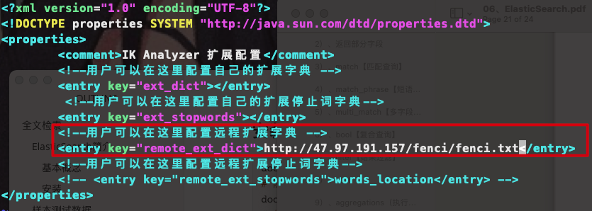
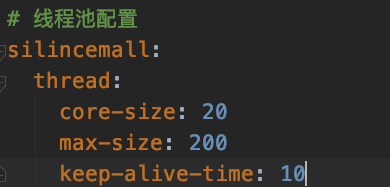
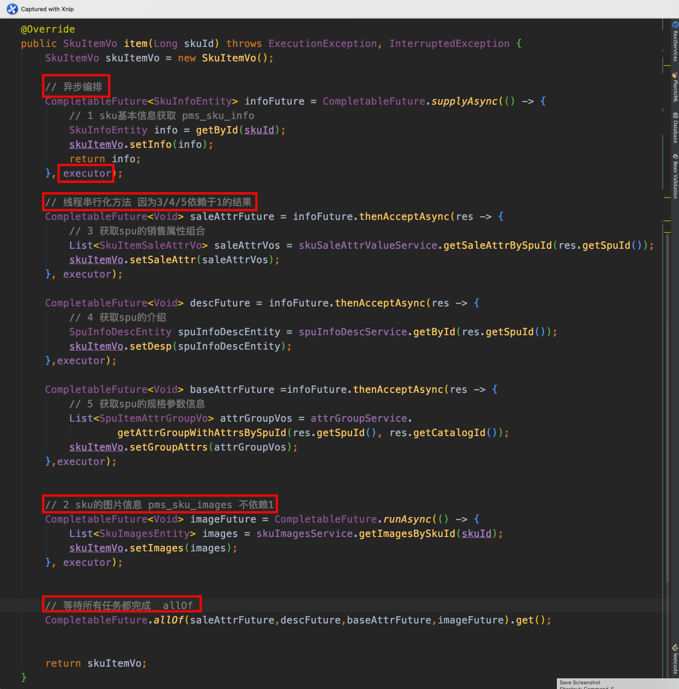
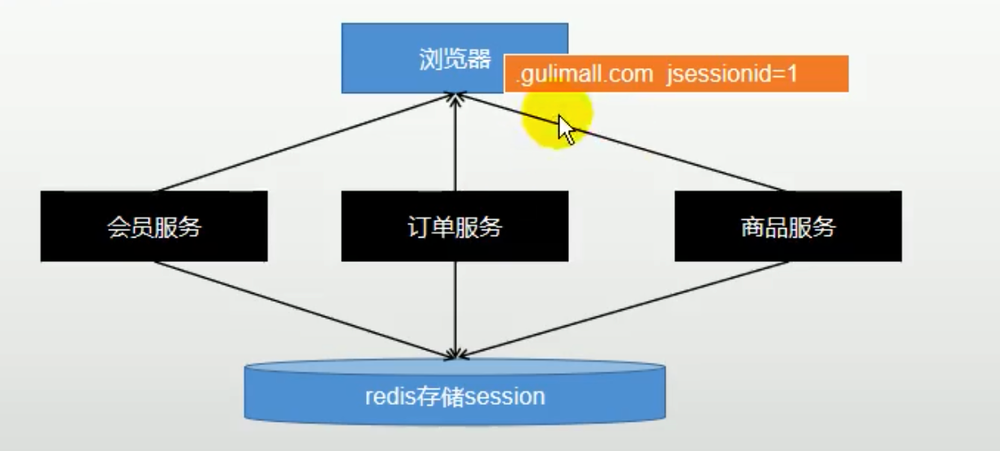
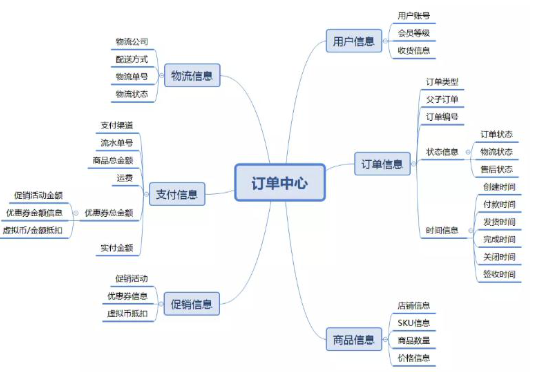
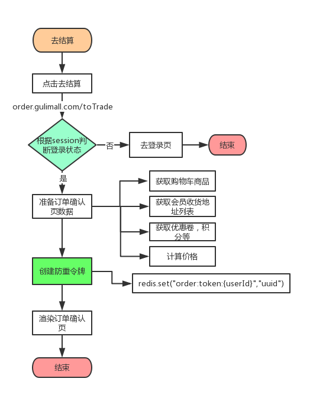
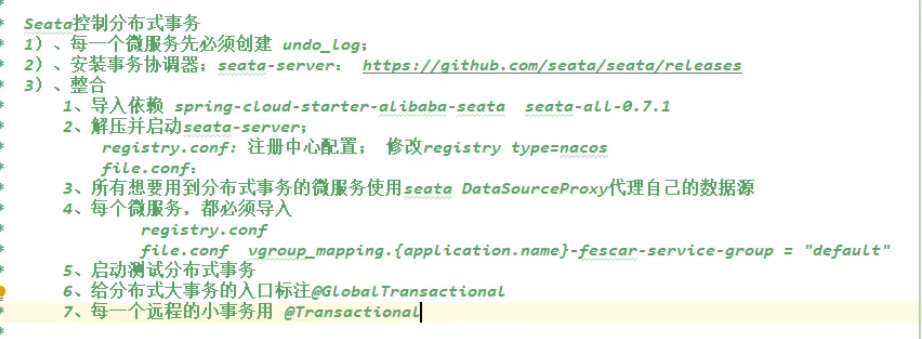
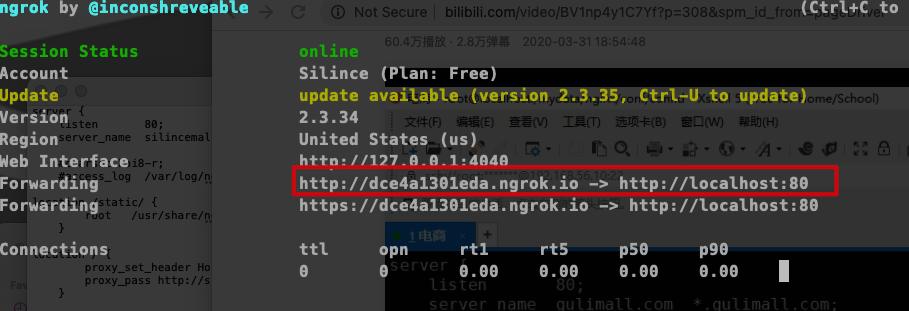
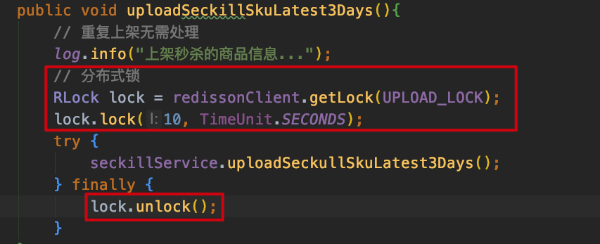
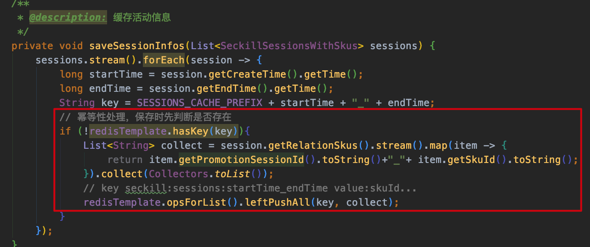

# 全文检索

## ElasticSearch简介

全文搜索属于最常见的需求，开源的 [Elasticsearch](https://www.elastic.co/cn/what-is/elasticsearch) 是目前全文搜索引擎的首选。 它可以快速地储存、搜索和分析海量数据。

Elastic 的底层是开源库 Lucene。但是，你没法直接用 Lucene，必须自己写代码去调用它的 接口。Elastic 是 Lucene 的封装，提供了 REST API 的操作接口，开箱即用。

REST API:天然的跨平台。 

**官方文档:https://www.elastic.co/guide/en/elasticsearch/reference/current/index.html** 

官方中文:https://www.elastic.co/guide/cn/elasticsearch/guide/current/foreword_id.html (翻译的比较早，不推荐)

社区中文:https://es.xiaoleilu.com/index.html  /  http://doc.codingdict.com/elasticsearch/0/


### 基本概念

**1、Index(索引) **

动词，相当于 MySQL 中的 insert;

名词，相当于 MySQL 中的 Database 

**2、Type(类型)**

在 Index(索引)中，可以定义一个或多个类型。 类似于 MySQL 中的 Table;每一种类型的数据放在一起;

**3、Document(文档)** 

保存在某个索引(Index)下，某种类型(Type)的一个数据(Document)，文档是 JSON 格

式的，Document 就像是 MySQL 中的某个 Table 里面的内容;


4、倒排索引机制

- 检索红海特工行动时：只要包含一个或多个分词就会被查出，因此记录1，2，3，4，5都会被查出，然后计算相关性得分取最高的检索出来。


### 安装

- 特别注意: `-e ES_JAVA_OPTS="-Xms64m -Xmx256m"`  测试环境下，设置 ES 的初始内存和最大内存，否则导致过大启动不了 ES

```shell
docker pull elasticsearch:7.4.2 #存储和检索数据 
docker pull kibana:7.4.2 #可视化检索数据
# 创建实例
mkdir -p /mydata/elasticsearch/config
mkdir -p /mydata/elasticsearch/data
echo "http.host: 0.0.0.0" >> /mydata/elasticsearch/config/elasticsearch.yml #所有ip都能访问
chmod -R 777 /mydata/elasticsearch #保证权限
# 启动实例
docker run --name elasticsearch -p 9200:9200 -p 9300:9300  -e "discovery.type=single-node" -e ES_JAVA_OPTS="-Xms64m -Xmx256m" -v /mydata/elasticsearch/config/elasticsearch.yml:/usr/share/elasticsearch/config/elasticsearch.yml -v /mydata/elasticsearch/data:/usr/share/elasticsearch/data -v /mydata/elasticsearch/plugins:/usr/share/elasticsearch/plugins -d elasticsearch:7.4.2
```

- 启动 Kibana `ELASTICSEARCH_HOSTS`为服务器地址

```shell
docker run --name kibana -e ELASTICSEARCH_HOSTS=http://47.97.191.157:9200 -p 5601:5601 -d kibana:7.4.2
```


## 样本测试数据

一份顾客银行账户信息的虚构的 JSON 文档样本。每个文档都有下列的 schema(模式)：

导入测试数据:

- [数据地址](https://github.com/elastic/elasticsearch/blob/master/docs/src/test/resources/accounts.json?raw=true )

```json
{
  "account_number": 0,
  "balance": 16623,
  "firstname": "Bradshaw",
  "lastname": "Mckenzie",
  "age": 29,
  "gender": "F",
  "address": "244 Columbus Place", "employer": "Euron",
  "email": "bradshawmckenzie@euron.com", "city": "Hobucken",
  "state": "CO"
}
```

- POST bank/account/_bulk


## 进阶检索

### SearchAPI

> 官方文档地址：https://www.elastic.co/guide/en/elasticsearch/reference/7.5/getting-started-search.html

ES 支持两种基本方式检索 :

- 一个是通过使用 REST request URI 发送搜索参数(uri+检索参数) 
- 另一个是通过使用 REST request body 来发送它们(uri+请求体)

**1**)、检索信息

- 一切检索从_search开始


- **uri+请求体进行检索**


### [Query DSL](https://www.elastic.co/guide/en/elasticsearch/reference/7.5/query-dsl.html)

**1**)、基本语法格式

**Elasticsearch** 提供了一个可以执行查询的 **Json** 风格的 **DSL**(**domain-specific language** 领域特 定语言)。这个被称为 Query DSL。该查询语言非常全面，并且刚开始的时候感觉有点复杂， 真正学好它的方法是从一些基础的示例开始的。

- 一个查询语句 的典型结构

```json
{
  QUERY_NAME: {
    ARGUMENT: VALUE,
    ARGUMENT: VALUE,... 
  }
}
```

- 如果是针对某个字段，那么它的结构如下:

```json
{
  QUERY_NAME:{
   FIELD_NAME:{
     ARGUMENT: VALUE,
     ARGUMENT: VALUE...
 		}
	}
}
```


**2**)、返回部分字段

```json
GET bank/_search {
  "query": {
    "match_all": {} 
  },
  "from": 0,
  "size": 5,
  "_source": ["age","balance"]
}
```

**3**)、**match**【匹配查询】 

- 基本类型(非字符串）,精确匹配 

```json
GET bank/_search  # match 返回 account_number=20 的
{
  "query": {
    "match": {
      "account_number": "20" 
    }
  } 
}
```

- 字符串，全文检索

```json
# 最终查询出 address 中包含 mill 单词的所有记录
# match 当搜索字符串类型的时候，会进行全文检索，并且每条记录有相关性得分。
GET bank/_search 
{
  "query": { 
    "match": {
      "address": "mill" 
    }
  } 
}
```

- 字符串，多个单词(分词+全文检索)

```json
GET bank/_search  # 最终查询出 address 中包含 mill 或者 road 或者 mill road 的所有记录，并给出相关性得分
{
  "query": { 
    "match": {
      "address": "mill road" 
    }
  } 
}
```

**4**)、**match_phrase**【短语匹配】

将需要匹配的值当成一个整体单词(不分词)进行检索

```json
GET bank/_search  # 查出 address 中包含 mill road 的所有记录，并给出相关性得分
{
  "query": { 
    "match_phrase": {
      "address": "mill road" 
    }
  } 
}
```

**5**)、**multi_match**【多字段匹配】

```json
GET bank/_search # state 或者 address 包含 mill
{
  "query": { 
    "multi_match": {
      "query": "mill",
      "fields": ["state","address"] 
    }
  } 
}
```

**6**)、**bool**【复合查询】

复合语句可以合并 任何 其它查询语句，包括复合语句，了解这一点是很重要的。这就意味 着，复合语句之间可以互相嵌套，可以表达非常复杂的逻辑。

- **must**:必须达到**must**列举的所有条件

```json
GET bank/_search {
  "query": { 
    "bool": {
      "must": [
        { "match": { "address": "mill" } },
        { "match": { "gender": "M" } } ]
    } 
  }
}
```

- **should**:应该达到**should**列举的条件，如果达到会增加相关文档的评分，并不会改变 查询的结果。如果 query 中只有 should 且只有一种匹配规则，那么 should 的条件就会被作为默认匹配条件而去改变查询结果

```json
GET bank/_search {
  "query": { 
    "bool": {
      "must": [{ 
        "match": { "address": "mill" } }, { "match": { "gender": "M" } }
              ], 
      "should": [{
        "match": { "address": "lane" }} ]
    } 
  }
}
```

- **must_not**必须不是指定的情况

```json
# address 包含 mill，并且 gender 是 M，如果 address 里面有 lane 最好不过，但是 email 必 须不包含 baluba.com
GET bank/_search { 
  "query": { 
    "bool": {
      "must": [
        { "match": { "address": "mill" } }, { "match": { "gender": "M" } }
      ], 
      "should": [
        {"match": { "address": "lane" }} 
      ],
      "must_not": [
        {"match": { "email": "baluba.com" }}
      ] 
    }
  }
}
```


**7**)、**filter**【结果过滤】

并不是所有的查询都需要产生分数，特别是那些仅用于 “**filtering**”(过滤)的文档。为了不计算分数 **Elasticsearch** 会自动检查场景并且优化查询的执行。

```json
GET bank/_search {
  "query": { 
    "bool": {
      "must": [
        {"match": { "address": "mill"}}
      ],
      "filter": {
        "range": { 
          "balance": {
            "gte": 10000,
            "lte": 20000 
          }
        } 
      }
    } 
  }
}
```


**8**)、**term**

和 match 一样。匹配某个属性的值。全文检索字段用 **match**，其他非 **text** 字段匹配用 **term**

```json
GET bank/_search 
{
  "query": { 
    "bool": {
      "must": [ 
        {"term": {
          "age": { 
            "value": "28"
          } 
        }},
        {"match": {
          "address": "990 Mill Road"
        }}
      ]
    } 
  }
}
```

**9**)、**aggregations**(执行聚合)

聚合提供了从数据中分组和提取数据的能力。最简单的聚合方法大致等于 **SQL GROUP BY** 和 **SQL** 聚合函数。在 **Elasticsearch** 中，您有执行搜索返回 **hits**(命中结果)，并且同时返 回聚合结果，把一个响应中的所有 **hits**(命中结果)分隔开的能力。这是非常强大且有效的， 您可以执行查询和多个聚合，并且在一次使用中得到各自的(任何一个的)返回结果，使用 一次简洁和简化的 **API** 来避免网络往返。

- 搜索**address**中包含**mill**的所有人的年龄分布以及平均年龄，但不显示这些人的详情。

```json
GET bank/_search {
  "query": { 
    "match": {
      "address": "mill" 
    }
  }, 
  "aggs": {
    "group_by_state": { 
      "terms": {
        "field": "age" }
    }, 
    "avg_age": {
      "avg": {
        "field": "age" }
    } 
  },
  "size": 0 
}
```


- 复杂:按照年龄聚合，并且请求这些年龄段的这些人的平均薪资

```json
GET bank/account/_search {
  "query": { 
    "match_all": {}
  }, 
  "aggs": {
    "age_avg": { 
      "terms": {
        "field": "age",
        "size": 1000 
      },
      "aggs": { 
        "banlances_avg": {
          "avg": {
            "field": "balance"
          } 
        }
      } 
    }
  },
  "size": 1000
}
```

- 复杂:查出所有年龄分布，并且这些年龄段中 M 的平均薪资和 F 的平均薪资以及这个年龄 段的总体平均薪资

```json
GET bank/account/_search
{
  "query": {
    "match_all": {} 
  },
  "aggs": { 
    "age_agg": {
      "terms": { 
        "field": "age", 
        "size": 100
      }, 
      "aggs": {
        "gender_agg": { 
          "terms": {
            "field": "gender.keyword",
            "size": 100 
          },
          "aggs": { 
            "balance_avg": {
              "avg": {
                "field": "balance"
              } 
            }
          } 
        },
        "balance_avg":{ 
          "avg": {
            "field": "balance" 
          }
        } 
      }
    } 
  },
  "size": 1000 
}
```

---

### Mapping

**1**)、字段类型


**2**)、映射

**Mapping** 是用来定义一个文档(**document**)，以及它所包含的属性(**field**)是如何存储和 索引的。比如，使用 mapping 来定义:

- 哪些字符串属性应该被看做全文本属性(full text fields)。 
- 哪些属性包含数字，日期或者地理位置。
- 文档中的所有属性是否都能被索引(_all 配置)。
- 日期的格式。
- 自定义映射规则来执行动态添加属性
- 查看mapping信息: `GET bank/_mapping`
- 修改mapping信息


**3**)、新版本改变

Es7 及以上移除了 type 的概念。

- 关系型数据库中两个数据表示是独立的，即使他们里面有相同名称的列也不影响使用，但 ES 中不是这样的。elasticsearch 是基于 Lucene 开发的搜索引擎，而 ES 中不同 type 下名称相同的 filed 最终在 Lucene 中的处理方式是一样的。
  -  两个不同type下的两个user_name，在ES同一个索引下其实被认为是同一个filed，你必须在两个不同的 type 中定义相同的 filed 映射。否则，不同 type 中的相同字段名称就会在处理中出现冲突的情况，导致 Lucene 处理效率下降。
  - 去掉type就是为了提高ES处理数据的效率。

Elasticsearch 7.x

- URL中的type参数为可选。比如，索引一个文档不再要求提供文档类型。 Elasticsearch 8.x
- 不再支持URL中的type参数。

 解决:

1)、将索引从多类型迁移到单类型，每种类型文档一个独立索引 

2)、将已存在的索引下的类型数据，全部迁移到指定位置即可。详见数据迁移

1. 创建映射
2. 添加新的字段映射
3. 更新映射
4. 数据迁移

## 分词

一个 **tokenizer**(分词器)接收一个字符流，将之分割为独立的 **tokens**(词元，通常是独立 的单词)，然后输出 **tokens** 流。例如，whitespace **tokenizer** 遇到空白字符时分割文本。它会将文本 "**Quick brown fox!**" 分割 为 [**Quick**, **brown**, **fox!**]。

该 **tokenizer**(分词器)还负责记录各个 **term**(词条)的顺序或 **position** 位置(用于 **phrase** 短 语和 **word proximity** 词近邻查询)，以及 **term**(词条)所代表的原始 **word**(单词)的 **start** (起始)和 **end**(结束)的 **character offsets**(字符偏移量)(用于高亮显示搜索的内容)。 **Elasticsearch** 提供了很多内置的分词器，可以用来构建 custom analyzers(自定义分词器)。

### 安装 **ik** 分词器

注意:不能用默认 elasticsearch-plugin install xxx.zip 进行自动安装

```shell
docker exec -it 容器 id /bin/bash
cd /elasticsearch//plugins/ik
wget https://github.com/medcl/elasticsearch-analysis-ik/releases/download/v7.4.2/elasticsearch-analysis-ik-7.4.2.zip
unzip elasticsearch-analysis-ik-7.4.2.zip
# 可以确认是否安装好了分词器
cd bin
elasticsearch-plugin list:即可列出系统的分词器
```


### 安装 **nginx**

```shell
docker pull nginx:1.10
# 随便启动一个nginx实例，只是为了复制出配置
docker run -p 80:80 --name nginx -d nginx:1.10
# 将容器内的配置文件拷贝到当前目录:
docker container cp nginx:/etc/nginx ./
# 修改文件名称,并把这个 conf 移动到 /Users/silince/Applications/docker/mydata/nginx 下
mv nginx conf 
mv conf /Users/silince/Applications/docker/mydata/nginx
# 删除容器
docker stop nginx && docker rm nginx
# 创建新的nginx;执行以下命令
docker run -p 80:80 --name nginx -v /Users/silince/Applications/docker/mydata/nginx/html:/usr/share/nginx/html  -v /Users/silince/Applications/docker/mydata/nginx/logs:/var/log/nginx -v /Users/silince/Applications/docker/mydata/nginx/conf:/etc/nginx -d nginx:1.10
```


### 自定义词库

1）修改 `/mydata/elasticsearch/plugins/ik/config` 中的  `IKAnalyzer.cfg.xml`



2）在nginx的html文件夹下：

```shell
mkdir fenci
cd fenci
vim fenci.txt # 在该文件中加入分词
```

然后重启 es 服务器，重启 nginx。

更新完成后，es 只会对新增的数据用新词分词。历史数据是不会重新分词的。如果想要历 史数据重新分词。需要执行:

```shell
POST my_index/_update_by_query?conflicts=proceed
```


## **Elasticsearch-Rest-Client**

1)、9300:TCP

- spring-data-elasticsearch:transport-api.jar;
  - springboot版本不同，**transport-api.jar**不同，不能适配es版本
  - 7.x已经不建议使用，8以后就要废弃

2)、9200:HTTP

- JestClient:非官方，更新慢
- RestTemplate:模拟发HTTP请求，ES很多操作需要自己封装，麻烦
- HttpClient:同上
- Elasticsearch-Rest-Client:官方RestClient，封装了ES操作，API层次分明，上手简单

最终选择 [Elasticsearch-Rest-Client(elasticsearch-rest-high-level-client) ](https://www.elastic.co/guide/en/elasticsearch/client/java-rest/current/java-rest-high.html)

### SpringBoot 整合

1）导入依赖

```xml
<dependency>
  <groupId>org.elasticsearch.client</groupId>
  <artifactId>elasticsearch-rest-high-level-client</artifactId>
  <version>7.4.2</version>
</dependency>
```


2）配置


3）使用 [官方文档 ](https://www.elastic.co/guide/en/elasticsearch/client/java-rest/current/java-rest-high.html)

```java
/**
 * @description: 测试存储数据到es/更新也可以
 * https://www.elastic.co/guide/en/elasticsearch/client/java-rest/current/java-rest-high-document-index.html
 */
@Test
public void indexData() throws IOException {
  IndexRequest indexRequest = new IndexRequest("users");
  indexRequest.id("1");
  User user = new User();
  user.setUsername("silince");
  user.setGender("man");
  user.setAge(18);
  indexRequest.source(JSON.toJSONString(user), XContentType.JSON); // 要保存的内容
  // 执行操作
  IndexResponse index = client.index(indexRequest, SilincemallElasticSearchConfig.COMMON_OPTIONS);
  System.out.println(index);
}

/**
 * @description: 复杂检索
 * https://www.elastic.co/guide/en/elasticsearch/client/java-rest/current/java-rest-high-search.html
 */
@Test
public void searchData() throws Exception{
  // 1. 创建检索请求
  SearchRequest searchRequest = new SearchRequest();
  // 指定索引
  searchRequest.indices("bank");
  // 指定DSL，检索条件
  SearchSourceBuilder sourceBuilder = new SearchSourceBuilder();
  // 1.1 构造检索条件
  sourceBuilder.query(QueryBuilders.matchQuery("address","mill"));
  // 1.2 按照年龄的值分布进行聚合
  TermsAggregationBuilder ageAgg = AggregationBuilders.terms("ageAgg").field("age").size(10);
  sourceBuilder.aggregation(ageAgg);
  // 1.3 计算平均薪资
  AvgAggregationBuilder balanceAvg = AggregationBuilders.avg("balanceAvg").field("balance");
  sourceBuilder.aggregation(balanceAvg);

  searchRequest.source(sourceBuilder);

  // 2. 执行检索
  SearchResponse searchResponse = client.search(searchRequest, SilincemallElasticSearchConfig.COMMON_OPTIONS);
  // 3. 分析结果
  System.out.println("检索条件: "+sourceBuilder.toString());
  System.out.println(searchResponse.toString());
  // 3.1 获取到所有查到的数据
  SearchHits hits = searchResponse.getHits();
  SearchHit[] searchHits = hits.getHits();
  for (SearchHit searchHit : searchHits) {
    String string = searchHit.getSourceAsString();
    Account account = JSON.parseObject(string, Account.class);
    System.out.println("account: "+ account.toString());
  }
  // 3.2 获取这次检索到的分析信息
  Aggregations aggregations = searchResponse.getAggregations();
  if (aggregations!=null){
    Terms ageAgg1 = aggregations.get("ageAgg");
    for (Terms.Bucket bucket : ageAgg1.getBuckets()) {
      String keyAsString = bucket.getKeyAsString();
      System.out.println("年龄: "+keyAsString+"==>"+bucket.getDocCount());
    }

    Avg balanceAvg1 = aggregations.get("balanceAvg");
    System.out.println("平均薪资: "+balanceAvg1.getValue());
  }
}
```

## ES实现日志分析


# 商品上架

> 上架的商品才可以在网站展示。上架的商品需要可以被检索。

## 商品 Mapping

分析:商品上架在 es 中是存 sku 还是 spu?

1)、检索的时候输入名字，是需要按照 sku 的 title 进行全文检索的 

2)、检索使用商品规格，规格是 spu 的公共属性，每个 spu 是一样的

3)、按照分类 id 进去的都是直接列出 spu 的，还可以切换。

4)、我们如果将 sku 的全量信息保存到 es 中(包括 spu 属性)就太多量字段了。 

5)、我们如果将 spu 以及他包含的 sku 信息保存到 es 中，也可以方便检索。但是 sku 属于 spu 的级联对象，在 es 中需要 **nested** 模型，这种性能差点。

 6)、但是存储与检索我们必须性能折中。

 7)、如果我们分拆存储，spu 和 attr 一个索引，sku 单独一个索引可能涉及的问题。 检索商品的名字，如“手机”，对应的 spu 有很多，我们要分析出这些 spu 的所有关联属性， 再做一次查询，就必须将所有 spu_id 都发出去。假设有 1 万个数据，数据传输一次就 10000*4=4MB;并发情况下假设 1000 检索请求，那就是 4GB 的数据，传输阻塞时间会很长，业务更加无法继续。

**所以，我们如下设计，这样才是文档区别于关系型数据库的地方，宽表设计，不能去考虑数据库范式。**

- 使用kibana创建映射
  - **index**:
     默认 true，如果为 false，表示该字段不会被索引，但是检索结果里面有，但字段本身不能当做检索条件。
  - **doc_values**:
     默认 true，设置为 false，表示不可以做排序、聚合以及脚本操作，这样更节省磁盘空间。 还可以通过设定 doc_values 为 true，index 为 false 来让字段不能被搜索但可以用于排序、聚合以及脚本操作。

```json
PUT product
{
  "mappings": { 
    "properties": {
      "skuId": { 
        "type": "long"
      }, 
      "spuId": {
        "type": "keyword" },
      "skuTitle": {
        "type": "text", "analyzer": "ik_smart"
      }, 
      "skuPrice": {
        "type": "keyword" 
      },
      "skuImg": {
        "type": "keyword",
        "index": false,
        "doc_values": false 
      },
      "saleCount": { 
        "type": "long"
      }, 
      "hasStock": {
        "type": "boolean" 
      },
      "hotScore": { 
        "type": "long"
      },
      "brandId": {
        "type": "long" 
      },
      "catalogId": { 
        "type": "long"
      }, 
      "brandName": {
        "type": "keyword", 
        "index": false, 
        "doc_values": false
      }, 
      "brandImg": {
        "type": "keyword", 
        "index": false, 
        "doc_values": false
      }, 
      "catalogName": {
        "type": "keyword",
        "index": false, 
        "doc_values": false
      }, 
      "attrs": {
        "type": "nested", 
        "properties": {
          "attrId": { 
            "type": "long"
          }, 
          "attrName": {
            "type": "keyword", 
            "index": false, 
            "doc_values": false
          },
          "attrValue": { 
            "type": "keyword"
          }}
      }}
  }}
```


## nested的作用

不使用nested时候，[ES中数组的扁平化处理](https://www.elastic.co/guide/en/elasticsearch/reference/7.5/nested.html)


## 上架细节

上架是将后台的商品放在 es 中可以提供检索和查询功能 

1)、hasStock:代表是否有库存。默认上架的商品都有库存。如果库存无货的时候才需要更新一下 es

2)、库存补上以后，也需要重新更新一下 es

3)、hotScore 是热度值，我们只模拟使用点击率更新热度。点击率增加到一定程度才更新热度值。

4)、下架就是从 es 中移除检索项，以及修改 mysql 状态

商品上架步骤:

1)、先在 es 中按照之前的 mapping 信息，建立 product 索引。 

2)、点击上架，查询出所有 sku 的信息，保存到 es 中

3)、es 保存成功返回，更新数据库的上架状态信息。

## 数据一致性

1)、商品无库存的时候需要更新 es 的库存信息 

2)、商品有库存也要更新 es 的信息


## 商品上架API

> [API-商品上架](https://github.com/Silincee/SilinceMall/blob/master/note/接口文档/后台管理系统接口/商品系统/20、商品上架 - 谷粒商城 - 易文档.pdf)

cn.silince.silincemall.product.controller.SpuInfoController::spuUp


# 商城首页

如果商城首页也用前后端分离的方式部署的话，就会屏蔽掉很多细节。

出于教学考虑，首页首页才用服务端的页面渲染开发(*Thymeleaf*)。

微服务最终的部署架构：

- 用户访问所有请求首先访问nginx
- 然后nginx作为反向代理将数据转发给网关，网关(统一的鉴权认证/限流)再路由到各个服务
- nginx主要用于部署静态资源(部署的**动静分离**),可以分担微服务的压力
  - 静：图片/js/css等静态资源(以实际文件存在的方式)
  - 动：服务器需要处理的请求


## Thymeleaf模版引擎

- 静态资源都放在static文件夹下就可以按照路径直接访问
- 页面放在templates下，直接访问
- springboot访问项目的时候，默认会找index
- 页面修改实时更新(不重启服务器)

1）引入*Thymeleaf*坐标

```xml
<!--Thymeleaf-->
<dependency>
  <groupId>org.springframework.boot</groupId>
  <artifactId>spring-boot-starter-thymeleaf</artifactId>
</dependency>
```

2）放置静态资源


3）配置文件


4）页面修改实时更新(不重启服务器)

- 引入坐标

```xml
<dependency>
  <groupId>org.springframework.boot</groupId>
  <artifactId>spring-boot-devtools</artifactId>
  <optional>true</optional>
</dependency>
```

- 重新编译资源(前提是已经关闭了缓存)

  


## nginx

### 正向代理和反向代理


### nginx配置文件


- 配置本地dns，修改/etc/hosts文件

```shell
127.0.0.1 silincemall.com
```

- 让nginx帮我们进行反向代理，所有来自原silincemall.com的请求，都转到网关

  - 在总配置文件 nginx.conf中配置上游服务器

    

  - server块中配置转发规则

    

  - 在网关配置路由规则，记得放在最后面

    

### 域名映射效果

- 请求接口 silincemall.com
- 请求页面 silincemall.com
- nginx直接代理给网关，网关会进行判断
  - 如果是`/api/** ` ,会转交给对应的服务器
  - 如果是 满足域名规则，则转交给对应的微服务服务器

 

# 性能压测

压力测试考察当前软硬件环境下系统所能承受的最大负荷并帮助找出系统瓶颈所在。压测都 是为了系统在线上的处理能力和稳定性维持在一个标准范围内，做到心中有数。

使用压力测试，我们有希望找到很多种用其他测试方法更难发现的错误。有两种错误类型是: 内存泄漏，并发与同步。

有效的压力测试系统将应用以下这些关键条件:重复，并发，量级，随机变化。

## 性能指标

- 响应时间(Response Time: RT) ：响应时间指用户从客户端发起一个请求开始，到客户端接收到从服务器端返回的响 应结束，整个过程所耗费的时间。

- HPS(Hits Per Second) :每秒点击次数，单位是次/秒。

- **TPS(Transaction per Second):系统每秒处理交易数(一个完整的业务)，单位是笔/秒。**

- **QPS(Query per Second):系统每秒处理查询次数，单位是次/秒。**

  对于互联网业务中，如果某些业务有且仅有一个请求连接，那么 TPS=QPS=HPS，一 般情况下用 TPS 来衡量整个业务流程，用 QPS 来衡量接口查询次数，用 HPS 来表 示对服务器单击请求。

- 无论TPS、QPS、HPS,此指标是衡量系统处理能力非常重要的指标，越大越好，根据经 验，一般情况下:

  - 金融行业:1000TPS~50000TPS，不包括互联网化的活动 
  - 保险行业:100TPS~100000TPS，不包括互联网化的活动 
  - 制造行业:10TPS~5000TPS 
  - 互联网电子商务:10000TPS~1000000TPS 
  - 互联网中型网站:1000TPS~50000TPS 
  - 互联网小型网站:500TPS~10000TPS

- 最大响应时间(Max Response Time) 指用户发出请求或者指令到系统做出反应(响应) 的最大时间。

- 最少响应时间(Mininum ResponseTime)指用户发出请求或者指令到系统做出反应(响应)的最少时间。

- 90%响应时间(90% Response Time) 是指所有用户的响应时间进行排序，第 90%的响应时间。

- **从外部看，性能测试主要关注如下三个指标**

  - **吞吐量:每秒钟系统能够处理的请求数、任务数。**
  - **响应时间:服务处理一个请求或一个任务的耗时。**
  - **错误率:一批请求中结果出错的请求所占比例。**

  

## JMeter

[Jmeter高并发测试](http://www.silince.cn/2020/11/23/Jmeter压测/)

- 有错误率同开发确认，确定是否允许错误的发生或者错误率允许在多大的范围内;
- Throughput吞吐量每秒请求的数大于并发数，则可以慢慢的往上面增加;若在压测的机 器性能很好的情况下，出现吞吐量小于并发数，说明并发数不能再增加了，可以慢慢的往下减，找到最佳的并发数;
- 压测结束，登陆相应的web服务器查看CPU等性能指标，进行数据的分析;
- 最大的tps，不断的增加并发数，加到tps达到一定值开始出现下降，那么那个值就是最大的 tps。
- 最大的并发数:最大的并发数和最大的tps是不同的概率，一般不断增加并发数，达到一个值后，服务器出现请求超时，则可认为该值为最大的并发数。
- 压测过程出现性能瓶颈，若压力机任务管理器查看到的cpu、网络和cpu都正常，未达到 90%以上，则可以说明服务器有问题，压力机没有问题。 
- **影响性能考虑点包括:**
  - **数据库、应用程序、中间件(tomact、Nginx)、网络和操作系统等方面** 
- 首先考虑自己的应用属于**CPU密集型还是IO密集型**


## 性能监控

### jvisualvm

监控内存泄露，跟踪垃圾回收，执行时内存、cpu 分析，线程分析。

在终端输入 `jvisualvm` 启动


- 运行:正在运行的

- 休眠:sleep

- 等待:wait 
- 驻留:线程池里面的空闲线程
- 监视:阻塞的线程，正在等待锁


### 安装插件方便查看gc


### 监控指标

#### 中间件指标

- 当前正在运行的线程数不能超过设定的最大值。一般情况下系统性能较好的情况下，线程数最小值设置 50 和最大值设置 200 比较合适。
- 当前运行的JDBC连接数不能超过设定的最大值。一般情况下系统性能较好的情况下， JDBC 最小值设置 50 和最大值设置 200 比较合适。
- GC频率不能频繁，特别是 FULL GC 更不能频繁，一般情况下系统性能较好的情况下， JVM 最小堆大小和最大堆大小分别设置 1024M 比较合适。


#### 数据库指标

- SQL耗时越小越好，一般情况下微秒级别。
- 命中率越高越好，一般情况下不能低于95%。 
- 锁等待次数越低越好，等待时间越短越好。


### JVM 分析&调优

jvm 调优，调的是稳定，并不能带给你性能的大幅提升。服务稳定的重要性就不用多说了， 保证服务的稳定，gc 永远会是 Java 程序员需要考虑的不稳定因素之一。复杂和高并发下的 服务，必须保证每次 gc 不会出现性能下降，各种性能指标不会出现波动，gc 回收规律而且 干净，找到合适的 jvm 设置。Full gc 最会影响性能，根据代码问题，避免 full gc 频率。可以 适当调大年轻代容量，让大对象可以在年轻代触发 yong gc，调整大对象在年轻代的回收频 次，尽可能保证大对象在年轻代回收，减小老年代缩短回收时间;

#### 几个常用工具

| jstack | 查看 jvm 线程运行状态，是否有死锁现象等等信息                |
| ------ | ------------------------------------------------------------ |
| jinfo  | 可以输出并修改运行时的 java 进程的 opts。                    |
| jps    | 与 unix 上的 ps 类似，用来显示本地的 java 进程，可以查看本地运行着几个 java 程序，并显示他们的进程号。 |
| jstat  | 一个极强的监视 VM 内存工具。可以用来监视 VM 内存内的各种堆和非堆的大小 及其内存使用量。 |
| jmap   | 打印出某个 java 进程(使用 pid)内存内的所有'对象'的情况(如:产生那些对象， 及其数量) |

#### 命令示例

在使用这些工具前，先用 JPS 命令获取当前的每个 JVM 进程号，然后选择要查看的 JVM。


## 性能测试

### 测试nginx

- 线程组设置：50线程/s ，循环次数永远
- 测试地址：http://192.168.0.100/

- 在docker中查看nginx的运行情况 `docker stats`

- 测试结果：CPU密集型

  


### 测试网关

- 测试地址：http://localhost:88/
- 测试结果：CPU占用大，伊甸园区频繁触发GC


### 简单服务

- 测试地址：http://localhost:10000/hello
- 测试结果：


### Gateway+简单服务

- 测试地址：http://localhost:88/hello  注意修改网关路由规则避免经过nginx

  

### 全链路+简单服务

- 测试地址：http://silincemall.com/hello


### 首页一级菜单渲染

- 测试地址：http://localhost:10000/


### 三级分类数据获取

- http://localhost:10000/index/catalog.json


### 首页全量数据获取

- http://localhost:10000/


## 压测报告

结论：

- **中间件越多，性能损失越大，大多都损失在网络交互了;**
- 业务:
  - Db(MySQL优化)
  - 模板的渲染速度(缓存) 
  - 静态资源

| 压测内容                                  | 压测线程数 | 吞吐量/s               | 90%响应时间 | 99%响应时间 |
| ----------------------------------------- | ---------- | ---------------------- | ----------- | ----------- |
| **Nginx**                                 | 50         | 433.16                 | 95          | 512         |
| **Gateway**                               | 50         | 12886.48               | 5           | 16          |
| **简单服务**                              | 50         | 15209.34               | 4           | 8           |
| **首页一级菜单渲染**                      | 50         | 94.76(db,thymelef)     | 718         | 1358        |
| **首页渲染(开缓存)**                      | 50         | 98.64(db加了索引)      | 702         | 1436        |
| **首页渲染(开缓存、 优化数据库、关日志)** | 50         | 110.97                 | 691         | 1345        |
| **三级分类数据获取**                      | 50         | 1.6(db)/3.92(加了索引) | 30739       | 30852       |
| **三级分类(优化业务)**                    | 50         | 5.11                   | 16592       | 18957       |
| **三级分类(使用 redis 作为缓存)**         | 50         | 2049.65                | 27          | 56          |
| **首页全量数据获取**                      | 50         | 20(静态资源)           | 4155        | 4855        |
| Nginx+Gateway                             | 50         |                        |             |             |
| Gateway+简单服务                          | 50         | 4718.08                | 18          | 55          |
| 全链路+简单服务                           | 50         | 406.09                 | 122         | 501         |

⚠️ 加粗的数据表示只压测自己，不结合网关


# 性能优化

## 首页全量数据获取优化

吞吐量小的原因主要在于静态资源的获取也要交给tomcat处理，可以结合nginx进行优化。


1）以后将所有项目的静态资源都应该放在nginx里面

- `/Users/silince/Applications/docker/mydata/nginx/html/static`

2）规则:/static/*所有请求都由nginx直接返回


测试：

- http://localhost:10000/
- 同时修改JVM参数。`-Xmx1024m -Xms1024m -Xmn512m` ,防止OOM


## 三级分类(优化业务)

三级分类(优化业务) 将数据库的多次查询变为一次


- 测试：http://localhost:10000/index/catalog.json


# 缓存

## 缓存使用

为了系统性能的提升，我们一般都会将部分数据放入缓存中，加速访问。而 db 承担数据落盘工作。

哪些数据适合放入缓存?

- **即时性、数据一致性要求不高的**

- **访问量大且更新频率不高的数据(读多，写少)** 

举例:电商类应用，商品分类，商品列表等适合缓存并加一个失效时间(根据数据更新频率 来定)，后台如果发布一个商品，买家需要 5 分钟才能看到新的商品一般还是可以接受的。


伪代码：

⚠️ **在开发中，凡是放入缓存中的数据我们都应该指定过期时间，使其可以在系统即使没有主动更新数据也能自动触发数据加载进缓存的流程。避免业务崩溃导致的数据永久不一致问题。**

```java
data = cache.load(id);//从缓存加载数据 If(data == null)
{
  data = db.load(id);//从数据库加载数据
  cache.put(id,data);//保存到 cache 中 
}
return data;
```


## 分布式缓存


## 整合 redis 作为缓存

1）引入 redis-starter

```xml
<dependency> 
  <groupId>org.springframework.boot</groupId>
  <artifactId>spring-boot-starter-data-redis</artifactId>
</dependency>
```

2）配置 redis

```yaml
spring:
  redis:
    host: 47.97.191.157
    port: 6379
```

3）使用 RedisTemplate 操作 redis

```java
@Resource
private StringRedisTemplate stringRedisTemplate;

@Test
public void stringRedisTemplate() {
  ValueOperations<String, String> ops = stringRedisTemplate.opsForValue();
  // 保存
  ops.set("hello","world_"+ UUID.randomUUID().toString());
  // 查询
  String hello = ops.get("hello");
  System.out.println("之前保存的数据是: "+hello);

}
```

4）切换使用 jedis(老版客户端，可以避免堆外内存溢出)

```xml
<!-- redis-->
<dependency>
  <groupId>org.springframework.boot</groupId>
  <artifactId>spring-boot-starter-data-redis</artifactId>
  <exclusions>
    <exclusion>
      <groupId>io.lettuce</groupId>
      <artifactId>lettuce-core</artifactId>
    </exclusion>
  </exclusions>
</dependency>

<!-- jedis-->
<dependency>
  <groupId>redis.clients</groupId>
  <artifactId>jedis</artifactId>
</dependency>
```

## 使用缓存优化三级分类

```java
/**
 * @description:  三级分类(优化业务) 使用redis缓存优化
 */
@Override
public Map<String, List<Catelog2Vo>> getCatalogJson() {
  // 1. 加入缓存逻辑，缓存中存的数据是json字符串(跨平台兼容)
  String catalogJSON = stringRedisTemplate.opsForValue().get("catalogJSON");
  if (StringUtils.isEmpty(catalogJSON)){
    // 2 缓存中没有数据 需要查询数据库
    Map<String, List<Catelog2Vo>> catalogJsonFromDbByOnce = getCatalogJsonFromDbByOnce();
    // 3 查到的数据再次放入缓存，将对象转为json放在缓存在
    String s = JSON.toJSONString(catalogJsonFromDbByOnce);
    stringRedisTemplate.opsForValue().set("catalogJSON",s);
    return catalogJsonFromDbByOnce;
  }
  // 4 转为我们指定的对象
  Map<String, List<Catelog2Vo>> result = JSON.parseObject(catalogJSON, new TypeReference<Map<String, List<Catelog2Vo>>>() {
  });
  return result;
}
```

测试结果：http://localhost:10000/index/catalog.json


### 堆外内存溢出

**然而会出现堆外内存溢出：**

- springboot2.0以后默认使用lettuce作为操作redis的客户端。它使用netty进行网络通信。
- lettuce的bug导致netty堆外内存溢出 
- netty如果没有指定堆外内存，默认使用 JVM中配置的 `-Xmx100m`
- 原因：没有及时的释放内存，可以通过 `-Dio.netty.maxDirectMemory`进行设置


解决方案：不能通过 `-Dio.netty.maxDirectMemory`只去调大对外内存

- 方案一：升级lettuce客户端。 目前还没有完美的解决方案
- **方案二：切换使用 jedis**


## 缓存失效问题

> [Redis缓存雪崩-穿透和击穿/](http://www.silince.cn/2020/10/26/Redis缓存雪崩-穿透和击穿/)

### 缓存穿透

- 缓存穿透是指查询一个一定不存在的数据，由于缓存是不命中，将去查询数据库，但是数据库也无此记录，我们没有将这次查询的 null 写入缓存，这将导致这个不存在的数据每次请求都要到存储层去查询，失去了缓存的意义。
- 在流量大时，可能DB就挂掉了，要是有人利用不存在的key频繁攻击我们的应用，这就是漏洞。
- 解决: 缓存空结果、并且设置短的过期时间。


### 缓存雪崩

- 缓存雪崩是指在我们设置缓存时采用了相同的过期时间，导致缓存在某一时刻同时失效，请求全部转发到 DB，DB 瞬时压力过重雪崩。
- 解决:原有的失效时间基础上增加一个随机值，比如 1-5 分钟随机，这样每一个缓存的过期时间的 重复率就会降低，就很难引发集体失效的事件。

1. 

### 缓存击穿

- 对于一些设置了过期时间的key，如果这些key可能会在某些时间点被超高并发地访问， 是一种非常“热点”的数据。
- 这个时候，需要考虑一个问题:如果这个key在大量请求同时进来前正好失效，那么所 有对这个 key 的数据查询都落到 db，我们称为缓存击穿。
- 解决: 加锁 


## Redis分布式锁

> [Redis分布式锁](http://www.silince.cn/2020/12/05/Redis分布式锁/)

### 分布式锁与本地锁


### 分布式锁实现

> [Redis分布式锁](http://www.silince.cn/2020/12/05/Redis分布式锁/#以上案例存在的问题)

#### lua脚本


Lua脚本：

-  如果获取的值等去传过来的值ARGV[1]，就删除该key，否则返回0

```lua
if redis.call("get",KEYS[1]) == ARGV[1] then  
    return redis.call("del",KEYS[1])
else
    return 0
end
```

**仍然存在的问题：**

-  **确保redisLock过期时间大于业务执行时间的问题。Redis 分布式锁如何续期？**
- **集群存在的问题+CAP，，对比zookeeper**


#### Redisson实现分布式锁

> [Redis分布式锁/#8终极版-redisson](http://www.silince.cn/2020/12/05/Redis分布式锁/#8终极版-redisson)

**Redisson** 是架设在 **Redis** 基础上的一个 Java 驻内存数据网格(In-Memory Data Grid)。充分 的利用了 Redis 键值数据库提供的一系列优势，基于 **Java** 实用工具包中常用接口，为使用者 提供了一系列具有分布式特性的常用工具类。使得原本作为协调单机多线程并发程序的工 具包获得了协调分布式多机多线程并发系统的能力，大大降低了设计和研发大规模分布式 系统的难度。同时结合各富特色的分布式服务，更进一步简化了分布式环境中程序相互之间的协作。 [官方文档](https://github.com/redisson/redisson/wiki/%E7%9B%AE%E5%BD%95)

1）[配置](https://github.com/redisson/redisson/wiki/2.-配置方法)

- 导入依赖

```xml
<!-- https://mvnrepository.com/artifact/org.redisson/redisson -->
<dependency>
  <groupId>org.redisson</groupId>
  <artifactId>redisson</artifactId>
  <version>3.12.0</version>
</dependency>
```

- Redisson程序化的配置方法是通过构建`Config`对象实例来实现的。例如：

```java
@Configuration
public class MyRedisConfig {
    /**
    * @description: 所有对Redisson的使用都是通过RedissonClient对象
    */
    @Bean(destroyMethod="shutdown")
    public RedissonClient redisson() throws IOException {
        Config config = new Config();
        config.useSingleServer().setAddress("redis://47.97.191.157:6379");
        return Redisson.create(config);
    }
}
```


2）[使用分布式锁](https://github.com/redisson/redisson/wiki/8.-分布式锁和同步器)

- 解决了锁的自动续期，如果业务超长，运行期间自动给锁续上新的30s。不用担心业务时间长，锁自动过期被删除。（看门狗）
- 加锁的业务只要运行完成，就不会给当前锁续期，及时不手动解锁，也会在30s之后自动删除。（看门狗）
- ⚠️：如果使用`lock.lock(10,TimeUnit.SECONDS)` 设置的自动解锁时间一定要大于业务的执行时间，因为不会自动续期
  - 如果我们传递了锁的超时时间，就发送给redis执行脚本，进行占锁，默认超时就是我们指定的时间
  - 如果我们未指定锁的超时时间，就使用30* 1000 【LockWatchdogTimeout看门狗的默认时间】；
    - 只要占锁成功，就会启动一个定时任务【重新给锁设置过期时间，新的过期时间就是看门狗的默认时间
    - 续期频率：internallockleaseTime【看门狗时间】 / 3，10s

⭐️ 最佳实战

```java
lock.lock(30,TimeUnit.SECONDS); // 省掉了整个续期操作，业务也不太会超过30s
```


### Redisson补充

#### 读写锁ReadWriteLock

- 读锁必须等待写操作完毕
  - 修改期间写锁是一个排他锁
  - 而读锁是一个共享锁，读读相当于无锁
- ⚠️ 先读再写会发生什么？ 
  - 有读锁，写也需要等待
  - **总结：只要有写的存在，都必须有一方等待**
- 业务场景：保证一定能读到最新数据


#### 信号量Semaphore

- 先存一个 park,3


#### 闭锁CountDownLatch

- 所有线程全部完成了业务才算完成


# 缓存数据一致性

缓存数据一致性问题： 缓存里面的数据如何和数据库保持一致

## 双写模式

- 可能会产生脏数据
- 可以使用`@CachePut`实现


## 失效模式

- 也还是会产生脏数据
- 可以使用`@CacheEvict`实现


## 解决方案

> **无论是双写模式还是失效模式，都会导致缓存的不一致问题。即多个实例同时更新会出事。怎么办？**

- **如果是用户纬度数据（订单数据、用户数据），这种并发几率非常小，不用考虑这个问题，**缓存数据加上过期时间，每隔一段时间触发读的主动更新即可
- **如果是菜单，商品介绍等基础数据，也可以去使用canal订阅binlog的方式。**
- 缓存数据+过期时间也足够解决大部分业务对于缓存的要求。
- **通过加锁保证并发读写，写写的时候按顺序排好队。读读无所谓。所以适合使用读写锁。**（业务不关心脏数据，允许临时脏数据可忽略）；

**总结:**

- <u>我们能放入缓存的数据本就不应该是实时性、一致性要求超高的。所以缓存数据的时候加上过期时间,保证每天拿到当前最新数据即可。</u>
- <u>我们不应该过度设计,增加系统的复杂性</u>
- <u>遇到实时性、一致性要求高的数据,就应该查数据库,即使慢点。</u>


### 改进方法1-分布式读写锁

分布式读写锁。读数据等待写数据整个操作完成

### 改进方法 **2-**使用 **cananl**

- cananl是阿里开源的一个中间件，可以模拟为一个数据库的从服务器，一旦数据库有什么变化马上可以同步过来
- 因此只要业务代码更新了数据库，binlog日志就记录了更新，canal便可以拿过这些更新区更新redis中的缓存。
- 优点：不需要在编码期间进行操作


# **Spring Cache**

## 简介

> [官方文档](https://docs.spring.io/spring-framework/docs/5.2.14.BUILD-SNAPSHOT/spring-framework-reference/integration.html#cache-annotations)

- Spring从3.1开始定义了org.springframework.cache.**Cache** 和 org.springframework.cache.**CacheManager** 接口来统一不同的缓存技术; 并支持使用 JCache(JSR-107)注解简化我们开发;
- Cache接口为缓存的组件规范定义，包含缓存的各种操作集合; Cache 接口下 Spring 提供了各种 xxxCache 的实现;如 RedisCache，EhCacheCache , ConcurrentMapCache 等;
- 每次调用需要缓存功能的方法时，Spring会检查检查指定参数的指定的目标方法是否已 经被调用过;如果有就直接从缓存中获取方法调用后的结果，如果没有就调用方法并缓 存结果后返回给用户。下次调用直接从缓存中获取。
- **使用Spring缓存抽象时我们需要关注以下两点:**
  - **确定方法需要被缓存以及他们的缓存策略** 
  - **从缓存中读取之前缓存存储的数据**


## 注解

- `@Cacheable`: 触发将数据保存到缓存的操作
- `@CacheEvict`: 触发将数据从缓存删除的操作
- `@CachePut`:不影响方法执行更新缓存
- `@Caching`: 组合以上多个操作
- `@CacheConfig`: 在类级别共享缓存的相同配置


## 整合SpringCache简化缓存开发

1）导入起步依赖

```xml
<dependency>
  <groupId>org.springframework.boot</groupId>
  <artifactId>spring-boot-starter-cache</artifactId>
</dependency>
```

2）编写配置

- 自动配置项
  - CacheAutoConfiguration会导入RedisCacheConfiguration(包含了缓存管理器 RedisCacheManager)
- 配置使用redis作为缓存 `spring.cache.type=redis`


3）测试使用缓存

1. 在启动类开启缓存功能 `@EnableCaching`
2. 只需要使用注解就能完成缓存操作


3. 默认行为
   - 如果缓存中存在，方法不用被调用
   - key默认自动生成，缓存的名字：`SimpleKey [](自主生成的key值)`
   - 缓存value的值，默认之用jdk序列化机制，将序列化后的数据存到redis
   - 默认TTL时间是-1，永不过期
4. 自定义：
   - 指定生成的缓存使用的key：key属性指定，接受一个[SpEL表达式](https://docs.spring.io/spring-framework/docs/5.2.14.BUILD-SNAPSHOT/spring-framework-reference/integration.html#cache-spel-context)
   - 指定缓存的数据的存活时间：在配置文件中指定`spring.cache.redis.time-to-live=3600000`,单位毫秒
   - **将数据保存为JSON格式**

### 将数据保存为JSON格式步骤

**原理：**

> CacheAutoConfiguration ==> RedisCacheConfiguration ==>自动配置了 RedisCacheManager ==> 初始化所有的缓存 ==>
> 每个缓存决定使用说明配置 ==> 想改缓存的配置，只需要在容器中放一个 RedisCacheConfiguration 即可 ==> 就会应用到当前 RedisCacheManager 管理的所有缓存分区中

- 添加配置文件 


结果：


### 额外的一些配置项

```yml
spring:
  cache:
    type: redis
    redis:
      time-to-live: 3600000
      key-prefix: CACHE_ # 指定缓存key的前缀，未配置则使用缓存的名字作为前缀。不建议开启
      use-key-prefix: true # 默认使用前缀
      cache-null-values: true # 是否缓存空值(防止缓存穿透）
```


## 原理与不足

Spring-Cache的不足：

1）读模式：

- 缓存穿透：查询一个null数据。 解决：缓存空数据：cache-null-values: true
- 缓存击穿：大量并发进来同时查询一个正好过期的key。 解决：Spring-Cache默认是不加锁的
  - 可以通过  `@Cacheable(value = "category",key = "#root.method.name",sync = true)`  开启本地同步
- 缓存雪崩：大量的key同时过期。 解决：加上过期时间即可，加随机时间(看情况，很容易弄巧成拙) time-to-live: 3600000

2）写模式：缓存与数据库的一致性

- 读写加锁，使用与读多写少的系统
- 引入中间件 Canal，感知到Mysql的更新然后去更新redis缓存
- 读多写多的还是直接查询数据库就行


总结：

- 常规数据(读多写少,即时性一致性要求不高的数据)完全可以使用Spring-Cache。写模式只要有一个过期时间就足够了
- 特殊数据还想提高速度加缓存，就要特殊设计


原理：

- 缓存管理器CacheManager(RedisCacheManager)会帮我们造出很多缓存组件 Cache(RedisCache)负责缓存的读写

---


# 三级分类缓存一致性的最终方案

**失效模式+SpringCache本地同步锁：**

1. 缓存的所有数据都有过期时间，数据过期下一次触发主动更新 
2. SpringCache本地同步锁

1）失效模式的实现

> 约定：存储同一类型的数据，都可以指定成同一个分区。分区名默认就是缓存的前缀

- ⭐️方式一：清空category分区下的所有缓存

```java
@CacheEvict(value = "category",allEntries = true)
```

- 方式二：使用 `@Caching` 组合多个注解

```java
@Caching(evict = { // 组合多个注解
  @CacheEvict(value = "category",key = "'getLevel1Categorys'"),
  @CacheEvict(value = "category",key = "'getCatalogJson'")
})
```


2）SpringCache本地同步锁的实现

- 可以通过  `@Cacheable(value = "category",key = "#root.method.name",sync = true)`  开启本地同步
- 虽然不是分布式的同步锁，只是查询的话每个微服务放入一个请求其实没什么影响。


也可以使用分布式读写锁，就是太重量级了，没有必要。

读写数据加上分布式读写锁。

- 经常写，经常读那肯定有影响
- 然而三级分类缓存不经常发生改变，只读取的话一点影响都没有

- 写锁：


- 读锁：


# 检索服务

## 环境搭建

1）nginx配置域名转发和静态资源

- hosts文件中添加`127.0.0.1 search.silincemall.com`

- 修改nginx配置文件

  

- 修改网关配置

  

- 最终效果


## 检索业务分析

检索入口：

1. 选择商品分类进行检索


2. 输入检索关键字展示检索页


3. 选择筛选条件进入


## 检索条件和查询语句分析

检索条件&排序条件

- 全文检索:skuTitle
- 排序:saleCount、hotScore、skuPrice
- 过滤:hasStock、skuPrice区间、brandId、catalogId、attrs 
- 聚合:attrs

完整的 url 参数例子：

-  **keyword**=小米&**sort**=saleCount_desc/asc&**hasStock**=0/1&**skuPrice**=400_1900&**brandId**=1&**catalogId**=1&**attrs**=1_3G:4G:5G&**attrs**=2_骁龙 845&**attrs**=4_高清屏

1）构造请求参数对应的vo：

```java
/**
 * @program: SilinceMall
 * @description: 封装页面所有可能传递过来的检索条件vo
 * @author: Silince
 * @create: 2021-02-20 22:08
 **/
@Data
public class SearchParam {

  private String keyword; // 页面传递过来的全文匹配关键字
  private Long catelogId; // 三级分类id

  /**
    * @description: 排序条件
     * sort=saleCount_asc/desc
     * sort=skuPrice_asc/desc
     * sort=hotScore_asc/desc
    */
  private String sort;

  /**
    * @description: 过滤条件
     * hasStock、skuPrice区间、brandId、catalogId、attrs
     * hasStock=0/1
     * skuPrice=1_500/_500/500_
     * brandId=1
     * attrs=2_5寸:6寸
    */
  private Integer hasStock; // 是否只显示有货
  private String skuPrice; // 价格区间
  private List<Long> brandId; // 品牌id,可以多选
  private List<String> attrs; // 属性，可以多选
  private Integer pageNum; // 页码


}
```


2）ES查询语句

- 需要参与评分的放到must中，如skuTitle
- 不需要参与评分的字段就写到filter中，如brandId，catalogId等
- 属性查询必须使用嵌入式的查询方式
- 查询中需要包含
  - 模糊匹配
  - 过滤(按照属性，分类，品牌，价格区间，库存)
  - 排序
  - 分页
  - 高亮显示
  - 聚合分析 ⭐️

2.1）重新建立映射

```json
PUT silincemall_product
{
  "mappings" : {
    "properties" : {
      "attrs" : {
        "type" : "nested",
        "properties" : {
          "attrId" : {
            "type" : "long"
          },
          "attrName" : {
            "type" : "keyword"
          },
          "attrValue" : {
            "type" : "keyword"
          }
        }
      },
      "brandId" : {
        "type" : "long"
      },
      "brandImg" : {
        "type" : "keyword"
      },
      "brandName" : {
        "type" : "keyword"
      },
      "catalogId" : {
        "type" : "long"
      },
      "catalogName" : {
        "type" : "keyword"
      },
      "hasStock" : {
        "type" : "boolean"
      },
      "hotScore" : {
        "type" : "long"
      },
      "saleCount" : {
        "type" : "long"
      },
      "skuId" : {
        "type" : "long"
      },
      "skuImg" : {
        "type" : "keyword"
      },
      "skuPrice" : {
        "type" : "keyword"
      },
      "skuTitle" : {
        "type" : "text",
        "analyzer" : "ik_smart"
      },
      "spuId" : {
        "type" : "keyword"
      }
    }
  }
}
```

2.2）查询DSL

```json
GET silincemall_product/_search
{
  "query": {
    "bool": {
      "must": [
        {
          "match": {
            "skuTitle": "华为"
          }
        }
      ],
      "filter": [
        {
          "term": {
            "catalogId": "225"
          }
        },
        {
          "terms": {
            "brandId": [
              "1",
              "2",
              "12"
            ]
          }
        },
        {
          "nested": {
            "path": "attrs",
            "query": {
              "bool": {
                "must": [
                  {
                    "term": {
                      "attrs.attrId": {
                        "value": "2"
                      }
                    }
                  },
                  {
                    "terms": {
                      "attrs.attrValue": [
                        "LIO-AL00",
                        "LIO-AL01"
                      ]
                    }
                  }
                ]
              }
            }
          }
        },
        {
          "term": {
            "hasStock": {
              "value": "true"
            }
          }
        },
        {
          "range": {
            "skuPrice": {
              "gte": 0,
              "lte": 6000
            }
          }
        }
      ]
    }
  },
  "sort": [
    {
      "skuPrice": {
        "order": "desc"
      }
    }
  ],
  "from": 0,
  "size": 5,
  "highlight": {
    "fields": {"skuTitle": {}},
    "pre_tags": "<b style='color:red'>",
    "post_tags": "</b>"
  },
  "aggs": {
    "brand_agg": {
      "terms": {
        "field": "brandId",
        "size": 10
      },
      "aggs": {
        "brand_name_agg": {
          "terms": {
            "field": "brandName",
            "size": 10
          }
        },
        "brand_img_agg":{"terms": {
          "field": "brandImg",
          "size": 10
        }}
      }
    },
    "catalog_agg":{
      "terms": {
        "field": "catalogId",
        "size": 10
      },
      "aggs": {
        "catalog_name_agg": {
          "terms": {
            "field": "catalogName",
            "size": 10
          }
        }
      }
    },
    "attr_agg":{
      "nested": {
        "path": "attrs"
      },
      "aggs": {
        "attr_id_agg": {
          "terms": {
            "field": "attrs.attrId",
            "size": 10
          },
          "aggs": {
            "attr_name_agg": {
              "terms": {
                "field": "attrs.attrName",
                "size": 10
              }
            },
            "attr_value_agg":{
              "terms": {
                "field": "attrs.attrValue",
                "size": 10
              }
            }
          }
        }
      }
    }
  }
}
```

2.3）使用Java动态构建出DSL查询语句

```java
/**
 * @description: 准备检索请求
 */
private SearchRequest buildSearchRequest(SearchParam param) {
  SearchSourceBuilder sourceBuilder = new SearchSourceBuilder();// 构建DSL语句

  /**
   * 查询： 模糊匹配 过滤(属性 分类 品牌 价格区间 库存)
   */
  BoolQueryBuilder boolQuery = QueryBuilders.boolQuery();
  // must 模糊匹配
  if (!StringUtils.isEmpty(param.getKeyword())) {
    boolQuery.must(QueryBuilders.matchQuery("skuTitle", param.getKeyword()));
  }
  // bool-filter-按照三级分类id查询
  if (param.getCatelog3Id() != null) {
    boolQuery.filter(QueryBuilders.termQuery("catalogId", param.getCatelog3Id()));
  }
  // bool-filter-按照品牌id查询
  if (param.getBrandId() != null && param.getBrandId().size() > 0) {
    boolQuery.filter(QueryBuilders.termQuery("brandId", param.getBrandId()));
  }
  // bool-filter-按照所有指定的属性进行查询
  if (param.getAttrs()!=null&&param.getAttrs().size()>0){
    // attrs=2_5寸:6寸&&attrs=1_16G:8G
    for (String attrStr : param.getAttrs()) {
      BoolQueryBuilder nestedBoolQuery = QueryBuilders.boolQuery();

      String[] s = attrStr.split("_");
      String attrId = s[0]; // 检索属性的id
      String[] attrValues = s[1].split(":"); // 这个属性的检索用的值
      nestedBoolQuery.must(QueryBuilders.termQuery("attrs.attrId",attrId));
      nestedBoolQuery.must(QueryBuilders.termsQuery("attrs.attrValue",attrValues));
      // 每一个必须都生成一个nested查询
      NestedQueryBuilder nestedQuery = QueryBuilders.nestedQuery("attrs", nestedBoolQuery, ScoreMode.None);
      boolQuery.filter(nestedQuery);
    }


  }

  // bool-filter-按照库存是否有进行查询
  if(param.getHasStock() != null){
    boolQuery.filter(QueryBuilders.termQuery("hasStock", param.getHasStock() == 1));
  }
  // bool-filter-按照价格区间进行查询 skuPrice=1_500/_500/500_
  if (!StringUtils.isEmpty(param.getSkuPrice())) {
    RangeQueryBuilder rangeQuery = QueryBuilders.rangeQuery("skuPrice");
    String[] s = param.getSkuPrice().split("_");
    if (param.getSkuPrice().startsWith("_")) {
      // _500
      rangeQuery.lte(s[0]);
    }else if (param.getSkuPrice().endsWith("_")) {
      // 500_
      rangeQuery.gte(s[1]);
    }else {
      // 表示为查询区间 1_500
      rangeQuery.gte(s[0]).lte(s[1]);
    }
    boolQuery.filter(rangeQuery);

  }

  // 把以前所有查询条件都拿来进行封装
  sourceBuilder.query(boolQuery);

  /**
    * 排序 分页 高亮
    */
  // 排序 sort=saleCount_asc/desc
  if (!StringUtils.isEmpty(param.getSort())){
    String[] s = param.getSort().split("_");
    SortOrder order = s[1].equalsIgnoreCase("asc") ? SortOrder.ASC : SortOrder.DESC;
    sourceBuilder.sort(s[0],order);
  }
  // 分页 from = (pageNum-1)*size
  sourceBuilder.from((param.getPageNum()-1)*EsConstant.PRODUCT_PAGESIZE);
  sourceBuilder.size(EsConstant.PRODUCT_PAGESIZE);
  // 高亮
  if (!StringUtils.isEmpty(param.getKeyword())){
    HighlightBuilder builder = new HighlightBuilder();

    builder.field("skuTitle");
    builder.preTags("<b style='color:red'>");
    builder.postTags("</b>");

    sourceBuilder.highlighter(builder);
  }


  /**
   *聚合分析
   */
  // 品牌聚合
  TermsAggregationBuilder brand_agg = AggregationBuilders.terms("brand_agg");
  brand_agg.field("brandId").size(50);
  // 品牌聚合的子聚合
  brand_agg.subAggregation(AggregationBuilders.terms("brand_name_agg").field("brandName").size(1));
  brand_agg.subAggregation(AggregationBuilders.terms("brand_img_agg").field("brandImg").size(1));
  sourceBuilder.aggregation(brand_agg);
  // 分类聚合 catalog_agg
  TermsAggregationBuilder catalog_agg = AggregationBuilders.terms("catalog_agg").field("catalogId").size(20);
  catalog_agg.subAggregation(AggregationBuilders.terms("catalog_name_agg").field("catalogName").size(1));
  sourceBuilder.aggregation(catalog_agg);
  // 属性聚合 attr_agg
  NestedAggregationBuilder attr_agg = AggregationBuilders.nested("attr_agg", "attrs");
  // 聚合出当前所有的attrId
  TermsAggregationBuilder attr_id_agg = AggregationBuilders.terms("attr_id_agg").field("attrs.attrId");
  // 聚合分析出当前attrId对应的名字和值
  attr_id_agg.subAggregation(AggregationBuilders.terms("attr_name_agg").field("attrs.attrName").size(1));
  attr_id_agg.subAggregation(AggregationBuilders.terms("attr_value_agg").field("attrs.attrValue").size(50));
  attr_agg.subAggregation(attr_id_agg);
  sourceBuilder.aggregation(attr_agg);

  System.out.println("构建的DSL语句: "+ sourceBuilder.toString());

  // 返回构造的请求
  SearchRequest searchRequest = new SearchRequest(new String[]{EsConstant.PRODUCT_INDEX}, sourceBuilder);
  return searchRequest;
}
```


## 响应结果封装

1）响应数据模型

```java
/**
 * @program: SilinceMall
 * @description: 检索返回的结果vo
 * @author: Silince
 * @create: 2021-02-20 22:32
 **/
@Data
public class SearchResult {
  private List<SkuEsModel> products; // 查询到的所有商品信息

  /**
    * @description: 以下是分页信息
    */
  private Long total; // 总记录数
  private Integer PageNum; // 当前页
  private Integer totalPages; // 总页数

  private List<BrandVo> brands; // 当前查询到的结果，所有涉及到的所有品牌
  private List<CatalogVo> catalogs; // 当前查询到的结果，所有涉及到的所有分类
  private List<AttrVo> attrs; // 当前查询到的结果，所有涉及到的所有属性

  //==============以上是返回给页面的所有信息============================

  @Data
  public static class  BrandVo{
    private Long brandId;
    private String brandName;
    private String brandImg;
  }

  @Data
  public static class  AttrVo{
    private Long attrId;
    private String attrName;
    private List<String> attrValue;
  }

  @Data
  public static class  CatalogVo{
    private Long catalogId;
    private String catalogName;
  }
}
```

2）构建结果数据方法

```java
/**
  * @description: 构建结果数据
  */
private SearchResult buildSearchResult(SearchResponse response, SearchParam param) {

  SearchResult result = new SearchResult();
  //1、返回的所有查询到的商品
  SearchHits hits = response.getHits();
  List<SkuEsModel> esModels = new ArrayList<>();
  if (hits.getHits() != null && hits.getHits().length > 0) {
    for (SearchHit hit : hits.getHits()) {
      String sourceAsString = hit.getSourceAsString();
      SkuEsModel esModel = JSON.parseObject(sourceAsString, SkuEsModel.class);
      if (!StringUtils.isEmpty(param.getKeyword())) {
        HighlightField skuTitle = hit.getHighlightFields().get("skuTitle");
        String string = skuTitle.getFragments()[0].string();
        esModel.setSkuTitle(string);
      }
      esModels.add(esModel);
    }
  }
  result.setProducts(esModels);


  //2、当前所有商品涉及到的所有属性信息
  List<SearchResult.AttrVo> attrVos = new ArrayList<>();
  ParsedNested attr_agg = response.getAggregations().get("attr_agg");
  ParsedLongTerms attr_id_agg = attr_agg.getAggregations().get("attr_id_agg");
  for (Terms.Bucket bucket : attr_id_agg.getBuckets()) {
    SearchResult.AttrVo attrVo = new SearchResult.AttrVo();
    //1、得到属性的id
    long attrId = bucket.getKeyAsNumber().longValue();
    //2、得到属性的名字
    String attrName = ((ParsedStringTerms) bucket.getAggregations().get("attr_name_agg")).getBuckets().get(0).getKeyAsString();

    //3、得到属性的所有值
    List<String> attrValues = ((ParsedStringTerms) bucket.getAggregations().get("attr_value_agg")).getBuckets().stream().map(item -> {
      String keyAsString = ((Terms.Bucket) item).getKeyAsString();
      return keyAsString;
    }).collect(Collectors.toList());

    attrVo.setAttrId(attrId);
    attrVo.setAttrName(attrName);
    attrVo.setAttrValue(attrValues);


    attrVos.add(attrVo);
  }

  result.setAttrs(attrVos);
  //3、当前所有商品涉及到的所有品牌信息
  List<SearchResult.BrandVo> brandVos = new ArrayList<>();
  ParsedLongTerms brand_agg = response.getAggregations().get("brand_agg");
  for (Terms.Bucket bucket : brand_agg.getBuckets()) {
    SearchResult.BrandVo brandVo = new SearchResult.BrandVo();
    //1、得到品牌的id
    long brandId = bucket.getKeyAsNumber().longValue();
    //2、得到品牌的名
    String brandName = ((ParsedStringTerms) bucket.getAggregations().get("brand_name_agg")).getBuckets().get(0).getKeyAsString();
    //3、得到品牌的图片
    String brandImg = ((ParsedStringTerms) bucket.getAggregations().get("brand_img_agg")).getBuckets().get(0).getKeyAsString();
    brandVo.setBrandId(brandId);
    brandVo.setBrandName(brandName);
    brandVo.setBrandImg(brandImg);
    brandVos.add(brandVo);
  }

  result.setBrands(brandVos);
  //4、当前所有商品涉及到的所有分类信息
  ParsedLongTerms catalog_agg = response.getAggregations().get("catalog_agg");
  List<SearchResult.CatalogVo> catalogVos = new ArrayList<>();
  List<? extends Terms.Bucket> buckets = catalog_agg.getBuckets();
  for (Terms.Bucket bucket : buckets) {
    SearchResult.CatalogVo catalogVo = new SearchResult.CatalogVo();
    //得到分类id
    String keyAsString = bucket.getKeyAsString();
    catalogVo.setCatalogId(Long.parseLong(keyAsString));

    //得到分类名
    ParsedStringTerms catalog_name_agg = bucket.getAggregations().get("catalog_name_agg");
    String catalog_name = catalog_name_agg.getBuckets().get(0).getKeyAsString();
    catalogVo.setCatalogName(catalog_name);
    catalogVos.add(catalogVo);
  }
  result.setCatalogs(catalogVos);
  //========以上从聚合信息中获取======

  // 5 分页信息总页码
  result.setPageNum(param.getPageNum());
  // 5 分页信息 总记录数
  long total = hits.getTotalHits().value;
  result.setTotal(total);
  // 5 分页信息 总页码-计算得到
  int totalPages = (int)total%EsConstant.PRODUCT_PAGESIZE==0?(int)total/EsConstant.PRODUCT_PAGESIZE:((int)total/EsConstant.PRODUCT_PAGESIZE);
  result.setTotalPages(totalPages);

  return result;
}
```


## 面包屑导航

1）在SearchResult中添加如下字段


2）封装响应数据中添加：


# CompletableFuture 异步编排

## 业务场景

查询商品详情页的逻辑比较复杂，有些数据还需要远程调用，必然需要花费更多的时间。


假如商品详情页的每个查询，需要如下标注的时间才能完成 

那么，用户需要 5.5s 后才能看到商品详情页的内容。很显然是不能接受的。 

如果有多个线程同时完成这 6 步操作，也许只需要 1.5s 即可完成响应。


## CompletableFuture

在 Java 8 中, 新增加了一个包含 50 个方法左右的类: CompletableFuture，提供了非常强大的 Future 的扩展功能，可以帮助我们简化异步编程的复杂性，提供了函数式编程的能力，可以 通过回调的方式处理计算结果，并且提供了转换和组合 CompletableFuture 的方法。 

**CompletableFuture 类实现了 Future 接口，所以你还是可以像以前一样通过`get`方法阻塞或 者轮询的方式获得结果，但是这种方式不推荐使用。**

CompletableFuture 和 FutureTask 同属于 Future 接口的实现类，都可以获取线程的执行结果。


## 商品详情业务

1）添加商品详情页的域名映射

```
127.0.0.1 item.silincemall.com
```

2）配置Gateway网关


3）封装Vo


4）异步编排优化

- 在容器中加入线程池

  

- 线程池要是可配置的

  



- 异步编排业务代码




# 认证服务

## 环境搭建

1）nginx配置域名转发和静态资源

- hosts文件中添加`127.0.0.1 auth.silincemall.com`

- 修改nginx配置文件

  

- 修改网关配置


## 用户注册

### 手机短信验证码

[短信发送API(SendSms)文档](https://help.aliyun.com/document_detail/55284.html?spm=a2c4g.11174283.6.672.153e2c42qPMDne)

- 在第三方服务中，自定义发送短信验证码组件


- 在第三方服务中定义Controller，以供其他服务进行调用


- 认证服务进行远程调用


- 验证码接口防刷


### 注册逻辑

1）后台用jsr303进行数据校验，有错误需要回显到页面(封装在errors中，在重定向域中取出即可)

- 转发在服务器端完成的(Model 中的数据还是在请求域中的，可以取到)
- 而重定向是在客户端完成的，共享数据就需要使用 RedirectAttributes
  - 重定向携带数据利用的是session原理，将数据放在session中
  - 只要跳到下一个页面取出这个数据以后，session里面的数据就会删掉


2）远程调用会员服务进行注册

- 设置查询出的默认会员等级

- 判断用户名和手机号是否已经存在，存在着直接向上抛出自定义的异常


- 注册方法需要捕获异常


3）存入密码数据库的密码必须加密

- MD5加密，但还是不能直接存加密后的结果(因为抗修改性的原因会被暴力破解）
- 盐值加密
  - 通过生成随机数与MD5生成字符串进行组合
  - 数据库同时存储MD5值与salt值。验证正确性时使用salt进行MD5即可
- 直接采用spring提供的密码加密器 `BCryptPasswordEncode`（已经装好盐值加密, 并且能够自动解析出盐值)


## 账号密码登录

第一次使用session：命令浏览器保存 SILINCESESSION 这个 cookie，以后浏览器访问哪个网站就会带上这个网站的cookie

- 为了子域之间：silincemall.com auth.silincemall.com ...也能共享。需要指定保存的时候指定域名为父域名，即使是子域名的SILINCESESSION cookie也能让父域名直接使用


由认证服务远程调用会员服务判断密码是否正确即可。


## 社交登陆

### 业务流程

QQ、微博、github 等网站的用户量非常大，别的网站为了 简化自我网站的登陆与注册逻辑，引入社交登陆功能;

步骤:
1)、用户点击 QQ 按钮

2)、引导跳转到 QQ 授权页

3)、用户主动点击授权，跳回之前网页

### OAuth2.0

-  **OAuth**: OAuth(开放授权)是一个开放标准，允许用户授权第三方网站访问他们存储 在另外的服务提供者上的信息，而不需要将用户名和密码提供给第三方网站或分享他们 数据的所有内容。 
- **OAuth2.0**:对于用户相关的OpenAPI(例如获取用户信息，动态同步，照片，日志，分 享等)，为了保护用户数据的安全和隐私，第三方网站访问用户数据前都需要显式的向 用户征求授权。

官方版流程:

(A)用户打开客户端以后，客户端要求用户给予授权。 

(B)用户同意给予客户端授权。 

(C)客户端使用上一步获得的授权，向认证服务器申请令牌。

(D)认证服务器对客户端进行认证以后，确认无误，同意发放令牌。

(E)客户端使用令牌，向资源服务器申请获取资源。 

(F)资源服务器确认令牌无误，同意向客户端开放资源。


⚠️：使用code换取ACCESSTOKEN访问令牌，code只能使用一次

同一个用户的ACCESSTOKEN一段时间内是不会发生变化的

### 实现微博登陆准备

1）[进入微博开放平台](https://open.weibo.com/connect)

2）登陆微博，进入微连接，选择网站接入

3）选择[立即接入](https://open.weibo.com/connect)

4）创建自己的应用

5）我们可以在开发阶段进行测试了

6）进入高级信息，填写授权回调页的地址


7）添加测试账号(选做)

8）进入[文档](https://open.weibo.com/wiki/授权机制说明)，按照流程测试社交登陆 

### 社交登陆实现

- 获取code后向微博请求令牌
- 处理返回的请求
  - 远程调用服务 登陆或者注册？
  - 当前用户是如果是第一次进入网站，为当前社交用户生成一个会员信息账号(发送请求获取微博用户信息)，以后这个社交账号就对应指定的会员


## 分布式session

登陆成功后首页显示登录名称。


### 分布式下的session共享

- 同个服务不同节点之间session不同步
- session不能跨域名共享
  - 第一次使用session：命令浏览器保存` JSESSIONID=xxx` 这个 cookie
  - 以后浏览器访问哪个网站就会带上这个网站的cookie
  - 为了让子域之间：silincemall.com auth.silincemall.com ...也能共享
  - 需要指定保存的时候指定域名为父域名，即使是子域名的` JSESSIONID=xxx` cookie也能让父域名直接使用
  - 可以整合SpringSession实现


### 解决方案

#### session复制(🙅)

优点

- web-server （Tomcat）原生支持，只需要修改配置文件。

缺点

- **session同步需要数据传输，占用大量网络带宽，降低了服务器群的业务处理能力**
- **任意一台web-server保存的数据都是所有web-server的session总和，受到内存限制无法水平扩展更多的web-server**
- 大型分布式集群情况下，由于所有web-server都全量保存数据，**所以此方案不可取。**

#### 客户端存储(🙅)

优点

- 服务器不需存储session，用户保存自己的session信息到cookie中。节省服务端资源

缺点

- 都是缺点，这只是一种思路。
- 每次http请求，携带用户在cookie中的完整信息，浪费网络带宽
- session数据放在cookie中，cookie有长度限制4K，不能保存大量信息
- session数据放在cookie中，存在泄漏、篡改、窃取等安全隐患

#### hash一致性(⭐️)

优点:

- 只需要改nginx配置，不需要修改应用代码
- 负载均衡，只要hash属性的值分布是均匀的，多台web-server的负载是均衡的
- 可以支持web-server水平扩展（session同步法是不行的，受内存限制）

缺点

- session还是存在web-server中的，所以web-server重启可能导致部分session丢失，影响业务，如部分用户需要重新登录
- 如果web-server水平扩展，rehash后session重新分布，也会有一部分用户路由不到正确的session

**但是以上缺点问题也不是很大，因为session本来都是有有效期的。所以这两种反向代理的方式可以使用**


#### 统一存储(⭐️)

优点:

- 没有安全隐患
- 可以水平扩展，数据库/缓存水平切分即可
- web-server重启或者扩容都不会有session丢失

不足

- 增加了一次网络调用，并且需要修改应用代码；**如将所有的getSession方法替换为从Redis查数据的方式。redis获取数据比内存慢很多**
- **上面缺点可以用SpringSession完美解决**


### 项目采用方案

Session共享问题解决：**不同服务，子域session共享**

jsessionid这个cookie默认是当前系统域名的。当我们分拆服务，不同域名部署的时候，我们可以使用如下解决方案：

- 扩大了子域名到silincemall.com




### [Spring Session实现共享](https://docs.spring.io/spring-session/docs/2.2.5.RELEASE/reference/html5/#samples)

1）整合到springboot [文档](https://docs.spring.io/spring-session/docs/2.2.5.RELEASE/reference/html5/guides/boot-redis.html)

POM和配置文件

2）Java的配置 [文档](https://docs.spring.io/spring-session/docs/2.2.5.RELEASE/reference/html5/#httpsession-redis-jc)

在启动类上添加`@EnableRedisHttpSession`注解即可

3）采用平常的存储session方式即可 `session.setAttribute("loginUser",data);`


4）商品服务想要取到子域(认证服务)的session的话也需要整合springsession

- [TODO1 解决子域session共享问题（ 默认发的令牌 session=xxx. 作用域是当前域）](https://docs.spring.io/spring-session/docs/2.2.5.RELEASE/reference/html5/#api-cookieserializer)

- [TODO2 使用JSON序列化的方式来序列化对象到redis，就可以不实现Serializable接口](https://github.com/spring-projects/spring-session/blob/2.2.5.RELEASE/spring-session-samples/spring-session-sample-boot-redis-json/src/main/java/sample/config/SessionConfig.java)

- 两边都添加上该配置类

  


### Spring Session核心原理

1）`@EnableRedisHttpSession`中的`@Import(RedisHttpSessionConfiguration.class)`导入了一个配置类

- 配置类中给容器中添加了一个组件`RedisOperationsSessionRepository`:redis操作session（增删改查的封装类）
- 还添加了一个`SessionRepositoryFilter` :session存储的过滤器，实现了Filter。
  - 每个请求过来都必须经过Filter
  - 创建的时候,就自动从容器中获取到了`sessionRepository`(存session的仓库,`RedisOperationsSessionRepository`是它的实现)
  - 还是实现了session的redis自动延期
  - 装饰者模式：


## 单点登录SSO

> [一个简单的单点登陆框架，可供参考](https://gitee.com/xuxueli0323/xxl-sso)

Single Sign On 一处登陆、处处可用。

如果存在多个系统，而session最多只能放大到一级域名。无法实现单点登录。

优点 : 

- 用户身份信息独立管理，更好的分布式管理。 
- 可以自己扩展安全策略

- 跨域不是问题

缺点：

- 认证服务器访问压力较大。


### 单点登录实现

核心:三个系统即使域名不一样，想办法给三个系统同步同一个用户的票据；

1）中央认证服务器；Ssoserver.com

2）其他系统，想要登录去ssoserver.com登录，登录成功跳转回来

3）只要有一个登录，其他都不用登录

4）全系统统一个 `sso-sessionid`；所有系统可能域名都不相同

⚠️：token可以使用jwt生成。就无须使用redis存储用户信息，无状态登录！


# 购物车

## 环境搭建

1）nginx配置域名转发和静态资源

- hosts文件中添加`127.0.0.1 cart.silincemall.com`

- 修改nginx配置文件

  

- 修改网关配置


## 购物车需求

- 用户可以在登录状态下将商品添加到购物车【用户购物车**/**在线购物车】。
- 登录以后，会将临时购物车的数据全部合并过来，并清空临时购物车
- 用户可以在未登录状态下将商品添加到购物车【游客购物车**/**离线购物车**/**临时购物车】

采用方案：都采用redis，浏览器即使关闭，下次进入，临时购物车数据都在(持久化)

其他需求：

- 用户可以使用购物车一起结算下单
- 给购物车添加商品
- 用户可以查询自己的购物车
- 用户可以在购物车中修改购买商品的数量。 
- 用户可以在购物车中删除商品。
- 选中不选中商品
- 在购物车中展示商品优惠信息
- 提示购物车商品价格变化


## 数据结构

首先不同用户应该有独立的购物车，因此购物车应该以用户的作为 key 来存储，Value 是 用户的所有购物车信息。这样看来基本的`k-v`结构就可以了。

但是，**我们对购物车中的商品进行增、删、改操作，基本都需要根据商品 id 进行判断**， 为了方便后期处理，我们的购物车也应该是`k-v`结构，key 是商品 id，value 才是这个商品的 购物车信息。

**综上所述，我们的购物车结构是一个双层 Map:  即  `Map<String,Map<String,String>>`**

- 第一层 Map，Key 是用户 id 
- 第二层 Map，Key 是购物车中商品 id，值是购物项数据


## 购物车的实现

1）配置拦截器判断用户的登陆状态,并且封装传递给controller目标请求

- 前置拦截器：判断用户的登陆状态，如果没有临时用户一定要分配一个临时用户

- 后置拦截器：分配一个临时用户(业务执行之后让浏览器保存 cookie-->user-key用户身份标识)

- ThreadLocal 同一个线程共享数据

  - 每一个请求进来，tomcat会开启一个线程处理，从拦截器到dao都是一个线程。
  - 同一个线程期间，上一个放的数据有可能是其他Service，在下一个中要共享这个数据就可以使用ThreadLocal
  - 核心原理就是一个 `Map<Thread,Object> threadLocal`

  

- 在配置中注册拦截器

  


2）添加商品购物车(使用了异步编排，注意线程池的配置)

1. 判断是添加还修改商品。修改则只需要修改数量即可
2. 获取到要添加商品的购物车
3. 远程调用商品服务查询商品详情
4. 远程调用查询sku的销售版本信息
5. 将商品存入购物车


- 细节优化 (防止 添加商品到购物车 重复刷新，需要重定向来到达成功页)

  

3）获取&合并购物车

- 注意登陆前如果有临时购物车需要合并，合并后要清除临时购物车


4）选择购物项


5）改变购物项数量


6）删除购物项


# 消息队列

[RabbitMQ概述](http://www.silince.cn/2020/11/25/RabbitMQ/)


# 订单服务


## 订单功能概述

电商系统涉及到 3 流，分别时信息流，资金流，物流，而订单系统作为中枢将三者有机的集合起来。 

订单模块是电商系统的枢纽，在订单这个环节上需求获取多个模块的数据和信息，同时对这 些信息进行加工处理后流向下个环节，这一系列就构成了订单的信息流通。

### 订单构成



### 订单流程

订单流程是指从订单产生到完成整个流转的过程，从而行程了一套标准流程规则。而不同的 产品类型或业务类型在系统中的流程会千差万别，比如上面提到的线上实物订单和虚拟订单 的流程，线上实物订单与 O2O 订单等，所以需要根据不同的类型进行构建订单流程。 不管类型如何订单都包括正向流程和逆向流程，对应的场景就是购买商品和退换货流程，正 向流程就是一个正常的网购步骤:订单生成–>支付订单–>卖家发货–>确认收货–>交易成功。 而每个步骤的背后，订单是如何在多系统之间交互流转的，可概括如下图


1、订单创建与支付
 (1) 、订单创建前需要预览订单，选择收货信息等
 (2) 、订单创建需要锁定库存，库存有才可创建，否则不能创建
 (3) 、订单创建后超时未支付需要解锁库存
 (4) 、支付成功后，需要进行拆单，根据商品打包方式，所在仓库，物流等进行拆单 (5) 、支付的每笔流水都需要记录，以待查账
 (6) 、订单创建，支付成功等状态都需要给MQ发送消息，方便其他系统感知订阅

2、逆向流程

(1)  、修改订单，用户没有提交订单，可以对订单一些信息进行修改，比如配送信息，

优惠信息，及其他一些订单可修改范围的内容，此时只需对数据进行变更即可。

(2)  、订单取消，用户主动取消订单和用户超时未支付，两种情况下订单都会取消订 单，而超时情况是系统自动关闭订单，所以在订单支付的响应机制上面要做支付的限时处理，尤其是在前面说的下单减库存的情形下面，可以保证快速的释放库存。 另外需要需要处理的是促销优惠中使用的优惠券，权益等视平台规则，进行相应补 回给用户。

(3)  、退款，在待发货订单状态下取消订单时，分为缺货退款和用户申请退款。如果是 全部退款则订单更新为关闭状态，若只是做部分退款则订单仍需进行进行，同时生 成一条退款的售后订单，走退款流程。退款金额需原路返回用户的账户。

(4)  、发货后的退款，发生在仓储货物配送，在配送过程中商品遗失，用户拒收，用户 收货后对商品不满意，这样情况下用户发起退款的售后诉求后，需要商户进行退款 的审核，双方达成一致后，系统更新退款状态，对订单进行退款操作，金额原路返 回用户的账户，同时关闭原订单数据。仅退款情况下暂不考虑仓库系统变化。如果 发生双方协调不一致情况下，可以申请平台客服介入。在退款订单商户不处理的情 况下，系统需要做限期判断，比如 5 天商户不处理，退款单自动变更同意退款。


### 幂等性处理


## 环境搭建

1）nginx配置域名转发和静态资源

- hosts文件中添加`127.0.0.1 order.silincemall.com`

- 修改nginx配置文件

  

- 修改网关配置


2）整合springSession

在操作订单的所有功能的时候，都需要用户的登陆状态。用户在登陆系统登陆后放在对应session中，订单等其他子域名需要进行同步。

- 配置方式见认证服务-分布session


## 创建订单

当用户点击提交订单按钮，应该收集页面数据提交到后台并生成订单数据

### 创建拦截器拦截未登陆请求

创建拦截器，注意之后要在配置类中添加该拦截器才生效

```java
@Component
public class LoginUserInterceptor implements HandlerInterceptor {

  public static ThreadLocal<MemberRespVo> loginUser = new ThreadLocal<>();

  @Override
  public boolean preHandle(HttpServletRequest request, HttpServletResponse response, Object handler) throws Exception {
    MemberRespVo attribute = (MemberRespVo) request.getSession().getAttribute(AuthServerConstant.LOGIN_USER);
    if (attribute!=null){
      loginUser.set(attribute);
      return true;
    }else {
      // 没登陆就去登陆
      request.getSession().setAttribute("msg","请先进行登陆");
      response.sendRedirect("http://auth.silincemall.com/login.html");
      return false;
    }
  }
}
```


### 数据模型

```java
@Data
public class OrderConfirmVo {

    private List<MemberAddressVo> address;// 收货地址列表
    private List<OrderItemVo> items; // 所有选中的购物项
    private Integer integration; // 会员积分信息
    private BigDecimal total; // 订单总额
    private BigDecimal payPrice; // 应付价格
}
```

### 代码实现


防重令牌采用token机制防止重复提交。流程图：




### Feign远程调用丢失请求头的问题

**远程调用查询信息时发现用户没有登陆**。因为Feign在远程调用之前要构造请求，调用很多的拦截器。


解决方案：加上feign的拦截器


### Feign异步调用丢失上下文的问题

异步编排后拦截器拿不到老请求了。因为异步创建的两个线程不能拿到72号线程中的ThreadLocal数据。


解决方案：手动为每个线程添加请求头


## 接口幂等性

### 什么是幂等性

接口幂等性就是用户对于同一操作发起的一次请求或者多次请求的结果是一致的，不会因 为多次点击而产生了副作用;**比如说支付场景，**用户购买了商品支付扣款成功，但是返回结果的时候网络异常，此时钱已经扣了，用户再次点击按钮，此时会进行第二次扣款，返回结 果成功，用户查询余额返发现多扣钱了，流水记录也变成了两条...,这就没有保证接口 的幂等性。

### 哪些情况需要防止

- 用户多次点击按钮

- 用户页面回退再次提交 
- 微服务互相调用，由于网络问题，导致请求失败。feign 触发重试机制 
- 其他业务情况

### 什么情况下需要幂等

**以 SQL 为例，有些操作是天然幂等的。**

**SELECT * FROM table WHER id=?，无论执行多少次都不会改变状态，是天然的幂等。**

**UPDATE tab1 SET col1=1 WHERE col2=2，无论执行成功多少次状态都是一致的，也是幂等操作。** 

**delete from user where userid=1，多次操作，结果一样，具备幂等性**

**insert into user(userid,name) values(1,'a') 如 userid 为唯一主键，即重复操作上面的业务，只会插入一条用户数据，具备幂等性。**

---

**<u>UPDATE tab1 SET col1=col1+1 WHERE col2=2，每次执行的结果都会发生变化，不是幂等的。 insert into user(userid,name) values(1,'a') 如 userid 不是主键，可以重复，那上面业务多次操 作，数据都会新增多条，不具备幂等性。</u>**


### 幂等解决方案

#### **token** 机制

1、服务端提供了发送 token 的接口。我们在分析业务的时候，哪些业务是存在幂等问题的， 就必须在执行业务前，先去获取 token，服务器会把 token 保存到 redis 中。

2、然后调用业务接口请求时，把 token 携带过去，一般放在请求头部。

3、服务器判断 token 是否存在 redis 中，存在表示第一次请求，然后删除 token,继续执行业 务。

4、如果判断 token 不存在 redis 中，就表示是重复操作，直接返回重复标记给 client，这样 就保证了业务代码，不被重复执行。


危险性:

1. 先删除 token 还是后删除 token;

   (1)  先删除可能导致，业务确实没有执行，重试还带上之前token，由于防重设计导致， 请求还是不能执行。

   (2)  后删除可能导致，业务处理成功，但是服务闪断，出现超时，没有删除token，别 人继续重试，导致业务被执行两边

   (3)  我们最好设计为先删除token，如果业务调用失败，就重新获取token再次请求。

2. Token 获取、比较和删除必须是原子性

   (1)  redis.get(token) 、token.equals、redis.del(token)如果这两个操作不是原子，可能导 致，高并发下，都 get 到同样的数据，判断都成功，继续业务并发执行

   (2)  可以在redis使用lua脚本完成这个操作

   ```lua
   if redis.call('get', KEYS[1]) == ARGV[1] then return redis.call('del', KEYS[1]) else return 0 end
   ```

   


#### 各种锁机制

**1**、数据库悲观锁

```sql
select * from xxxx where id = 1 for update;
```

**悲观锁使用时一般伴随事务一起使用，数据锁定时间可能会很长，需要根据实际情况选用。 另外要注意的是，id 字段一定是主键或者唯一索引，不然可能造成锁表的结果，处理起来会非常麻烦。**

**2**、数据库乐观锁

这种方法适合在更新的场景中，

```sql
update t_goods set count = count -1 , version = version + 1 where good_id=2 and version = 1
```

根据 version 版本，也就是在操作库存前先获取当前商品的 version 版本号，然后操作的时候 带上此 version 号。我们梳理下，我们第一次操作库存时，得到 version 为 1，调用库存服务 version 变成了 2;但返回给订单服务出现了问题，订单服务又一次发起调用库存服务，当订 单服务传如的 version 还是 1，再执行上面的 sql 语句时，就不会执行;因为 version 已经变 为 2 了，where 条件就不成立。这样就保证了不管调用几次，只会真正的处理一次。 乐观锁主要使用于处理读多写少的问题

**3**、业务层分布式锁

**如果多个机器可能在同一时间同时处理相同的数据，比如多台机器定时任务都拿到了相同数据处理，我们就可以加分布式锁，锁定此数据，处理完成后释放锁。**获取到锁的必须先判断 这个数据是否被处理过。


#### 各种唯一约束

**1**、数据库唯一约束

插入数据，应该按照唯一索引进行插入，比如订单号，相同的订单就不可能有两条记录插入。 我们在数据库层面防止重复。

**这个机制是利用了数据库的主键唯一约束的特性，解决了在 insert 场景时幂等问题。但主键的要求不是自增的主键，这样就需要业务生成全局唯一的主键。** 如果是分库分表场景下，路由规则要保证相同请求下，落地在同一个数据库和同一表中，要不然数据库主键约束就不起效果了，因为是不同的数据库和表主键不相关。

**2**、**redis set** 防重

**很多数据需要处理，只能被处理一次，比如我们可以计算数据的 MD5 将其放入 redis 的 set，每次处理数据，先看这个 MD5 是否已经存在，存在就不处理。**


#### 防重表

使用订单号 orderNo 做为去重表的唯一索引，把唯一索引插入去重表，再进行业务操作，且 他们在同一个事务中。这个保证了重复请求时，因为去重表有唯一约束，导致请求失败，避 免了幂等问题。这里要注意的是，去重表和业务表应该在同一库中，这样就保证了在同一个 事务，即使业务操作失败了，也会把去重表的数据回滚。这个很好的保证了数据一致性。

之前说的 redis 防重也算


#### 全局请求唯一 **id**

调用接口时，生成一个唯一 id，redis 将数据保存到集合中(去重)，存在即处理过。 （解决Feign重复调用）

可以使用 nginx 设置每一个请求的唯一 id;（无法做到防重复，因为页面提交订单发送的两次请求都过nginx得到的是不同的id。）

```shell
proxy_set_header X-Request-Id $request_id;
```


## 提交订单中存在的分布式事务问题


### 本地事务

#### **1**、事务的基本性质

数据库事务的几个特性:原子性(Atomicity )、一致性( Consistency )、隔离性或独立性( Isolation) 和持久性(Durabilily)，简称就是 ACID;

- 原子性:一系列的操作整体不可拆分，要么同时成功，要么同时失败
-  一致性:数据在事务的前后，业务整体一致。
  - 转账。A:1000;B:1000; 转200 事务成功; A:800 B:1200
- 隔离性:事务之间互相隔离。
- 持久性:一旦事务成功，数据一定会落盘在数据库

在以往的单体应用中，我们多个业务操作使用同一条连接操作不同的数据表，一旦有异常， 我们可以很容易的整体回滚;

- Business:我们具体的业务代码
-  Storage:库存业务代码;扣库存
-  Order:订单业务代码;保存订单

- Account:账号业务代码;减账户余额 比如买东西业务，扣库存，下订单，账户扣款，是一个整体;必须同时成功或者失败
- 一个事务开始，代表以下的所有操作都在同一个连接里面;


---

#### **2**、事务的隔离级别

- READ UNCOMMITTED(读未提交) ：该隔离级别的事务会读到其它未提交事务的数据，此现象也称之为脏读。
- READ COMMITTED(读提交) ：一个事务可以读取另一个已提交的事务，多次读取会造成不一样的结果，此现象称为不可重 复读问题，Oracle 和 SQL Server 的默认隔离级别。

- REPEATABLE READ(可重复读)：该隔离级别是 MySQL 默认的隔离级别，在同一个事务里，select 的结果是事务开始时时间 点的状态，因此，同样的 select 操作读到的结果会是一致的，但是，会有幻读现象。MySQL 的 InnoDB 引擎可以通过 next-key locks 机制(参考下文"行锁的算法"一节)来避免幻读。
- SERIALIZABLE(序列化)：在该隔离级别下事务都是串行顺序执行的，MySQL 数据库的 InnoDB 引擎会给读操作隐式 加一把读共享锁，从而避免了脏读、不可重读复读和幻读问题。

---

#### **3**、事务的传播行为

**1**、**PROPAGATION_REQUIRED**:如果当前没有事务，就创建一个新事务，如果当前存在事务， 就加入该事务，该设置是最常用的设置。 

**2**、**PROPAGATION_SUPPORTS**:支持当前事务，如果当前存在事务，就加入该事务，如果当 前不存在事务，就以非事务执行。 

**3**、**PROPAGATION_MANDATORY**:支持当前事务，如果当前存在事务，就加入该事务，如果 当前不存在事务，就抛出异常。 

**4**、**PROPAGATION_REQUIRES_NEW**:创建新事务，无论当前存不存在事务，都创建新事务。 

**5**、**PROPAGATION_NOT_SUPPORTED**:以非事务方式执行操作，如果当前存在事务，就把当 前事务挂起。 

**6**、**PROPAGATION_NEVER**:以非事务方式执行，如果当前存在事务，则抛出异常。

 **7**、**PROPAGATION_NESTED**:如果当前存在事务，则在嵌套事务内执行。如果当前没有事务， 则执行与 PROPAGATION_REQUIRED 类似的操作。

---

#### **4**、**SpringBoot** 事务的坑

**在同一个类里面，编写两个方法，内部调用的时候，会导致事务设置失效。原因是没有用到。**

这是因为绕过了代理对象的缘故，事务是使用代理对象(JDK默认的动态代理)来控制的。

解决方案，使用aspectj代理对象来调用事务方法：

1)、导入 `spring-boot-starter-aop `

2)、`@EnableAspectJAutoProxy(exposeProxy=true) ` 开启aspectj动态代理功能，以后所有的动态代理都是aspectj创建的(即使没有接口也可以创建动态代理)，并且对外暴露代理对象

3)、本类互调调用对象，使用 `AopContext.currentProxy() `获取当前代理对象


### 分布式事务

#### **1**、为什么有分布式事务

分布式系统经常出现的异常：机器宕机、网络异常、消息丢失、消息乱序、数据错误、不可靠的 TCP、存储数据丢失..


#### **2**、**CAP** 定理

1）**CAP** 定理

CAP 原则又称 CAP 定理，指的是在一个分布式系统中 

- 一致性(Consistency):在分布式系统中的所有数据备份，在同一时刻是否同样的值。(等同于所有节点访 问同一份最新的数据副本)
- 可用性(Availability)：在集群中一部分节点故障后，集群整体是否还能响应客户端的读写请求。(对数据更新具备高可用性)
- 分区容错性(Partition tolerance)：大多数分布式系统都分布在多个子网络。每个子网络就叫做一个区(partition)。 分区容错的意思是，区间通信可能失败。比如，一台服务器放在中国，另一台服务 器放在美国，这就是两个区，它们之间可能无法通信。

CAP 原则指的是，这三个要素最多只能同时实现两点，不可能三者兼顾。


一般来说，分区容错无法避免，因此可以认为 CAP 的 P 总是成立。CAP 定理告诉我们， 剩下的 C 和 A 无法同时做到。

对于多数大型互联网应用的场景，主机众多、部署分散，而且现在的集群规模越来越大，所 以节点故障、网络故障是常态，而且要保证服务可用性达到 99.99999%(N 个 9)，**即保证 P和A，舍弃C。**

分布式系统中实现一致性的 raft 算法、paxos http://thesecretlivesofdata.com/raft/


#### 3、**BASE** 理论

是对 CAP 理论的延伸，思想是即使无法做到强一致性(CAP 的一致性就是强一致性)，但可以采用适当的采取弱一致性，即最终一致性。

BASE 是指：

1）基本可用(Basically Available)

- **基本可用是指分布式系统在出现故障的时候，允许损失部分可用性(例如响应时间、 功能上的可用性)，允许损失部分可用性。**需要注意的是，基本可用绝不等价于系统不可用。
  - 响应时间上的损失:正常情况下搜索引擎需要在 0.5 秒之内返回给用户相应的查询结果，但由于出现故障(比如系统部分机房发生断电或断网故障)，查询结果的响应时间增加到了 1~2 秒。
  - 功能上的损失:购物网站在购物高峰(如双十一)时，为了保护系统的稳定性，部分消费者可能会被引导到一个降级页面。

2）软状态(Soft State)

- **软状态是指允许系统存在中间状态，而该中间状态不会影响系统整体可用性。**分布式存储中一般一份数据会有多个副本，允许不同副本同步的延时就是软状态的体现。mysql replication 的异步复制也是一种体现。

3）最终一致性( Eventual Consistency)

- **最终一致性是指系统中的所有数据副本经过一定时间后，最终能够达到一致的状态。**弱一致性和强一致性相反，最终一致性是弱一致性的一种特殊情况。


#### **4**、强一致性、弱一致性、最终一致性

**从客户端角度，多进程并发访问时，更新过的数据在不同进程如何获取的不同策略，决定了 不同的一致性。**

- 对于关系型数据库，要求更新过的数据能被后续的访问都能看到，这是**强一致性**。
- 如果能容忍后续的部分或者全部访问不到，则是**弱一致性**。
- 如果经过一段时间后要求 能访问到更新后的数据，则是**最终一致性**

----

### 分布式事务几种方案

#### **1**)、**2PC** 模式

> **缺点：不仅要锁住参与者的所有资源，而且要锁住协调者资源，开销大。一句话总结就是：2PC效率很低，对高并发很不友好**

数据库支持的 2PC【2 phase commit 二阶提交】，又叫做 XA Transactions。 

MySQL 从 5.5 版本开始支持，SQL Server 2005 开始支持，Oracle 7 开始支持。 

其中，XA 是一个两阶段提交协议，该协议分为以下两个阶段:

第一阶段:事务协调器要求每个涉及到事务的数据库预提交(precommit)此操作，并反映是 否可以提交.

第二阶段:事务协调器要求每个数据库提交数据。 

其中，如果有任何一个数据库否决此次提交，那么所有数据库都会被要求回滚它们在此事务中的那部分信息。


- XA协议比较简单，而且一旦商业数据库实现了XA协议，使用分布式事务的成本也比较低。
- **XA性能不理想，**特别是在交易下单链路，往往并发量很高，XA无法满足高并发场景
- XA目前在商业数据库支持的比较理想，**在mysql数据库中支持的不太理想**，mysql的XA 实现，没有记录 prepare 阶段日志，主备切换回导致主库与备库数据不一致。
- 许多nosql也没有支持XA，这让XA的应用场景变得非常狭隘。
- 也有3PC，引入了超时机制(无论协调者还是参与者，在向对方发送请求后，若长时间未收到回应则做出相应处理)


#### **2**)、**3PC** 模式

与两阶段提交不同的是，三阶段提交有两个改动点。

**1、引入超时机制。同时在协调者和参与者中都引入超时机制。**

**2、在第一阶段和第二阶段中插入一个准备阶段。保证了在最后提交阶段之前各参与节点的状态是一致的。也就是说，除了引入超时机制之外，3PC把2PC的准备阶段再次一分为二，这样三阶段提交就有CanCommit、PreCommit、DoCommit三个阶段。**

阶段一：CanCommit

- 事务询问 执行者向所有参与者发送CanCommit请求，等待所有参与者的响应
- 参与者反馈响应 参与者节点若认为自身可以完成事务，返回Yes；反之，返回No

阶段二：PreCommit

- 若所有参与者反馈的结果都是Yes响应，那么进行事务预提交
- 若任意一个参与者反馈的结果是No响应，或者在等待超时之后，那么执行事务中断

阶段三：doCommit

- 该阶段可能存在两种情况，执行事务的提交和中断事务
- 若执行者接受到所有参与的Ack响应，那么执行事务提交
- 如果有任意一个参与者反馈No响应，或者在等待超时之后，执行中断事务


#### **3**)、柔性事务**-TCC** 事务补偿型方案 

刚性事务:遵循 ACID 原则，强一致性。

柔性事务:遵循 BASE 理论，最终一致性。与刚性事务不同，柔性事务允许一定时间内，不同节点的数据不一致，但要求最终一致。


一阶段 prepare 行为:调用 自定义 的 prepare 逻辑。

二阶段 commit 行为:调用 自定义 的 commit 逻辑。

二阶段 rollback 行为:调用 自定义 的 rollback 逻辑。

**所谓 TCC 模式，是指支持把 自定义 的分支事务纳入到全局事务的管理中。**


#### **3**)、柔性事务**-**最大努力通知型方案 ⭐️

**按规律进行通知，不保证数据一定能通知成功，但会提供可查询操作接口进行核对。**

这种方案主要用在与第三方系统通讯时，比如:**调用微信或支付宝支付后的支付结果通知**。这种 方案也是结合 MQ 进行实现，**例如:通过 MQ 发送 http 请求，设置最大通知次数。达到通知次数后即不再通知。**

**案例:银行通知、商户通知等(各大交易业务平台间的商户通知:多次通知、查询校对、对账文件)，支付宝的支付成功异步回调。**


#### **4**)、柔性事务**-**可靠消息**+**最终一致性方案(异步确保型) ⭐️

> 存在一个大订单调用了订单服务，库存服务，用户服务，只要大订单失败就给消息队列发消息。服务只要收到这个消息，就自己来回滚它的逻辑。

**实现:业务处理服务在业务事务提交之前，向实时消息服务请求发送消息，实时消息服务只记录消息数据，而不是真正的发送。业务处理服务在业务事务提交之后，向实时消息服务确认发送。只有在得到确认发送指令后，实时消息服务才会真正发送。**

防止消息丢失:

- 做好消息确认机制(**pulisher**，**consumer**【手动 **ack**】
- 每一个发送的消息都在数据库做好记录。定期将失败的消息再次发送一遍


## 提交订单分布式事务解决方案

### 提交订单业务流程

下单业务逻辑：

1. 验证令牌【令牌的对比和删除必须保证原子性】
   - Lua脚本**原子验证令牌和删除令牌** 0-校验失败 1-校验且删除成功。
   - 令牌验证成功 下单： 去创建订单，验证价格，锁定库存
2. 验价/金额对比。验价成功，保存订单到数据库。
3. 保存订单后还需要进行库存锁定 只要有异常就回滚订单数据。锁定库存逻辑(MQ实现分布式事务)：


### Seata实现分布式事务

> [Seata处理分布式事务](http://www.silince.cn/2020/11/30/SpringCloud-Alibaba-Seata处理分布式事务/#订单库存账户业务数据库准备)  不采用该方案，下单是典型的高并发场景，SeataAT模式效率太低了，不适合。主要还是考虑采用 mq的方案。



AT 模式：

1）前提

- 基于支持本地 ACID 事务的关系型数据库。
- Java 应用，通过 JDBC 访问数据库。

2）整体机制

两阶段提交协议的演变：

- 一阶段：业务数据和回滚日志记录在同一个本地事务中提交，释放本地锁和连接资源。
- 二阶段：
  - 提交异步化，非常快速地完成。
  - 回滚通过一阶段的回滚日志进行反向补偿。


### mq实现可靠消息**+**最终一致性方案(异步确保型)

> [rabbitmq延迟队列](http://www.silince.cn/2020/11/25/RabbitMQ/#rabbitmq延迟队列)

#### 消息队列流程


#### 库存解锁

> 下订单成功，库存锁定成功，接下来的业务调用失败，导致订单回滚。之前锁定的库存就要自动解锁。

1）创建库存服务需要的交换机、队列和绑定。在配置文件中注入即可

```java
@Configuration
public class MyRabbitConfig {

    @Autowired
    RabbitTemplate rabbitTemplate;

    /**
     * 使用JSON序列化机制，进行消息转换
     */
    @Bean
    public MessageConverter messageConverter(){
        return new Jackson2JsonMessageConverter();
    }


//    @RabbitListener(queues = "stock.release.stock.queue")
//    public void  handle(Message message){
//
//    }

    /**
    * @description: 创建库存服务的交换机 stock-event-exchange(topic类型)
    */
    @Bean
    public Exchange stockEventExchange(){
        return  new TopicExchange("stock-event-exchange",true,false);
    }

    /**
    * @description: 创建库存释放队列 stock.release.stock.queue
    */
    @Bean
    public Queue stockReleaseStockQueue(){
        //String name, boolean durable, boolean exclusive, boolean autoDelete, Map<String, Object> arguments
        return new Queue("stock.release.stock.queue",true,false,false);
    }

    /**
     * @description: 创建库存延时队列 stock.delay.queue
     */
    @Bean
    public Queue stockDelayQueue(){
        /**
         * x-dead-letter-exchange: stock-event-exchange
         * x-dead-letter-routing-key: order.release.order
         * x-message-ttl: 60000
         */
        Map<String,Object> args = new HashMap<>();
        args.put("x-dead-letter-exchange","stock-event-exchange");
        args.put("x-dead-letter-routing-key","stock.release");
        args.put("x-message-ttl",120000);
        return new Queue("stock.delay.queue",true,false,false,args);
    }

    
    /** 
    * @description: 创建绑定
    */ 
    @Bean
    public Binding stockReleaseBinding(){
        /**
         * String destination, DestinationType destinationType, String exchange, String routingKey,
         *           Map<String, Object> arguments
         */
        return  new Binding("stock.release.stock.queue",
                Binding.DestinationType.QUEUE,
                "stock-event-exchange",
                "stock.release.#",
                null);
    }

    @Bean
    public Binding stockLockedBinding(){
        /**
         * String destination, DestinationType destinationType, String exchange, String routingKey,
         *           Map<String, Object> arguments
         */
        return  new Binding("stock.delay.queue",
                Binding.DestinationType.QUEUE,
                "stock-event-exchange",
                "stock.locked",
                null);
    }

}
```


2）锁定库存成功时。告诉MQ锁定成功,并保存锁定成功的详情 `WareSkuServiceImpl::orderLockStock`


2）监听库存解锁 `cn.silince.silincemall.ware.listener.StockReleaseListener`

查询数据库关于这个订单的锁定库存信息

- 查到了数据。说明锁定库存成功了，但还需要查看订单是否被创建：
  - 如果不存在这个订单，说明接下来的业务调用失败，导致订单回滚。之前锁定的库存就**必须要解锁**。
  - 存在该订单，还需要查看订单的状态：
    - **已取消，说明订单超时被系统取消，需要解锁库存**
    - 没有取消，就不能解锁
- 没有数据。说明锁库存失败(库存工作单已全部回滚)导致订单失败
  - 无需解锁


⚠️：**只要解锁库存的消息失败。一定要告诉服务器解锁失败。所以要配置手动的ack机制**


#### 定时关单

> 订单创建成功后，给交换机发送消息，根据`order.create.order`路由到延时队列，到时后发送`order.release.order`路由键个交换机路由到`order.release.order.queue`触发释放订单服务。


1）订单创建成功后，发送消息给mq。 `OrderServiceImpl::submitOrder`


2）监听关闭订单：关闭前需要查询订单最新状态


#### 订单释放&库存解锁存在的问题

为了结果该问题，额外订单交换机额外绑定了`stock.release.stock.queue`队列，一旦释放了订单服务，就给该队列发订单消息，调用handleOrder处理逻辑。


1）新增加绑定：订单交换机额外绑定`stock.release.stock.queue`队列


2） 防止订单服务卡顿，导致订单状态消息一直改不了，库存消息优先到期。查订单状态新建状态，什么都不做就走了。导致卡顿的订单永远得不到解锁。


#### [如何保证可靠消息](http://www.silince.cn/2020/11/25/RabbitMQ/#如何保证消息可靠性)


# 支付

## 支付流程


## 环境搭建

1、[进入“蚂蚁金服开放平台”](https://open.alipay.com/platform/home.htm)

2、下载支付宝官方 demo，进行配置和测试

文档地址

https://open.alipay.com/platform/home.htm 支付宝&蚂蚁金服开发者平台

https://docs.open.alipay.com/catalog 开发者文档

https://docs.open.alipay.com/270/106291/ 全部文档=>电脑网站支付文档;下载 demo


3、配置使用沙箱进行测试

1. 使用 RSA 工具生成签名 

2. 下载沙箱版钱包 

3. [运行官方 demo 进行测试](/Users/silince/Applications/AliPay/alipay_demo)


4、什么是公钥、私钥、加密、签名和验签?

1）公钥和私钥是一个相对概念 它们的公私性是相对于生成者来说的。 一对密钥生成后，保存在生成者手里的就是私钥， 生成者发布出去大家用的就是公钥

2）加密和数字签名

加密是指:

- 我们使用一对公私钥中的一个密钥来对数据进行加密，而使用另一个密钥来进行解 密的技术。

- 公钥和私钥都可以用来加密，也都可以用来解密。

- 但这个加解密必须是一对密钥之间的互相加解密，否则不能成功。

- 加密的目的是:为了确保数据传输过程中的不可读性，就是不想让别人看到。

- 对称加密和非对称加密

  

  

签名:

- 给我们将要发送的数据，做上一个唯一签名(类似于指纹)
- 用来互相验证接收方和发送方的身份;
- 在验证身份的基础上再验证一下传递的数据是否被篡改过。因此使用数字签名可以用来达到数据的明文传输。

验签

-  支付宝为了验证请求的数据是否商户本人发的，
- 商户为了验证响应的数据是否支付宝发的


## 订单服务整合支付

1）将支付页让浏览器展示 支付成功以后要跳到用户订单列表页


2）会员服务环境搭建

- DNS域名映射 `127.0.0.1 member.silincemall.com`

- nginx配置和静态资源

- 网关路由配置

  


3）返回pay页面后会跳转到 AlipayTemplate 中配置的同步通知结果页，如果支付成功跳转到：http://member.silincemall.com/memberOrder.html。


4）在会员服务中处理支付成功请求：

- 首先引入spring-session 依赖 (分布式session)和配置`SilincemallSessionConfig`。目的是为了判断当前用户登录状态。

- 然后要引入拦截器`LoginUserInterceptor`和配置类`MemberWebConfig`添加拦截器(拦截未登陆请求)
- 查出当前登陆的用户的所有订单列表数据，注意远程调用order服务时需要在请求头上带上cookie(表明已登陆)。在`SilinceFeignConfig`中配置。


订单远程服务：


## 异步通知支付结果

> [异步结果通知-文档](https://opendocs.alipay.com/open/270/105902)

对于 PC 网站支付的交易，在用户支付完成之后，支付宝会根据 API 中商户传入的 notify_url，通过 POST 请求的形式将支付结果作为参数通知到商户系统。也可以看作是分布式事务，使用的是最大努力通知型方案：


### 配置内网穿透

[ngork实现内网穿透](http://www.silince.cn/2018/12/03/ngork/)



配置之后还是无法访问：http://dce4a1301eda.ngrok.io/payed/notify?name=hello

原因：请求Host头不匹配。内网穿透请求使用的是外网的host主机地址，因此无法通过本机配置的域名映射转给订单服务。


解决方案：

- 把发送过来的请求做一个精确映射，直接把 `dce4a1301eda.ngrok.io`的请求转发到订单服务。

  

- 注意拦截器要放行改请求，无需登录


测试结果：


### 配置controller接收通知

> [异步通知参数](https://opendocs.alipay.com/open/270/105902) 只要收到到支付宝的异步通知，说明订单支付成功，返回success即不会再通知。

- 验签


- 处理支付宝异步通知的返回数据
  - 保存交易流水
  - 修改订单的状态信息


## 收单

> 订单超时未支付，需要取消订单。

1、订单在支付页，不支付，一直刷新，订单过期了才支付，订单状态改为已支付了，但是库存解锁了。

- 使用支付宝自动收单功能解决。只要一段时间不付，就不能支付了。

  

2、由于时延等问题。订单解锁完成，正在解锁库存的时候，异步通知才到

- 订单解锁，手动调用收单
- [用于交易创建后，用户在一定时间内未进行支付，可调用该接口直接将未付款的交易进行关闭。](https://opendocs.alipay.com/apis/api_1/alipay.trade.close)

3、网络阻塞问题，订单支付成功的异步通知一直不到达

- 查询订单列表时，ajax获取当前未支付的订单状态，查询订单状态时，再获取一下支付宝此订单的状态

4、其他各种问题

- 每天晚上闲时下载支付宝对账单，一一进行对账


# 秒杀服务

## 秒杀业务

秒杀具有瞬间高并发的特点，针对这一特点，必须要做限流 + 异步 + 缓存(页面静态化) + 独立部署。

限流方式:

- 前端限流，一些高并发的网站直接在前端页面开始限流，例如:小米的验证码设计 
- nginx 限流，直接负载部分请求到错误的静态页面:令牌算法 漏斗算法
- 网关限流，限流的过滤器
- 代码中使用分布式信号量
- rabbitmq 限流(能者多劳:chanel.basicQos(1))，保证发挥所有服务器的性能。


## 定时任务

### [cron 表达式](http://www.quartz-scheduler.org/documentation/quartz-2.3.0/tutorials/crontrigger.html)

> [在线cron表达式生成器](https://cron.qqe2.com/)

语法:秒 分 时 日 月 周 **年(Spring 不支持)**


特殊字符: 


### SpringBoot 整合

- Spring中6位组成，不允许第7位的年
- 在周几的位置，1-7代表周一到周日； MON-SUN
- 定时任务不应该阻塞。默认是阻塞的
  - 可以让业务运行以异步编排的方式，自己提交到线程池
  - 支持定时任务线程池；设置 `TaskSchedulingProperties`；`spring.task.scheduling.pool.size=5`
  - 让定时任务异步执行：异步任务；

**解决：使用异步+定时任务线程池来完成定时任务不阻塞的功能；**


### 分布式定时任务


## 秒杀商品定时上架

> TODO 上架时还需要预先锁定库存，活动结束后还剩下库存就复原
>
> TODO 上架秒杀商品的时候，每一个数据都有过期时间

1）业务流程：


2）创建定时查询上架任务

- 异步+定时任务线程池来配置定时任务不阻塞

  

- 每天晚上3点；上架最近三天需要秒杀的商品。

  


3）秒杀商品封装Vo。  `SeckillServiceImpl::uploadSeckullSkuLatest3Days`

- 缓存活动信息 List  `key seckill:sessions:startTime_endTime  value [活动场次id_skuId...]`
- 缓存活动的关联商品信息 Hash  `key seckill:skus  value {key:活动场次id_skuId value:SecKillRedisTo}`
  - sku的基本数据
  - sku的秒杀信息
  - 设置当前商品的秒杀时间信息
  - 设置商品的随机码 防止被攻击(seckill?skuId=1&key=asadf)


4）设置秒杀商品分布式信号量作为库存扣减信息 `seckillstock#(商品随机码)`

- redisson配置


- 引入分布式信号量 商品可以秒杀的数量作为信号量。获取不到信号量无需执行数据库的操作，大大减轻了压力。（限流）


## 定时上架任务分布式场景下存在的问题


### 分布式锁




### 上架幂等性




## 查询秒杀商品


## 秒杀页面渲染

查询商品详情时新增 查询秒杀信息。⚠️秒杀活动开始后 才允许携带秒杀随机码


## 秒杀商品抢购 ⭐️

### 高并发系统需要关注的问题


### 秒杀流程

1）普通流程 购物车逻辑

业务模型比较统一，流量可以分散到各个业务。当时流量大时，可能所有服务都崩了。


2）超高并发流程

到给mq发送消息之前，没有操作任何数据库。只需要校验好合法性即可，全在缓存中操作。

缺点：如果没有人消费订单，支付信息就会一直不成功。


实现：

- 登陆判断由拦截器实现
- 校验合法性
  - 校验时间合法性
  - 校验随机码和商品id
  - 校验购物数量是否合理
  - 验证这个人是否已经购买过


- 秒杀成功 快速下单，发送MQ消息

  


- order服务监听该mq消息

  

  - 新建队列和绑定

    

  - 监听消息 收到后生成订单详细信息


# [Sentinel](http://www.silince.cn/2020/11/29/SpringCloud-Alibaba-Sentinel实现熔断与限流/#安装sentinel控制台)

## 熔断降级限流

**1）什么是熔断**

A 服务调用 B 服务的某个功能，由于网络不稳定问题，或者 B 服务卡机，导致功能时间超长。如果这样子的次数太多。我们就可以直接将 B 断路了(A 不再请求 B 接口)，凡是 调用 B 的直接返回降级数据，不必等待 B 的超长执行。 这样 B 的故障问题，就不会级联影 响到 A。


**2）什么是降级** 

整个网站处于流量高峰期，服务器压力剧增，根据当前业务情况及流量，对一些服务和页面进行有策略的降级**（停止服务，所有的调用直接返回降级数据）**。以此缓解服务器资源的的压力，以保证核心业务的正常运行，同时也保持了客户和大部分客户的得到正确的相应。


相同点:

- 为了保证集群大部分服务的可用性和可靠性，防止崩溃，牺牲小我

- 用户最终都是体验到某个功能不可用 

不同点:

- 熔断是被调用方故障，触发的系统主动规则

- 降级是基于全局考虑，停止一些正常服务，释放资源 


**3）什么是限流**

对打入服务的请求流量进行控制，使服务能够承担不超过自己能力的流量压力


## **Hystrix** 与 **Sentinel** 比较


## 整合 **Feign+Sentinel** 测试熔断降级

> [SpringCloud-Alibaba-Sentinel实现熔断与限流/#降级规则](http://www.silince.cn/2020/11/29/SpringCloud-Alibaba-Sentinel实现熔断与限流/#降级规则)

1）什么是熔断降级

除了流量控制以外，降低调用链路中的不稳定资源也是 Sentinel 的使命之一。由于调用关 系的复杂性，如果调用链路中的某个资源出现了不稳定，最终会导致请求发生堆积。

Sentinel 和 Hystrix 的原则是一致的: 当检测到调用链路中某个资源出现不稳定的表现，例 如请求响应时间长或异常比例升高的时候，则对这个资源的调用进行限制，让请求快速失败， 避免影响到其它的资源而导致级联故障。


2）熔断降级设计理念

在限制的手段上，Sentinel 和 Hystrix 采取了完全不一样的方法。

Hystrix 通过 线程池隔离 的方式，来对依赖(在 Sentinel 的概念中对应 资源)进行了隔 离。这样做的好处是资源和资源之间做到了最彻底的隔离。缺点是除了增加了线程切换的成 本(过多的线程池导致线程数目过多)，还需要预先给各个资源做线程池大小的分配。

*Sentinel* 对这个问题采取了两种手段*:*

- 通过并发线程数进行限制，和资源池隔离的方法不同，Sentinel 通过限制资源并发线程的数量，来减少不稳定资源对其 它资源的影响。这样不但没有线程切换的损耗，也不需要您预先分配线程池的大小。当某个 资源出现不稳定的情况下，例如响应时间变长，对资源的直接影响就是会造成线程数的逐步 堆积。当线程数在特定资源上堆积到一定的数量之后，对该资源的新请求就会被拒绝。堆积 的线程完成任务后才开始继续接收请求。

- 通过响应时间对资源进行降级， 除了对并发线程数进行控制以外，Sentinel 还可以通过响应时间来快速降级不稳定的资源。 当依赖的资源出现响应时间过长后，所有对该资源的访问都会被直接拒绝，直到过了指定的 时间窗口之后才重新恢复。


## 自定义受保护的资源


## 网关限流

[网关限流](https://github.com/alibaba/Sentinel/wiki/网关限流)

自定义配置流控规则


# Sleuth

> [SpringCloud-Sleuth分布式请求链路跟踪](http://www.silince.cn/2020/11/27/SpringCloud-Sleuth分布式请求链路跟踪/#搭建链路监控步骤)

微服务架构是一个分布式架构，它按业务划分服务单元，一个分布式系统往往有很多个服务 单元。由于服务单元数量众多，业务的复杂性，如果出现了错误和异常，很难去定位。主要 体现在，一个请求可能需要调用很多个服务，而内部服务的调用复杂性，决定了问题难以 定位。所以微服务架构中，必须实现分布式链路追踪，去跟进一个请求到底有哪些服务参与， 参与的顺序又是怎样的，从而达到每个请求的步骤清晰可见，出了问题，很快定位。


# 总结

高并发有三包：缓存 异步 队排好(MQ)


分布式事务：

- 并发量不高的场景(后台管理系统)可以使用Seata
- 并发量高 如下单秒杀等业务就要使用 最终一致性（MQ发送一个消息，首先要保证可靠消息[发送端确认和接受端确认机制]，最终的系统只需要监听消息，然后根据消息处理业务即可）。

性能与压力测试：


缓存：

- 击穿雪崩穿透
- 缓存不一致 spring cache


分布式锁：

- 大并发量的请求同时查询数据库时，先用分布式锁锁住，只有一个请求回去查询数据库放到缓存中。
- 接口幂等性也使用到：并发几个请求都来调用某个接口，接口只能掉一次，数据是什么就是什么。释放锁以后其他请求先要判断数据的状态，如果已被处理了就不自信后续的请求业务了。（多台机器秒杀商品定时上架 ）


elasticsearch


异步编排和线程池


登陆

- 社交登陆
- 分布式系统 session共享


商城业务

- 后台关系统商品上架
- 商品检索
- 商品详情
- 购物车
- 订单
- 秒杀
- 支付 关单-死信队列


nacos sentinel seata oss sleuth/zipkin链路追踪

